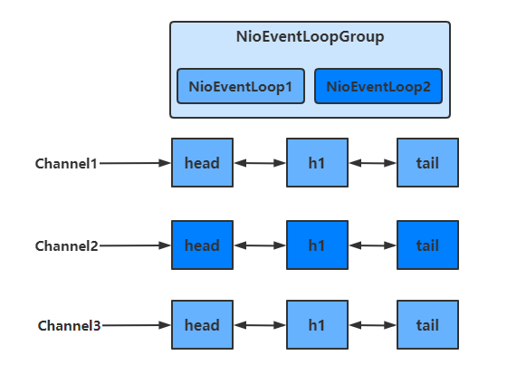

# netty1

作者: fbk
时间：2023-2-7
地点：济南
>足够优秀再大方拥有


## 概述
```
Netty is an asynchronous event-driven network application framework
for rapid development of maintainable high performance protocol servers & clients.
```
Netty 是一个异步的、基于事件驱动的网络应用框架，用于快速开发可维护、高性能的网络服务器和客户端

注意：`netty的异步还是基于多路复用的，并没有实现真正意义上的异步IO`
### 优势
- 如果使用传统NIO，其工作量大，bug 多
  - 需要自己构建协议
  - 解决 TCP 传输问题，如粘包、半包
  - 因为bug的存在，epoll 空轮询导致 CPU 100%
- Netty 对 API 进行增强，使之更易用，如
  - FastThreadLocal => ThreadLocal
  - ByteBuf => ByteBuffer
## 案例
### 服务器端
```java
    private static void server(){
        new ServerBootstrap()
                .group(new NioEventLoopGroup())
                .channel(NioServerSocketChannel.class)
                .childHandler(new ChannelInitializer<NioSocketChannel>() {
                    @Override
                    protected void initChannel(NioSocketChannel nioSocketChannel) throws Exception {
                        nioSocketChannel.pipeline().addLast(new StringDecoder());
                        nioSocketChannel.pipeline().addLast(new SimpleChannelInboundHandler<String>() {
                            @Override
                            protected void channelRead0(ChannelHandlerContext channelHandlerContext, String s) throws Exception {
                                System.out.println(s);
                            }
                        });
                    }
                }).bind(8080);
    }
```
### 客户端
```java
    private static void client() throws InterruptedException {
        new Bootstrap()
                .group(new NioEventLoopGroup())
                .channel(NioSocketChannel.class)
                .handler(new ChannelInitializer<Channel>() {
                    @Override
                    protected void initChannel(Channel channel) throws Exception {
                        channel.pipeline().addLast(new StringEncoder());
                    }
                })
                .connect(new InetSocketAddress("localhost",8080))
                .sync()
                .channel()
                .writeAndFlush("hello world");
    }
```
### 组件解释
- channel是数据的通道
  - 客户端绑定客户端的channel,NioSocketChannel
  - 服务器绑定channel，NioServerSocketChannel
- handler可以理解为数据的处理程序
  - pipeline负责一直拿到channel中的数据并且在后边添加方法操作channel中的数据，pipeline可以有多个handler
  - handler分为Inbound和Outbound两类
    - inblound入栈
    - outbound出栈
- nioEventLoop可以理解为处理数据的工人
  - eventLoop可以管理多个channel的io操作，并且eventLoop负责某个channel，将会与channel进行绑定，以后该channel中的io操作都由eventLoop负责
  - eventLoop 既可以执行 io 操作，也可以进行任务处理，每个 eventLoop 有自己的任务队列，队列里可以堆放多个 channel 的待处理任务，任务分为普通任务、定时任务
  - eventLoop 按照 pipeline 顺序，依次按照 handler 的规划（代码）处理数据，可以为每个 handler 指定不同的 eventLoop
## 组件
### EventLoop
事件循环对象`EventLoop`

EventLoop本质是一个单线程执行器（每个里边维护了一个Selector），里面有run方法处理一个或多个channel远远不断地io事件

它的继承关系如下

- 继承自 j.u.c.ScheduledExecutorService 因此包含了线程池中所有的方法
- 继承自 netty 自己的 OrderedEventExecutor
  - 提供了 boolean inEventLoop(Thread thread) 方法判断一个线程是否属于此 EventLoop
  - 提供了 EventLoopGroup parent() 方法来看看自己属于哪个 EventLoopGroup

事件循环组`EventLoopGroup`

EventLoopGroup是一组EventLoop，Channel一般会调用EventLoopGroup的register方法来绑定其中一个EventLoop，后续这个channel上的io事件都由此EvevtLoop处理

- 继承自 netty 自己的 EventExecutorGroup
  - 实现了 Iterable 接口提供遍历 EventLoop 的能力
  - 另有 next 方法获取集合中下一个 EventLoop

#### 处理普通和定时任务
```java
    private static void testEventLoop(){
        NioEventLoopGroup group = new NioEventLoopGroup(2);

        System.out.println(group.next());

        System.out.println(group.next());
        
        //因为eventLoop继承了线程池中所有的方法
        group.next().execute(()->{
            System.out.println(Thread.currentThread().getName()+"hello");
        });
        
        group.next().scheduleAtFixedRate(()->{
            System.out.println(Thread.currentThread().getName()+"world");
        }, 0,1,TimeUnit.SECONDS);
    }
```
```
io.netty.channel.nio.NioEventLoop@3f49dace
io.netty.channel.nio.NioEventLoop@1e397ed7
nioEventLoopGroup-2-1hello
nioEventLoopGroup-2-2world
nioEventLoopGroup-2-2world
nioEventLoopGroup-2-2world
nioEventLoopGroup-2-2world
nioEventLoopGroup-2-2world
```
#### 关闭EventLoopGroup
优雅关闭 shutdownGracefully 方法。该方法会首先切换 EventLoopGroup 到关闭状态从而拒绝新的任务的加入，然后在任务队列的任务都处理完成后，停止线程的运行。从而确保整体应用是在正常有序的状态下退出的
#### 处理IO任务
`server`
```java
```
`分工`
```java
public class MyServer {
    public static void main(String[] args) {
        new ServerBootstrap()
            	// 两个Group，分别为Boss 负责Accept事件，Worker 负责读写事件
                .group(new NioEventLoopGroup(1), new NioEventLoopGroup(2))
            
				...
    }
}
```

`增加自定义EventLoopGroup`
当有的任务需要较长的事件处理，可以使用非NioEventLoopGroup，避免同一个NioEventLoop中的其他Channel在较长的时间内都无法得到处理
```java
    private static void myServer(){
        //添加自定义非NioEventLoopGroup

        DefaultEventLoopGroup group = new DefaultEventLoopGroup();

        new ServerBootstrap()
                .group(new NioEventLoopGroup(1), new NioEventLoopGroup(2))
                .channel(NioServerSocketChannel.class)
                .childHandler(new ChannelInitializer<SocketChannel>() {
                    @Override
                    protected void initChannel(SocketChannel socketChannel) throws Exception {
                        socketChannel.pipeline().addLast("nioHandler",new ChannelInboundHandlerAdapter(){
                            @Override
                            public void channelRead(ChannelHandlerContext ctx, Object msg) throws Exception {
                                ByteBuf buf = (ByteBuf) msg;

                                System.out.println(Thread.currentThread().getName()+buf.toString(Charset.defaultCharset()));
                                //调用下一个handler
                                ctx.fireChannelRead(msg);
                            }
                        }).addLast(group,"myHandler",new ChannelInboundHandlerAdapter(){
                            @Override
                            public void channelRead(ChannelHandlerContext ctx, Object msg) throws Exception {
                                ByteBuf buf = (ByteBuf) msg;
                                System.out.println(Thread.currentThread().getName() + " " + buf.toString(StandardCharsets.UTF_8));
                            }
                        });
                    }
                }).bind(8080);
    }
```
启动四个客户端
```
nioEventLoopGroup-4-1 hello1
defaultEventLoopGroup-2-1 hello1
nioEventLoopGroup-4-2 hello2
defaultEventLoopGroup-2-2 hello2
nioEventLoopGroup-4-1 hello3
defaultEventLoopGroup-2-3 hello3
nioEventLoopGroup-4-2 hello4
defaultEventLoopGroup-2-4 hello4
```


`切换的实现`

不同的EventLoopGroup切换的实现原理如下

由上面的图可以看出，当handler中绑定的Group不同时，需要切换Group来执行不同的任务

```java
static void invokeChannelRead(final AbstractChannelHandlerContext next, Object msg) {
    final Object m = next.pipeline.touch(ObjectUtil.checkNotNull(msg, "msg"), next);
    // 获得下一个EventLoop, excutor 即为 EventLoopGroup
    EventExecutor executor = next.executor();
    
    // 如果下一个EventLoop 在当前的 EventLoopGroup中
    if (executor.inEventLoop()) {
        // 使用当前 EventLoopGroup 中的 EventLoop 来处理任务
        next.invokeChannelRead(m);
    } else {
        // 否则让另一个 EventLoopGroup 中的 EventLoop 来创建任务并执行
        executor.execute(new Runnable() {
            public void run() {
                next.invokeChannelRead(m);
            }
        });
    }
}
```
- 如果两个channel绑定的是同一个EventLooGroup，那么就直接调用
- 否则，把要调用的代码封装为一个任务对象，由下一个 handler 的 EventLoopGroup 来调用
### channel
- close()可以用来关闭channel
- closeFuture（）用来处理channel的关闭
  - sync用来等待channel的关闭
  - addListener方法是异步等待Channel关闭
- pipeline() 方法用于添加处理器
- write() 方法将数据写入
  - 因为缓冲机制，数据被写入到 Channel 中以后，不会立即被发送
  - 只有当缓冲满了或者调用了flush()方法后，才会将数据通过 Channel 发送出去
- writeAndFlush() 方法将数据写入并立即发送（刷出）
#### ChannelFuture
```java
public class MyClient {
    public static void main(String[] args) throws IOException, InterruptedException {
        ChannelFuture channelFuture = new Bootstrap()
                .group(new NioEventLoopGroup())
                .channel(NioSocketChannel.class)
                .handler(new ChannelInitializer<SocketChannel>() {
                    @Override
                    protected void initChannel(SocketChannel socketChannel) throws Exception {
                        socketChannel.pipeline().addLast(new StringEncoder());
                    }
                })
                // 该方法为异步非阻塞方法，主线程调用后不会被阻塞，真正去执行连接操作的是NIO线程
            	// NIO线程：NioEventLoop 中的线程
                .connect(new InetSocketAddress("localhost", 8080));
        
        // 该方法用于等待连接真正建立
        channelFuture.sync();
        
        // 获取客户端-服务器之间的Channel对象
        Channel channel = channelFuture.channel();
        channel.writeAndFlush("hello world");
        System.in.read();
    }
}
```
如果去掉`channelFuture.sync()`，那么服务器就会无法收到hello world

这是因为建立连接connect的过程是异步阻塞的，如果不通过`sync()`方法阻塞主线程，等待真正的连接，这时通过channelFuture.channel()获取的channel对象并不是真正与服务器建立好的channel

所以需要通过channelFuture.sync()方法，阻塞主线程，同步处理结果，等待连接真正建立好以后，再去获得 Channel 传递数据。使用该方法，获取 Channel 和发送数据的线程都是主线程

下面还有一种方法，用于异步获取建立连接后的 Channel 和发送数据，使得执行这些操作的线程是 NIO 线程（去执行connect操作的线程）

`addListener方法`

通过这种方法可以在NIO线程中获取 Channel 并发送数据，而不是在主线程中执行这些操作

```java
    private static void myClient() throws IOException {
        ChannelFuture channelFuture = new Bootstrap()
                .group(new NioEventLoopGroup())
                .channel(NioSocketChannel.class)
                .handler(new ChannelInitializer<SocketChannel>() {
                    @Override
                    protected void initChannel(SocketChannel socketChannel) throws Exception {
                        socketChannel.pipeline().addLast(new StringEncoder());
                    }
                    // 该方法为异步非阻塞方法，主线程调用后不会被阻塞，真正去执行连接操作的是NIO线程
                    // NIO线程：NioEventLoop 中的线程
                }).connect(new InetSocketAddress("localhost", 8080));

        // 当connect方法执行完毕后，也就是连接真正建立后
        // 会在NIO线程中调用operationComplete方法
        channelFuture.addListener(new ChannelFutureListener() {
            @Override
            public void operationComplete(ChannelFuture channelFuture) throws Exception {
                Channel channel = channelFuture.channel();
                channel.writeAndFlush("hello world");
            }
        });
        System.in.read();

    }
```

`处理关闭`

```java
    private static void readClient() throws InterruptedException {
        NioEventLoopGroup group = new NioEventLoopGroup();

        ChannelFuture channelFuture = new Bootstrap()
                .group(group)
                .channel(NioSocketChannel.class)
                .handler(new ChannelInitializer<SocketChannel>() {
                    @Override
                    protected void initChannel(SocketChannel socketChannel) throws Exception {
                        socketChannel.pipeline().addLast(new StringEncoder());
                    }
                })
                .connect(new InetSocketAddress("localhost", 8080));

        Channel channel = channelFuture.channel();

        Scanner scanner = new Scanner(System.in);

        ThreadFactory build = new ThreadFactoryBuilder()
                .setNameFormat("demo-pool-%d").build();
        ThreadPoolExecutor pool = new ThreadPoolExecutor(1, 1, 0L, TimeUnit.SECONDS, new LinkedBlockingDeque<Runnable>(),build);

        pool.execute(()->{
            while (true){
                String msg = scanner.next();
                if("q".equals(msg)){
                    channel.close();
                    break;
                }
                channel.writeAndFlush(msg);
            }
        });


        //获得closeFuture

        ChannelFuture closeFuture = channel.closeFuture();

        System.out.println("waiting close");

        //同步等待NIO线程执行完close

        closeFuture.sync();

        //关闭EventLoop
        group.shutdownGracefully();
    }
```
`关闭channel`

当我们关闭channel.close进行关闭，但是该方法也是一个异步方法，真正的关闭操作并不是在调用该方法的线程中执行的，而是在NIO线程中执行真正的关闭操作

如果我们想在channel真正关闭以后，执行一些额外的操作，可以选择以下两种方法来实现


- 通过channel.closeFuture()方法获得对应的ChannelFuture对象，然后调用sync()方法阻塞执行操作的线程，等待channel真正关闭后，再执行其他操作
```java
// 获得closeFuture对象
ChannelFuture closeFuture = channel.closeFuture();

// 同步等待NIO线程执行完close操作
closeFuture.sync();
```

- 调用closeFuture.addListener方法，添加close的后续操作

```java
closeFuture.addListener(new ChannelFutureListener() {
    @Override
    public void operationComplete(ChannelFuture channelFuture) throws Exception {
        // 等待channel关闭后才执行的操作
        System.out.println("关闭之后执行一些额外操作...");
        // 关闭EventLoopGroup
        group.shutdownGracefully();
    }
});
```

### Future和Promise

netty 中的 Future 与 jdk 中的 Future 同名，但是是两个接口

netty 的 Future 继承自 jdk 的 Future，而 Promise 又对 netty Future 进行了扩展

- jdk Future 只能同步等待任务结束（或成功、或失败）才能得到结果
- netty Future 可以同步等待任务结束得到结果，也可以异步方式得到结果，但都是要等任务结束
- netty Promise 不仅有 netty Future 的功能，而且脱离了任务独立存在，只作为两个线程间传递结果的容器


#### JDK Futrue
```java
    private static void jdkFuture() throws ExecutionException, InterruptedException {
        ThreadFactory factory = new ThreadFactory() {

            @Override
            public Thread newThread(Runnable r) {
                return new Thread(r, "t1");
            }
        };
        ThreadPoolExecutor executor = new ThreadPoolExecutor(5, 10, 10, TimeUnit.SECONDS, new ArrayBlockingQueue<Runnable>(10), factory);

        Future<Integer> future = executor.submit(new Callable<Integer>() {
            @Override
            public Integer call() throws Exception {
                TimeUnit.SECONDS.sleep(1);
                return 50;
            }
        });

        // 通过阻塞的方式，获得运行结果
        System.out.println(future.get());
    }
```
#### Netty Future
```java
    private static void nettyFuture() throws ExecutionException, InterruptedException {
        NioEventLoopGroup group = new NioEventLoopGroup();

        EventLoop eventLoop = group.next();

        io.netty.util.concurrent.Future<Integer> future = eventLoop.submit(new Callable<Integer>() {
            @Override
            public Integer call() throws Exception {
                return 50;
            }
        });

        // 主线程中获取结果
        System.out.println(Thread.currentThread().getName() + " 获取结果");
        System.out.println("getNow " + future.getNow());
        System.out.println("get " + future.get());


        //nio异步获取任务

        future.addListener(new GenericFutureListener<io.netty.util.concurrent.Future<? super Integer>>() {
            @Override
            public void operationComplete(io.netty.util.concurrent.Future<? super Integer> future) throws Exception {
                System.out.println(Thread.currentThread().getName() + " 获取结果");
                System.out.println("getNow " + future.getNow());
            }
        });
    }
```
netty中的future对象，可以通过eventLoop的submit（）获得
- 可以通过Future对象的get方法，阻塞地获取返回结果
- 也可以通过getNow方法，获取结果，若还没有结果，则返回null，该方法是非阻塞的
- 还可以通过future.addListener方法，在Callable方法执行的线程中，异步获取返回结果
#### netty Promise
```java
    private static void nettyPromise() throws ExecutionException, InterruptedException {
        NioEventLoopGroup group = new NioEventLoopGroup();
        EventLoop eventLoop = group.next();

        DefaultPromise<Object> promise = new DefaultPromise<>(eventLoop);

        new Thread(()->{
            try {
                TimeUnit.SECONDS.sleep(1);
            } catch (InterruptedException e) {
                throw new RuntimeException(e);
            }
            promise.setSuccess(100);
        }).start();

        // 主线程从Promise中获取结果
        System.out.println(Thread.currentThread().getName() + " " + promise.get());

    }
```
Promise相当于一个容器，可以用于存放各个线程中的结果，然后让其他线程去获取该结果
### handle和PipeLine
#### PipeLine
```java
    private static void pipeLineServer(){
        new ServerBootstrap()
                .group(new NioEventLoopGroup())
                .channel(NioServerSocketChannel.class)
                .childHandler(new ChannelInitializer<SocketChannel>() {
                    //执行顺序 head->h1->h2->h3->h4_tail
                    @Override
                    protected void initChannel(SocketChannel socketChannel) throws Exception {
                        //socketChannel的pipeLine添加handler
                        // pipeline中handler是带有head与tail节点的双向链表，的实际结构为
                        // head <-> handler1 <-> ... <-> handler4 <->tail
                        // Inbound主要处理入站操作，一般为读操作，发生入站操作时会触发Inbound方法
                        // 入栈时，handler是从head向后调用的
                        socketChannel.pipeline().addLast("handler1",new ChannelInboundHandlerAdapter(){
                            @Override
                            public void channelRead(ChannelHandlerContext ctx, Object msg) throws Exception {
                                System.out.println(Thread.currentThread().getName()+"handler1");
                                super.channelRead(ctx, msg);
                            }
                        });
                        socketChannel.pipeline().addLast("handler2", new ChannelInboundHandlerAdapter() {
                            @Override
                            public void channelRead(ChannelHandlerContext ctx, Object msg) throws Exception {
                                System.out.println(Thread.currentThread().getName() + " Inbound handler 2");
                                // 执行write操作，使得Outbound的方法能够得到调用
                                socketChannel.writeAndFlush(ctx.alloc().buffer().writeBytes("Server...".getBytes(StandardCharsets.UTF_8)));
                                super.channelRead(ctx, msg);
                            }
                        });
                        // Outbound主要处理出站操作，一般为写操作，发生出站操作时会触发Outbound方法
                        // 出站时，handler的调用是从tail向前调用的
                        socketChannel.pipeline().addLast("handler3" ,new ChannelOutboundHandlerAdapter(){
                            @Override
                            public void write(ChannelHandlerContext ctx, Object msg, ChannelPromise promise) throws Exception {
                                System.out.println(Thread.currentThread().getName() + " Outbound handler 1");
                                super.write(ctx, msg, promise);
                            }
                        });
                        socketChannel.pipeline().addLast("handler4" ,new ChannelOutboundHandlerAdapter(){
                            @Override
                            public void write(ChannelHandlerContext ctx, Object msg, ChannelPromise promise) throws Exception {
                                System.out.println(Thread.currentThread().getName() + " Outbound handler 2");
                                super.write(ctx, msg, promise);
                            }
                        });
                    }
                }).bind(8080);
    }
```
#### outBoundHandler
`socketChannel.writeAndFlush()`

当handler中调用该方法进行写操作时，会触发Outbound操作，此时是从tail向前寻找OutboundHandler


`ctx.writeAndFlush()`

当handler中调用该方法进行写操作时，会触发Outbound操作，此时是从当前handler向前寻找OutboundHandler


### ByteBuf
#### 创建
```java
    private static void start(){
        ByteBuf buffer = ByteBufAllocator.DEFAULT.buffer(16);
        System.out.println(buffer);
        StringBuilder sb = new StringBuilder();
        for (int i = 0; i < 20; i++) {
          sb.append("a");
        }
        buffer.writeBytes(sb.toString().getBytes(StandardCharsets.UTF_8));
        System.out.println(buffer);
    }
```
运行结果
```
PooledUnsafeDirectByteBuf(ridx: 0, widx: 0, cap: 16)
PooledUnsafeDirectByteBuf(ridx: 0, widx: 20, cap: 64)
```
`ByteBuf`通过`ByteBufAllocator`选择`allocator`并调用对应的`buffer()`方法来创建的，默认使用直接内存作为ByteBuf，容量为256个字节，可以指定初始容量的大小

当ByteBuf的容量无法容纳所有数据时，ByteBuf会进行扩容操作

如果在handler中创建ByteBuf，建议使用`ChannelHandlerContext ctx.alloc().buffer()`来创建
#### 直接内存和堆内存

通过该方法创建的ByteBuf，使用的是基于直接内存的ByteBuf
```java
ByteBuf buffer = ByteBufAllocator.DEFAULT.buffer(16);
```
使用的是堆内存从中的内存
```java
BytBuf buffer=ByteBufAllocator.DEFAULT.heapBuffer()
```
创建池化基于直接内存的 ByteBuf
```java
ByteBuf buffer = ByteBufAllocator.DEFAULT.directBuffer(16);
```
- 直接内存创建和销毁的代价昂贵，但读写性能高（少一次内存复制），适合配合池化功能一起用
- 直接内存对 GC 压力小，因为这部分内存不受 JVM 垃圾回收的管理，但也要注意及时主动释放

```java
public class ByteBufStudy {
    public static void main(String[] args) {
        ByteBuf buffer = ByteBufAllocator.DEFAULT.buffer(16);
        System.out.println(buffer.getClass());

        buffer = ByteBufAllocator.DEFAULT.heapBuffer(16);
        System.out.println(buffer.getClass());

        buffer = ByteBufAllocator.DEFAULT.directBuffer(16);
        System.out.println(buffer.getClass());
    }
}
```
```
// 使用池化的直接内存
class io.netty.buffer.PooledUnsafeDirectByteBuf
    
// 使用池化的堆内存    
class io.netty.buffer.PooledUnsafeHeapByteBuf
    
// 使用池化的直接内存    
class io.netty.buffer.PooledUnsafeDirectByteBuf
```
#### 池化和非池化
池化的最大意义在于可以重用 ByteBuf，优点有

- 没有池化，则每次都得创建新的 ByteBuf 实例，这个操作对直接内存代价昂贵，就算是堆内存，也会增加 GC 压力
- 有了池化，则可以重用池中 ByteBuf 实例，并且采用了与 jemalloc 类似的内存分配算法提升分配效率
- 高并发时，池化功能更节约内存，减少内存溢出的可能

池化功能是否开启，可以通过下面的系统环境变量来设置

```
-Dio.netty.allocator.type={unpooled|pooled}
```
- 4.1 以后，非 Android 平台默认启用池化实现，Android 平台启用非池化实现
- 4.1 之前，池化功能还不成熟，默认是非池化实现组成

#### 组成
`ByteBuf主要有以下几个组成部分`

- 最大容量与当前容量
  - 在构造ByteBuf时，可传入两个参数，分别代表初始容量和最大容量，若未传入第二个参数（最大容量），最大容量默认为Integer.MAX_VALUE
  - 当ByteBuf容量无法容纳所有数据时，会进行扩容操作，若超出最大容量，会抛出java.lang.IndexOutOfBoundsException异常
- 读写操作不同于ByteBuffer只用position进行控制，ByteBuf分别由读指针和写指针两个指针控制。进行读写操作时，无需进行模式的切换
  - 读指针前的部分被称为废弃部分，是已经读过的内容
  - 读指针与写指针之间的空间称为可读部分
  - 写指针与当前容量之间的空间称为可写部分


#### 写入

- 注意
  - 这些方法的未指明返回值的，其返回值都是 ByteBuf，意味着可以链式调用来写入不同的数据
  - 网络传输中，默认习惯是 Big Endian，使用 writeInt(int value)

```java
    private static void readBuffer(){
        ByteBuf buffer = ByteBufAllocator.DEFAULT.buffer(16, 20);
        buffer.writeBytes(new byte[]{1,2,3,4}).writeInt(5).writeIntLE(6).writeLong(7);
        System.out.println(buffer);
    }
```

#### 扩容规则

- 如何写入后数据大小未超过 512 字节，则选择下一个 16 的整数倍进行扩容
  - 例如写入后大小为 12 字节，则扩容后 capacity 是 16 字节
- 如果写入后数据大小超过 512 字节，则选择下一个 2n
  - 例如写入后大小为 513 字节，则扩容后 capacity 是 210=1024 字节（29=512 已经不够了）
- 扩容不能超过 maxCapacity，否则会抛出java.lang.IndexOutOfBoundsException异常

#### 读取
读取主要是通过一系列read方法进行读取，读取时会根据读取数据的字节数移动读指针

如果需要`重复读取`，需要调用`buffer.markReaderIndex()`对读指针进行标记，并通过`buffer.resetReaderIndex()`将读指针恢复到mark标记的位置

```java
public class ByteBufStudy {
    public static void main(String[] args) {
        // 创建ByteBuf
        ByteBuf buffer = ByteBufAllocator.DEFAULT.buffer(16, 20);

        // 向buffer中写入数据
        buffer.writeBytes(new byte[]{1, 2, 3, 4});
        buffer.writeInt(5);

        // 读取4个字节
        System.out.println(buffer.readByte());
        System.out.println(buffer.readByte());
        System.out.println(buffer.readByte());
        System.out.println(buffer.readByte());
        ByteBufUtil.log(buffer);

        // 通过mark与reset实现重复读取
        buffer.markReaderIndex();
        System.out.println(buffer.readInt());
        ByteBufUtil.log(buffer);

        // 恢复到mark标记处
        buffer.resetReaderIndex();
        ByteBufUtil.log(buffer);
    }
}
```

```
1
2
3
4
read index:4 write index:8 capacity:16
         +-------------------------------------------------+
         |  0  1  2  3  4  5  6  7  8  9  a  b  c  d  e  f |
+--------+-------------------------------------------------+----------------+
|00000000| 00 00 00 05                                     |....            |
+--------+-------------------------------------------------+----------------+
5
read index:8 write index:8 capacity:16

read index:4 write index:8 capacity:16
         +-------------------------------------------------+
         |  0  1  2  3  4  5  6  7  8  9  a  b  c  d  e  f |
+--------+-------------------------------------------------+----------------+
|00000000| 00 00 00 05                                     |....            |
+--------+-------------------------------------------------+----------------+
```

#### 释放
由于netty有堆外内存，堆外内存最好是`使用手动释放`，而不是等待GC
- UnpooledHeapByteBuf 使用的是 JVM 内存，只需等 GC 回收内存即可
- UnpooledDirectByteBuf 使用的就是直接内存了，需要特殊的方法来回收内存
- PooledByteBuf 和它的子类使用了池化机制，需要更复杂的规则来回收内存

`释放规则`

因为 pipeline 的存在，一般需要将 ByteBuf 传递给下一个 ChannelHandler，如果在每个 ChannelHandler 中都去调用 release ，就失去了传递性（如果在这个 ChannelHandler 内这个 ByteBuf 已完成了它的使命，那么便无须再传递）

`基本规则`

- 谁最后调用byteBuf，谁就负责release
- 入站 ByteBuf 处理原则
  - 对原始 ByteBuf 不做处理，调用 ctx.fireChannelRead(msg) 向后传递，这时无须 release
  - 将原始 ByteBuf 转换为其它类型的 Java 对象，这时 ByteBuf 就没用了，必须 release
  - 如果不调用 ctx.fireChannelRead(msg) 向后传递，那么也必须 release
  - 注意各种异常，如果 ByteBuf 没有成功传递到下一个 ChannelHandler，必须 release
  - 假设消息一直向后传，那么 TailContext 会负责释放未处理消息（原始的 ByteBuf）
- 出站 ByteBuf 处理原则
  - 出站消息最终都会转为 ByteBuf 输出，一直向前传，由 HeadContext flush 后 release
- 异常处理原则
  - 有时候不清楚 ByteBuf 被引用了多少次，但又必须彻底释放，可以循环调用 release 直到返回 true
  ```java
  while (!buffer.release()) {}
  ```
- 当ByteBuf被传到了pipeline的head与tail时，ByteBuf会被其中的方法彻底释放，但前提是ByteBuf被传递到了head与tail中

`TailConext中释放ByteBuf的源码`
```java
public static boolean release(Object msg) {
	return msg instanceof ReferenceCounted ? ((ReferenceCounted)msg).release() : false;
}
```

### 切片
ByteBuf切片是【零拷贝】的体现之一，对原始 ByteBuf 进行切片成多个 ByteBuf，切片后的 ByteBuf 并没有发生内存复制，还是使用原始 ByteBuf 的内存，切片后的 ByteBuf 维护独立的 read，write 指针

得到分片后的buffer后，要调用其retain方法，使其内部的引用计数加一。避免原ByteBuf释放，导致切片buffer无法使用

修改原ByteBuf中的值，也会影响切片后得到的ByteBuf

```java
    private static void testSplice(){
        ByteBuf buffer = ByteBufAllocator.DEFAULT.buffer(16, 20);

        buffer.writeBytes(new byte[]{1,2,3,4,5,6,7,8,9,10});
        //将buffer切成两部分
        ByteBuf slice1 = buffer.slice(0, 5);

        ByteBuf slice2 = buffer.slice(5, 5);

        //为了避免buffer删除后如果使用slice1和slice2，那么就会抛出异常,使用retain()在buffer的计数器+1，在buffer使用release()就会先判断计数器上的是否>0,如果大于0则不删除

        slice1.retain();

        slice2.retain();

        //修改slice的值，buffer的值也会修改

        slice1.setByte(0,'a');

        //浅拷贝buffer的所有内容,堆内存的地址还是没有变化

        ByteBuf duplicate = buffer.duplicate();

        //深拷贝，在堆内存创建新对象

        ByteBuf copy = buffer.copy();

        //合并两个buffer

        ByteBuf composite1 = ByteBufAllocator.DEFAULT.buffer(5);
        composite1.writeBytes(new byte[]{1,2,3,4,5});
        ByteBuf composite2 = ByteBufAllocator.DEFAULT.buffer(5);
        composite2.writeBytes(new byte[]{6,7,8,9,10});

        CompositeByteBuf compositeByteBuf = ByteBufAllocator.DEFAULT.compositeBuffer(10);
        
        compositeByteBuf.addComponents(true,composite1,composite2);

    }
```