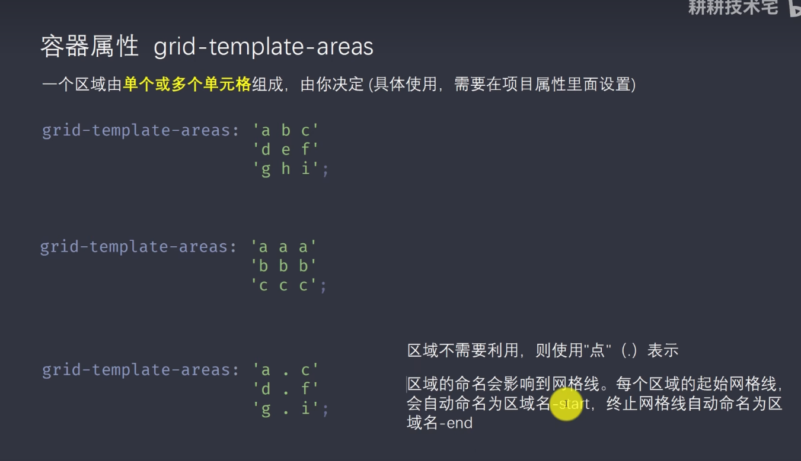

# gird布局

作者: fbk
时间：2022-12-30
地点：济南
>足够优秀再大方拥有

# 容器属性
- grid-template-columns
- grid-template-rows
- grid-row-gap
- grid-coloum-gap

## grid-template-columns和 grid-template-rows
例: grid-template-columns:100px,100px,100px,100px就是指定4行100px的列<br>
语法糖： grid-template-columns(循环的
次数,宽度)<br>
grid-template-columns(4,100px)<br>
grid-template-columns(auto-fill,100px)<br>
grid-template-columns:1fr,2fr,3fr进行均分
grid-template-columns:1fr,minmax(150px,1fr)minmax设置最小值和最大值<br>
## grid-row-gap和grid-coloums-gap
```css
grid-row-gap:20px//行与行之间的距离
grid-coloums-gap:20px//列于列之间的距离
合并写法
grid-gap:20px 20px
```
## grid-template-areas

## 对齐方式jusitify-items align-items(对容器中的每个item对齐)
### jusitify-items
横向居中对齐
### align-items
纵向居中对齐

## 容器对齐jusitify-content align-content(整个容器进行对齐)
### jusitify-content
整个容器居横向中对齐
### align-content
整个容器居中纵向对齐
## grid-auto-rows gird-auto-coloums
item没有设置宽高并且多出来的可以设置item的宽高
# 项目属性
## grid-rows-start gird-row-end grid-colum-statr gird-column-end
例
```css
.dmeo{
    gird-template-colums:[c1] 100px [c2] 100px [c3] 100px [c4]
    grid-template-rows:[c1]100px [c2] 100px [c3] 100px [c4] 100px [c5]
    //上述相当于一个4行3列
    gird-colums-satrt:1
    gird-colums-end:3
    //从第一个开始，第三个结束
    //简写
    gird-colums:1/3
    gird-colums-start:span 3 向右跨越三个
    gird-columns-end:span 2向左两个

}
```
## 区域
```css
.container{
    gird-template-areas:'a a a' 'a a a' 'c c c' 'd d d'
}
.item{
gird-area:b
/* 将b区域全占了 */
}
```
## jusitify-self align-self place-self
```css
jusitify-self:item里边对齐，和jusitify-item一样，只是jusitify-item定义在容器，jusitify-self定义在item

```