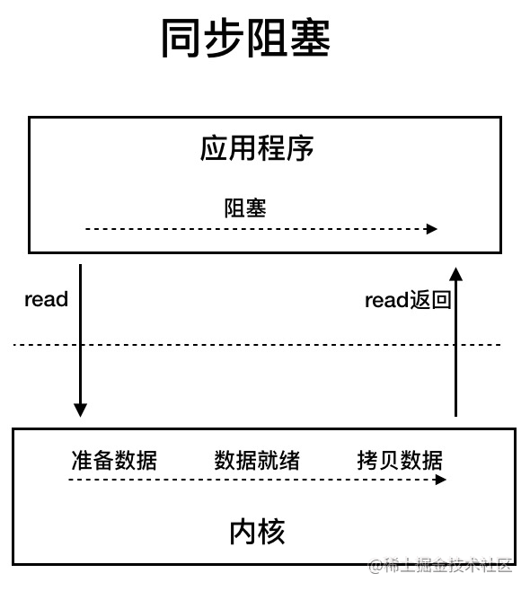
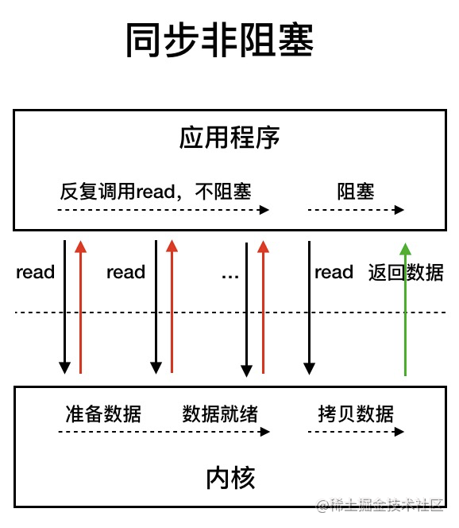
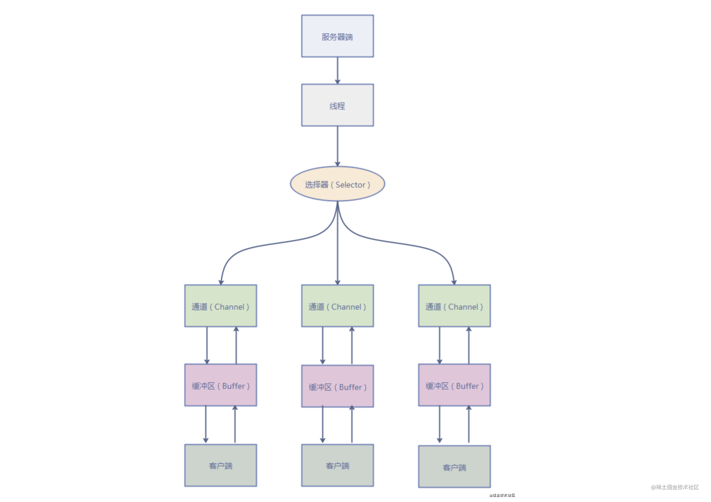

# IO模型详解
作者: fbk
时间：2023-1-11
地点：济南
>足够优秀再大方拥有

## 常见的IO模型
- 同步阻塞I/O
- 同步非阻塞I/O
- I/O多路复用
- 信号驱动I/O
- 异步I/O

## 同步阻塞
在应用程序发起read调用，会一直阻塞，直到内核把数据拷贝到用户空间

在连接数量过高的情况下，传统的BIO是不行的

## NIO (Non-blocking/New I/O)
在java1.4引入，提供了`Channel`,`Selector`,`Buffer`

同步非阻塞进行轮询操作，避免了一直阻塞，但是在内核拷贝到用户空间，线程还是阻塞的
## I/O多路复用

IO 多路复用模型中，线程首先发起 select 调用，询问内核数据是否准备就绪，等内核把数据准备好了，用户线程再发起 read 调用。read 调用的过程（数据从内核空间 -> 用户空间）还是阻塞的。目前支持 IO 多路复用的系统调用，有 select，epoll 等等。
- select 系统调用，目前几乎在所有的操作系统上都有支持。select 调用 ：内核提供的系统调用，它支持一次查询多个系统调用的可用状态。几乎所有的操作系统都支持。
- epoll 调用 ：linux 2.6 内核，属于 select 调用的增强版本，优化了 IO 的执行效率。

IO 多路复用模型，通过减少无效的系统调用，减少了对 CPU 资源的消耗。

Java 中的 NIO ，有一个非常重要的选择器 ( Selector ) 的概念，也可以被称为 多路复用器。通过它，只需要一个线程便可以管理多个客户端连接。当客户端数据到了之后，才会为其服务。

## AIO (Asynchronous I/O)

异步IO基于事件和回调机制实现的，就是应用操作之后就会返回，不会堵塞在那里，当内核准备完后会通知相应的线程进行后续操作

## 总结
