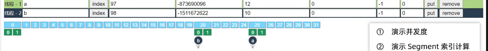

# java面试题
作者: fbk
时间：2023-2-21
地点：天津
>足够优秀再大方拥有
## HashMap
### 1.7的HashMap和1.8的HashMap的有什么区别
1. 1.7数组+链表
2. 1.8数组+（链表|红黑树）
### 为什么要使用红黑树
1. 红黑树的出现时用来避免DOS攻击的，防止链表超长时的性能下降，树化应当是偶然的情况
### 为什么一上来不树化
1.  hash表的查找，更新的时间复杂度是0(1)，但是红黑树的查找，更新的时间复杂度是O（log2n）,TreeNode占用的空间也比普通的Node打，如果必要，尽量还是使用链表
2. hash值如果足够随机，则在hash表内按泊松分布，在负载因子是0.75的情况下，长度超过8得分链表出现的概率微乎其微，选择8就是为了让树化的几率足够小
### 树化的条件
1. 链表的长度超过树化阈值(8),链表的容量超过64
### 退化的条件
1. 在扩容时如果拆分树时，树元素的个数<=6就会发生退化
2. remove树节点时，如果root,root.left,root.right,root.left.left有一个为null，就会发生退化
### 索引如何计算
计算对象的hashCode(),在进行调用hashMap的hash()方法进行二次哈希，最后&(capacity-1)得到索引
### hashCode都有了，为什么还要提供二次hash
1. 二次hash是为了综合高位数据，让hash分布更加均匀
### 数组的容量为什么选择2的n次方幂
1. 计算索引的时候，如果数组的容量是2的n次方幂的时候可以使用位与运算代替，效率更高(二次hash的值&(数组容量-1))
### 数组扩容后怎么判断要要移位
1. 二次hash&当前数组容量如果位0，不变化，如果不为0，则变化，移动的位置就是桶下标+二次hash&当前数组容量的结果


### 计算索引时，如果时
### HashTable和ConcurrentHashMap

1. HashTable和ConcurrentHashMap都是线程安全的
2. hashTable都对应一把锁，只有一个线程操作他
3. 1.8之前concurrentHashMap使用了segment+数组+链表的结构，每个segment对应一把锁
4. 1.8开始concurrentHashMap将数组的每个头节点作为锁


一开始segment的初始容量是16个`(数组的容量也要符合2^n)`，也就证明可以有16个线程同时进行操作

在添加key为a的一项数据，a的原始hash是97，经过concurrentHashMap
```java
            int hash = spread(key.hashCode());
```
这个方法会再次生成一个二次hash，通过二次哈希我们将他转换为二进制

最终的结果就是`1100 1011 1110 1100 1000 1100 0001 0000`,找到这个数的高次位`1100`换算成10进制就是12，所以存放在12的segment的下标，在segment下标位12的地方，还要进行细分索引位置，上述二级制结果的最后一位就是存放在segment位置的下标

#### 扩容的条件
1. 排除初始化集合的大小，在以后向集合添加元素，当集合的元素长度>=集合的长度的四分之三，就要进行扩容，对集合大小*2
2. 在一开始初始化集合长度是要考虑集合的`capacity和factor`这两个因素，capacity表示将来要放多少个元素
   - 假设capacity是12，factor是0.75，初始化集合长度是16的话，放入集合12个元素，集合容量还是要进行扩容，所以集合的长度应该设置为32

### 扩容的流程

1. 一个数组在满足里边的数组容量大于等于四分之三的情况下，那么就要进行扩容，扩容会在每个数组的末尾开始，每个segment的下标在经过扩容后会显示forwardingNode
2. segment下标下如果只有一个元素，那么就是直接将这个元素进行复制到新扩容的数组中去
3. 如果是多个元素的情况下，就要考虑重新对链表的元素排序
4. 假设在扩容的时候我们进行了put或者get，在迁移之前也就是segment没有变成forwardingNode的情况下，可以进行get或者put，
5. 如果put或者get的是当前正在迁移的链表，只能将这个线程进行阻塞
6. 如果是get或者put是后续已经处理的segment下标，也就是变成forwardingNode的下标，是不可以去新的数组中取出元素的，而是要帮忙将老的线程扩容到新的线程


## ArrayList
1. 无参构造arrayList在初始化容器容量为0
2. 在之后每次扩容都是`当前数组的长度+当前数组的长度>>1`
3. 初始化添加一个集合的情况
```java
ArrayList<Integer> list=new ArrayList<>();
list.addAll(List.of(1,2,3))
//当前list的长度为10
```
```java
ArrayList<Integer> list=new ArrayList<>();
list.addAll(List.of(1,2,3,4,5,6,7,8,9,,10,11))
//此时list的长度是11
```
在每次添加数组的时候，调用集合的`addAll方法`，如果添加的数组长度>10,就会选取添加的数组长度作为初始容量
## iterator
### iterator_FailFast_Fail
```java
        ArrayList<Person> list = new ArrayList<Person>();
        // CopyOnWriteArrayList<Person> personList = new CopyOnWriteArrayList<>();
        list.add(new Person("1",1));
        list.add(new Person("2",2));
        list.add(new Person("3",3));
        list.add(new Person("4",4));

        for (Person person : list) {
            System.out.println(person);
        }
```
1. 在`System.out.println(person);`中添加断点条件为`person.name.equals("3")`,对list进行操作添加新的元素`list.add(new Person("5",5))`,在遍历完3之后会立刻报错，跳出迭代器
2. vector也是一个failFast模式
### iterator_FailSafe_Fail
```java
        CopyOnWriteArrayList<Person> list = new CopyOnWriteArrayList<>();
        list.add(new Person("1",1));
        list.add(new Person("2",2));
        list.add(new Person("3",3));
        list.add(new Person("4",4));

        for (Person person : list) {
            System.out.println(person);
        }
```
1. 还是上边的步骤，添加后不会报错，但是集合在遍历到4就结束循环，不会便利到5
## linkedList
1. arrayList的随机访问性能远远大于linkedList性能，因为linkedList是可以散乱在内存分布的，所以他是使用的指针进行指向，所以查找的时候是远远不如arrayList通过下标查找的块
2. linkedList和arrayList在向两端插入元素的时候速度基本差不多，但是向数组
3. 因为CPU的缓存速度是远远大于内存速度的，ArrayList是一个内存相连的数组，所以在加载第n个元素中，会把n附近的元素也读入CPU缓存中，因为CPU判断有很大的几率会读入第nge元素附近的元素，提高了ArrayList的查找性能
，但是LinkedList作为内存分布不在一块，所以在获取元素中放入CPU缓存还是吃亏的，因为不确定第n个元素的周围是否存在元素

## spring refresh
### 解析属性的注解


在这个步骤我们可以注解在类上的属性的获取properties文件的值
```java
/**
 * @Author 房博坤
 * @Date 2023/2/22 16:15
 * @Version 1.0.1
 */
public class TestEnviroment {
    public static void main(String[] args) throws NoSuchFieldException, IOException {
        System.out.println("获取@value值");

        QualifierAnnotationAutowireCandidateResolver resolver = new QualifierAnnotationAutowireCandidateResolver();

        Object name = resolver.getSuggestedValue(new DependencyDescriptor(Bean1.class.getDeclaredField("name"), false));

        System.out.println(name);

        System.out.println("解析value的值");

        Object javaHome = resolver.getSuggestedValue(new DependencyDescriptor(Bean1.class.getDeclaredField("javaHome"), false));

        System.out.println(javaHome);


        System.out.println("解析sqlEl表达式");

        Object expression = resolver.getSuggestedValue(new DependencyDescriptor(Bean1.class.getDeclaredField("expression"), false));

        System.out.println(expression);

        System.out.println(getEnvironment().resolvePlaceholders(expression.toString()));

        System.out.println("");
    }

    private static Environment getEnvironment() throws IOException {
        StandardEnvironment env = new StandardEnvironment();
        env.getPropertySources().addLast(new ResourcePropertySource("jdbc",new ClassPathResource("jdbc properties")));
        return env;
    }

    static class Bean1{

        @Value("hello")
        private String name;

        @Value("${JAVA_HOME}")
        private String javaHome;


        @Value("#{'class version:'+'${java.class.version}'}")
        private String expression;
    }
}

```

可以通过`QualifierAnnotationAutowireCandidateResolver`类的`getSuggestedValue(new DependencyDescriptor(Bean1.class.getDeclaredField("name"), false));`获取属性注解@value的值


### obtainFreshBeanFactory
- beanFactory相当于ApplicationContext的成员变量，对于拓展spring的功能基本上是在beanFacotry实现的


- 获取beanFactory，beanFactory负责bean的创建，依赖注入和初始化

- BeanDefinition作为bean的设立蓝图，规定了bean的特征，如单例多例，依赖关系，初始销毁

- registerBean和registerBeanDefination的区别是什么
  1. 
1. 在最开始可以获取默认的beanFactory

```java
        System.out.println("一开始");

        DefaultListableBeanFactory beanFactory = new DefaultListableBeanFactory();

        System.out.println(Arrays.toString(beanFactory.getBeanDefinitionNames()));
```
2. 从xml获取加载bean定义
```java
        System.out.println("从xml获取");

        XmlBeanDefinitionReader reader1 = new XmlBeanDefinitionReader(beanFactory);

        reader1.loadBeanDefinitions(new ClassPathResource("ld.xml"));

        System.out.println(Arrays.toString(beanFactory.getBeanDefinitionNames()));
```
3. 从配置类进行获取
```java
        System.out.println("从配置类获取");

        beanFactory.registerBeanDefinition("config1", BeanDefinitionBuilder.genericBeanDefinition(Config1.class).getBeanDefinition());

        ConfigurationClassPostProcessor postProcessor = new ConfigurationClassPostProcessor();

        postProcessor.postProcessBeanDefinitionRegistry(beanFactory);

        System.out.println(Arrays.toString(beanFactory.getBeanDefinitionNames()));
```
4. 包扫描获取

```java
        System.out.println("包扫描");

        ClassPathBeanDefinitionScanner scanner = new ClassPathBeanDefinitionScanner(beanFactory);

        scanner.scan("day04.refresh.sub");

        System.out.println(Arrays.toString(beanFactory.getBeanDefinitionNames()));
```
```java
    static class Config1{
        @Bean
        public Bean2 bean2(){
            return new Bean2();
        }
    }

    static class Bean1{

    }
    static class Bean2{

    }
```
### 准备bean工厂

`完善beanFactory`

- standardBeanExpressionResolver来解析SQLEL
- ResoueceEditorRegister会注释类型转换器，并且ApplicationContext提供的Enviroment完成${}解析
- 特殊bean指beanFactory以及ApplicationContext，通过registerResolveableDependency来注册
- ApplicationContextAwareProcessor用来解析Aware接口
- BeanPostProcedss相当于对beanFactory的功能增强，让他可以识别更对的注解如@Autowire等等


### postProcessBeanFactory

`子类拓展器`

一般ApplciationContext都要利用呀注册新的scope，完善web的BeanFactory


### invokeBenaFactoryPostProcessors

`bean后处理器的作用`

- beanFactory后处理器，充当beanFactory拓展点
- ConfigurationClassPostProcessor 解析`@Configuration,@Bean,@Import,@PropertySource`


### registerBeanPostProcessors

### 拓展beanFactory处理器

```java
public class TestBeanPostProcessor {

    public static void main(String[] args) {
        GenericApplicationContext context = new GenericApplicationContext();

        DefaultListableBeanFactory beanFactory = context.getDefaultListableBeanFactory();

        beanFactory.registerBeanDefinition("bean1", BeanDefinitionBuilder.genericBeanDefinition(Bean1.class).getBeanDefinition());
        beanFactory.registerBeanDefinition("bean2", BeanDefinitionBuilder.genericBeanDefinition(Bean2.class).getBeanDefinition());
        beanFactory.registerBeanDefinition("bean3", BeanDefinitionBuilder.genericBeanDefinition(Bean3.class).getBeanDefinition());

        context.refresh();

        beanFactory.getBean(Bean1.class).foo();

        //在执行的过程中发现并不能执行注解相关操作，那么就要配置后处理器进行解析注解

    }

    static class Bean1{
      Bean2 bean2;
      Bean3 bean3;

      @Autowired
        public void setBean2(Bean2 bean2) {
            this.bean2 = bean2;
        }

        @Resource
        public void setBean3(Bean3 bean3) {
            System.out.println("执行了注解")
            this.bean3 = bean3;
        }

        public void foo(){
            System.out.println("foo");
        }
    }

    @Aspect
    static class Bean2{

    }
    @Before("execution(* foo())")
    static class Bean3{

    }


    static class Aspect1{

        public void before(){
            System.out.println("before...");
        }
    }
}
```
```
foo
```
没有加入拓展器我们就不能识别这些注解，所以要去beanFactory去注册可以解析@Autowired注解解析器

```java
        //解析@autowared,@value注解
        beanFactory.registerBeanDefinition("processor1",BeanDefinitionBuilder.genericBeanDefinition(AutowiredAnnotationBeanPostProcessor.class).getBeanDefinition());

        //解析resource，preDestroy，PostConstruct注解
        beanFactory.registerBeanDefinition("processor2",BeanDefinitionBuilder.genericBeanDefinition(CommonAnnotationBeanPostProcessor.class).getBeanDefinition());

        //解析aspect和after，before等注解
        beanFactory.registerBeanDefinition("processor3",BeanDefinitionBuilder.genericBeanDefinition(AnnotationAwareAspectJAutoProxyCreator.class).getBeanDefinition());
```
通过向beanFactory注册注释解析器就可以实现注解解析

### initMessageSource

applicationContext进行功能增强，国际化增强

先找到ApplicationContext里边是否存在messageSource的bean，如果没有，则提供空的MessageSource实现，这个功能只存在ApplicationContext当中

### initApplicationEventMulticaster

- 用来发布事件给监听器
- 可以从容器中找到名为ApplicationEventMulticaster的bean作为时间监听广播器，若没有，也会创建新的事件广播器
- 可以调用ApplicationContext.publishEvent来发布事件
### onRresh

`空实现`

### registerListeners

- 用来接收事件
- 一部分监听器是事先编程添加的，另一部分监听器来自容器中的bean，还有一部分来源于@EventListener的解析

- 接收事件实现ApplicationListener接口，重写其中的onApplicationEvent(E e)方法即可


### finishBeanFactoryInitlialization

- conversionService是一套转换机制，作为对PropertyEditor的补充
- 单例池用来缓存所有的单例对象，对象创建都分为三部分，每一阶段都有不同的bean后处理器参与，拓展功能

### finishRefresh
- 控制容器内需要生命周期管理的bean
- 如果容器中名称为lifecycleProcessor的bean就用它，否则创建默认生命周期管理器，相当于这个生命周期start，继承lifeCycle的bean就开始start，生命周期end，继承lifeCycle的bean就开始end


## springBean生命周期

### 处理名称，检查缓存
- 先把bean别名解析为实际名称，在进行后续处理
- 若要FactoryBean本身，需要使用&名称获取
- singletonObjects是一级缓存，放单例成品对象
- singletonFactories是三级缓存，放单例工厂
- earlySingletonObjects是二级缓存，放单例工厂的产品，可称为提前单例对象
### 处理父子容器
- 父子容器的bean名称可以重复
- 优先找子容器的bean，找到了直接返回，找不到向父容器继续查找
### dependsOn
大部分bean是有依赖关系的，比如说a依赖b，就会先创建b

如果a和b没有相互依赖，但还是想让b先创建，就会使用a dependsOn b，让b先创建

### 按scope创建bean
#### 单例bean
##### 创建流程
- context使用refresh
- 调用getBean初始化(init)bean
- context关闭，销毁bean
#### 多例bean创建
- 多例bean从getBean开始创建
#### request bean
从首次getBean被创建，到request结束前被销毁

### 创建bean
#### 创建bean实例阶段
#### 依赖注入
在beanFactory中使用`registerBeanDefinition`去注册注解解析器
#### 初始化
|  要点   | 总结  |
|  ----  | ----  |
| 内置Aware接口的装配  | 包括BeanNameAware，BeanFactory等 |
| 拓展Aware接口的装配  | 由ApplicationContextAwareProcessor解析 |
| @PostConstruct |由commonAnnotationBeanPostProcessor解析，执行时机在postProcessBeforeInitalizalization|
| InitializingBean | 通过接口回调执行初始化|
|initMethod(即`<bean init-method>`或@Bean(initMethod))|根据BeanDefination得到初始化方法执行初始化|
|创建aop代理| 使用AnnotationAwareAspectJAutoProxyCreator注册注解解析器 |

#### 创建阶段
```java

/**
 * @Author 房博坤
 * @Date 2023/2/23 21:37
 * @Version 1.0.1
 */
public class TestInitialization {

    public static void main(String[] args) {
        GenericApplicationContext context = new GenericApplicationContext();
        context.registerBean(CommonAnnotationBeanPostProcessor.class);
        context.registerBean("bean1",Bean1.class,bd->bd.setInitMethodName("initMethod"));
        context.refresh();
    }

    static class Bean1 implements InitializingBean, BeanFactoryAware{

        @Override
        public void setBeanFactory(BeanFactory beanFactory) throws BeansException {
            System.out.println(4);
        }
        @PostConstruct
        public void init(){
            System.out.println(2);
        }

        public void initMethod(){
            System.out.println(3);
        }

        @Override
        public void afterPropertiesSet() throws Exception {
            System.out.println(1);
        }
    }
}
```
1. 首先执行的是`BeanFactoryAware`方法是`setBeanFactory`,也就是aware接口的方法
2. 其次执行的是使用`@PostConsuctor`注解的方法
3. 再执行的是`InitiaLizationBean`的方法
4. 最后执行的是使用`registerBean`注册的初始化方法`setInitMethodName`
```
4
2
1
3
```
#### 注册可销毁的bean
- 判断并等级可销毁的bean
  1. 如果实现了disposableBean或者AutoCloseAble接口，则为可销毁bean
  2. 如果自定义了destoryMethod，则为可销毁的bean
  3. 如果采用了@Bean没有指定destoryMethod，则可以采用自动推断的方式获取销毁方法名(close,shutDown)
  4. 如果有preDestory注解的方法
- 储存位置
  1. singleton scope的可销毁bean会储存在beanFactory的成员当中
  2. 自定义的scope的可销毁bean会储存在对应的域当中(request的bean)
  3. porperty scope不会储存，需要自己找到此对象销毁

`存储时都会封装成一个DisposableBeanAdapter类型对销毁方法的调用进行适配`

#### 销毁bean
- singletonBean的销毁在ApplicationContext.close时，此时会找得到所有的DisposableBean的名字，逐一销毁
- 自定义scope bean的销毁在作用域对象生命周期结束
- propotype bean的销毁可以通过自己手动调用AutowireCapableBeanFactory.destoryBean方法执行销毁
- 同一bean中不同形式的调用次序
  - 优先后处理器销毁，@PreDestory
  - 其次DisposableBena接口销毁
  - 最后destoryMethod销毁（包括自定义名称，推断名称，autoCloseable接口）
## spring事务
1. 在添加`@Transactional`注解时，spring默认只是对runtimeExpection和Error这两个类的子类才会进行回滚操作
2. 可以使用`@Transaction(rollbackFor=FileNotFoundExpection.class)`添加特定的异常类让在触发这个错误的时候进行回滚
3. 一般直接可以使用`@Transaction(rollbackFor=Expection.class)`
4. 自己加了`try catch`代码块并不会全局抛出异常，所以也不会回滚代码
   - 解决方法：在catch块中添加`throw new RuntimeExpection(e)` 
   - 在catch块中添加`TransactionInterceptor.currentTransactionStatues().setRollbackOnly()`
   - 如果是在aspect切面`try catch`异常，那么也不会捕获异常，可以使用前两种方法，也可以提高前面执行的优先级,只用`@Order`
5. 如果方法使用default修饰的话，也不会在异常抛出回滚事务，只能使用public才能回滚
6. 设置父子容器，如果父容器开启了`事务回滚的注解`，子容器继承他，但是子容器扫描的范围并且他的包扫描的范围比父容器还大，并且在这个项目中，存在两个service5类，其中一个是父包，自包可以扫描的，另一个只能子包扫描，这时进行依赖注入的时候，就会默认从子包扫描的类中去注入service5，但是子包又没有开启事务管理，所以`@Transaction`无效，所以在今后的项目中，不要让子包扫描到不该扫的包
7. 使用`@Transaction`需要代理对象才能起作用，从applicationContext容器中获取对用的类型生成代理对象，如果代理对象里边的方法使用this，默认使用的是当前的方法也就是没有代理类，那么就事务就不会生效
   - 解决方法
   - 使用@Autowire注入自己，注入的代理对象调用事务方法
   - 使用`AppContext.currentProxy`去得到当前的代理对象，然后调用方法，还需要在父容器中设置`@EnableAspectjAutoProxy(exposeProxy=true)`

8. 如果同时有两个线程同时执行转账操作

|  余额\账户   | A  |  B  |
|  ----  | ----  | -----|
|  1000  | ----  | -----|
|  1000  | ----  | -----|

1. 账号A首先进行查询,没有任何锁保护的情况下，账户B也查询了余额
2. 两个线程查询的A余额都是1000，所以会对A账户进行两次转钱的操作，导致账户A的余额会变成负数
- 解决方法
  1. 如果给转账的方法添加synchronize修饰符，保证查询和转账的原子性，但是不能保证事务提交的原子性，还是会发生余额为负的情况
  2. 在线程的层面加锁实现
  3. 数据库层面：在查询余额后的sql语句加上for update，保证查询sql的原子性
## springMvc 执行流程
### 初始化阶段
1. 在web容器第一次调用dispatcherServlet时候，会创建其对象并执行init方法
2. init方法会创建spring web容器并调用refresh方法
3. refresh会创建并初始化SpringMVC的重要组件，如multipleResolver，HandlerMapping，HandlerApapter，HandlerExpectionResolver，ViewResolver等，除了mutipleResolver，上述的组件都可以创建多个
4. 容器初始化后，会将上一步初始化好的重要组件，赋值给dispatcherServlet的成员变量
### 匹配阶段
1. 用户发送统一的请求到达前端控制器DispatcherServlet
2. DispatcherServlet遍历所有HandlerMapping，找到路径匹配的处理器
   - HandlerMapping有多个，每个HandlerMapping会返回不同的处理器对象，谁先匹配，返回谁的处理器，其中能识别@RequestMapping的优先级最高
   - 对于@RequestMapping的处理器时HandlerMethod，包含了控制器对象和控制器方法信息
   - 路径与处理器的映射关系在HandlerMapping初始化就建立好了
3. 将HandlerMethod连同匹配到的拦截器，生成HandlerExecutiaonChain返回
4. 遍历HandlerAdapter处理器适配器，找到能处理HandlerMethod的适配器对象开始匹配
### 执行阶段
1. 拦截器preHandler
2. 由HandlerApapter调用HandlerMethod
   - 调用前处理不同类型的handler
   - 调用后处理不同类型的返回值
3. 如果第二步没有异常
  - 返回ModelAndView
  - 执行拦截器PostHandler
  - 解析视图（ViewResolver），得到View对象，进行视图解析
4. 第二步有异常的化，进入HandlerExpectionResolver异常处理流程
5. 最后都会执行afterCompletion方法
6. 如果控制器标注了@ResponseBody注解，则在第二部，就会生成JSON结果，并标记ModleAndView处理好，就不会执行第三步的视图渲染，但是还会执行postHandler还有afterCompletion
## springboot自动装配
在`springBootApplication`注解中含有
```java
@Target({ElementType.TYPE})
@Retention(RetentionPolicy.RUNTIME)
@Documented
@Inherited
@SpringBootConfiguration
@EnableAutoConfiguration
@ComponentScan(
    excludeFilters = {@Filter(
    type = FilterType.CUSTOM,
    classes = {TypeExcludeFilter.class}
), @Filter(
    type = FilterType.CUSTOM,
    classes = {AutoConfigurationExcludeFilter.class}
)}
)
```
1. @EnableAutoConfiguration
```java
{
        GenericApplicationContext context = new GenericApplicationContext();
        AnnotationConfigUtils.registerAnnotationConfigProcessors(context.getDefaultListableBeanFactory());
        context.registerBean(FialFastVsFailSafe.class);
        context.refresh();
        System.out.println(AutoConfigurationPackages.get(context.getDefaultListableBeanFactory()));

    }

    @Configuration
    @EnableAutoConfiguration
    static class Demo1{
        public static void main(String[] args) {
            failFast();
        }
    }
```
可以输出当前类的包所在路径
2. @import
用来加载META-INF/spring.factories的文件自动配置类

## 循环依赖-铺垫

### 一级缓存-只实现了singleton scope
```java
public class A{}
//获取bean，如果存在，则返回存在的，不存在则返回创建的
A a=singletion.get();
if(a!=null) return a
else {
    a=new A();
    singletion.put(a);
}
```
#### 一级缓存的弊端
```java
public class A{
    private B b;
    public setB(B b){
        this.b=b;
    }
    public void init(){

    }
}


public class B{
        private A a;
    public setB(A a){
        this.a=a;
    }
    public void init(){

    }
}
```
在上述的代码中，a，b的对象实例在singletion都需要创建，但是它们都需要对方的实例，set是在init方法执行之前执行的，所以没有对方的实例，就不会执行init，所以死锁了
### 二级缓存
- 一级缓存singleObjects
- 二级缓存singletonFactories

1. new A()后创建的实例虽然还没有给成员变量赋值+没有执行init方法，那就先放入二级缓存
2. a.setB(?)就会像二级缓存中查找是否有B的实例，没有的话，就创建new B,放如二级缓存
3. 此时在二级缓存中的B并不是init后的完成的B实例，A也不是，但是spring为了完成任务将半成品的a去set到了b成员变量，然后执行init，最后放入一级缓存
4. a继续执行向下的步骤
### 三级缓存
- 三级缓存：earlySingletonObjects

1. 判断一级缓存中有没有实例，没有实例的话，创建一个半成品放入二级缓存
2. a进行set的时候从二级缓存中获取，如果没有的话，就去创建b实例
3. b获取a向二级缓存取出半成品a，spring检测如果是循环依赖的将a创建一个工厂对象放入三级缓存中并返回三级缓存的a的实例存入b
4. 将b的工厂对象返回并在a进行set
5. 创建代理，如果代理已经创建则返回三级缓存中的工厂对象
### set循环注入
1. getBean(a)创建a的实例
2. populdate(b)，检测到有b的成员变量属性
3. getBean(b)创建b的实例
4. populate(a)创建a的实例
5. 由图可以看出，在a.setB(?)之前就会将a的实例放入三级缓存当中


## 乐观锁和悲观锁
1. 悲观锁的代表是synchronize和Lock锁
   - 核心思想是[线程只能占有勒索，才能去操作共享变量，每次只有一个线程占锁成功，获取锁失败的线程，都得停下来]
   - 线程从运行到阻塞，再从阻塞到唤醒，涉及线程的上下文切换，如果性能严重，会发生泄漏
   - 线程在获取synchronize和Lock锁时，如果锁已经被占用了，都会做几次重试操作，减少阻塞机会
2. 乐观锁是AtomicInteger，使用cas保证原子性
   - 核心思想是[无需加锁，每次只有一个线程能够修改共享变量，其他失败的线程不需要停止，可以不断重试直到成功]
   - 由于线程一直运行所以没有上下文切换
   - 需要多核CPU支持，并且线程数不能超过CPU核心数
## 创建一个饿汉式单例
```java
public class Singleton1 implements  Serializable {
    //饿汉式创建，加载当前类就创建singleton,只要类被初始化了，就会创建singleton

    private  final static SingeleTop singeleTop=new SingeleTop();

    public Singleton1() {
    System.out.println("执行了构造方法")
    }

    public SingeleTop getInstance(){
        return singeleTop;
    }
    public void otherMethod(){
        System.out.println("调用这个方法前就要创建对象实例了");
    }

    public static void main(String[] args){
        Singleton1 sin=new Singleton1()
        sin.otherMethod();
    }
}
```
1. 在调用otherMethod前就开始加载类，创建singleton变量

如何破解单例对象

1. 创建反射
```java
    private static void reflection(Class<?> clazz) throws NoSuchMethodException, InvocationTargetException, InstantiationException, IllegalAccessException {
        Constructor<?> constructor = clazz.getDeclaredConstructor();
        constructor.setAccessible(true);
        System.out.println("创建实例");
        TryModel tryModel1 = (TryModel) constructor.newInstance();
    }

```
- 预防策略
```java
public Singleton(){
    if(singeleTop!=null){
        throw new RuntimeExpection("运行异常");
    }
}
```
2. serializable创建对象破坏单例
```java
    private static void serializable(Object instance) throws IOException, ClassNotFoundException {
        ByteArrayOutputStream bas = new ByteArrayOutputStream();
        ObjectOutputStream oos = new ObjectOutputStream(bas);
        oos.writeObject(instance);
        ObjectInputStream ois = new ObjectInputStream(new ByteArrayInputStream(bas.toByteArray()));
        System.out.println("反序列化创建单例"+ois.readObject());

    }
```
- 预防策略
```java
//在singleton1类上重写resolve方法，返回当前对象singleTop
public Object ReadResolve(){
    return singleTon;
}
```
3. unsafe破坏单例对象
- 目前没有解决方法
## 创建一个懒汉式单例
```java
public class Singleton3 implements Serializable {

    private Singleton3(){}

    private static Singleton3 singleton3=null;

    public static Singleton3 getInstance(){
        if(singleton3==null){
            singleton3=new Singleton3();
        }
        return singleton3;

    }
}
```
- 上述方法存在的缺陷就是当多线程同时执行getInstance方法，此时就有可能创建多个实例，不符合单例模式
- 解决方法
```java
public class Singleton3 implements Serializable {

    private Singleton3(){}

    private static Singleton3 singleton3=null;

    public static synchronize Singleton3 getInstance(){
        if(singleton3==null){
            singleton3=new Singleton3();
        }
        return singleton3;

    }
}
```
- 为getInstancea加上一个锁，这样可以保证只会创建一个单例对象
- 但是只需要创建的时候加锁保证单例创建，后续if会自动跳过创建，使用类锁太耗费性能
- 在代码块上添加锁
```java
public class Singleton3 implements Serializable {

    private Singleton3(){}

    private static Singleton3 INSTANCE=null;

    public static Singleton3 getInstance(){
       if(INSTANCE==null){
         synchronize(Singleton.class){
            if(INSTANCE==null){
                INSATNCE=new Singleton3();
            }
         }
       }

       return INSATNCE;
    }
}
```