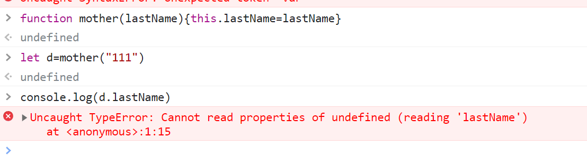
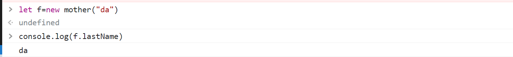

# js的原型对象

作者: fbk
时间：2022-12-16
地点：济南
>足够优秀再大方拥有

# 1.分类
## 1.基本类型：string,number,boolean,object,null,undefined
## 2.引用类型: String,Number,Booelan,Object,Function,Array,Date,RegExp,Error
```js
let a=new Number(1234)

```
# 2.创建对象的过程

```js
function Monther(lastName){
  this.lastName=lastName
}
let son=new Mother("da")
```

```xml
1.创建了新对象 son.__proto__会和Mother.prototype联系起来
2.新对象和函数会用Mother.call(son,'da')进行绑定
3.执行代码
4.如果mother里边没有返回值，则返回创建的对象实例
```
`错误写法`



`正确写法`

