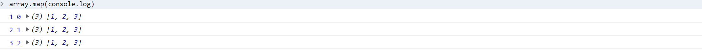

# js的小知识
作者: fbk
时间：2022-12-16
地点：济南
>足够优秀再大方拥有


## 1.map函数
```js
let array=[1,2,3]
array.map(console.log)
```

`结果`


## 2.防抖
### 1.防抖的作用：n秒以后再执行这个函数，如果重新触发，则重新计时
### 2.先上代码
```js
function resizeColor(){
    let r=Math.floor(Math.random()*255)
    let g=Math.floor(Math.random()*255)
    let b=Math.floor(Math.random()*255)
        window.addEventListener('resize', throttle(coloring, 2000))
}
document.addEventListener('resize',resizeColor)
```
这是没有控制防抖的代码，很明显，随着屏幕的缩放，屏幕的颜色也在随时改变
- solution
```js
    function resizeColor(){
    let r=Math.floor(Math.random()*255)
    let g=Math.floor(Math.random()*255)
    let b=Math.floor(Math.random()*255)
            document.body.style.background = `rgb(${r},${g},${b})`
}
function fangdou(func,delay){
    let timer;
    return function(){
        let args=arguments
        clearTimeout(timer)
        let context=this
        timer=setTimeout(()=>{
           func.apply(context,args)
        },delay)
    }
}
window.addEventListener('resize',fangdou(resizeColor,2000))
```

## 3.节流：n秒之内只能触发一次
```html
<body>
<input type="button" value="点击click"/>
<script>
document.querySelector('input').addEventListener('click',jieliu(saveMoney,2000))
function saveMoney(){
    console.log('我要省钱')
}
function jieliu(func,delay){
   let oldTime=Date.now()
   return function(...args){
    let newTime=Date.now()
    if(newTime>oldTime>=delay){
        fn.apply(null,args)
        oldTime=Date.now()
    }
   }
}
</script>
</body>
```

## 4.函数的柯里化
首先我们举一个代码例子
```js
//普通函数
function add(a,b){
    return a+b
}
//柯里化
function curryingAdd(x){
    return function(y){
        return  x+y
    }
}
```
- 通用的封装方法
```js
var currying=function(){
    var args=Array.property.splice.call()
}
```

## 5.js的闭包
### 1.百度解释：
闭包就是能够读取其他函数内部变量的函数。例如在javascript中，只有函数内部的子函数才能读取局部变量，所以闭包可以理解成“定义在一个函数内部的函数“。在本质上，闭包是将函数内部和函数外部连接起来的桥梁。
直接上代码
```js
var a='全局变量'
function A(){
    var a='局部变量'
    B()
}
function B(){
    console.log(a)
}
A()
```
分析执行栈执行的结果
1.a，A，B进入全局上下文
2.当执行A，。a作为A的局部变量
3.B（）被推倒栈顶，但是作用域依然是全局，所以输出是`全局变量`
- 闭包的作用
```js
var a='全局变量'
function A(){ 
    var a='局部变量'
    return{
    B:function(){
        console.log(a)
    }
    }
}
var obj=A()
obj.B()
```
其实很显然，是用obj执行的B方法，B的作用域链当然是指向A的
## 6.sort排序
数字排序中
当function(x,y)得到的返回值小于0,x会被移动到y前面
当function(x,y)得到的返回值大于0，x会被移动到y后面
升序,return x-y
降序,return y-x
## 递归
今天再说一说递归吧，递归的应用场景可能在平常的时候不常见，但是许多算法包括竞赛很喜欢递归，不管是哪种语言，他们总有共同的递归处
- 都要确定递归的出口
- 方法的执行都是入栈和出栈的操作

以最经典的斐波那契数列，题目就是求出斐波那契的第n个数的数值
```js
function solution(n){
//首先要确定递归的出口
if(n===1||n===2) return 1
return solution(n-1)+solution(n-2)
}
```
当初写下这个代码还是存在疑问的，但是其实通过栈也就逐渐明白，无非就是方法的入栈，先进后出的原理，随着n不断地减小，他就会逐渐逼近栈的出口，finally，当n等于1或者2，就会出栈，n===1和n===2统一的拆分父类是什么，n===3，那么也就说n===3就是2,说到这里，我相信大家肯定可以明白了🐵

## js任务执行
- 同步任务
- 异步任务
  - 在ES5后，js引入了promise，这样不需要浏览器，js自身引擎就可以发起异步任务了
  - 宏任务是由浏览器，node发起的
    - setTimeout
    - 事件
    - 网络请求（ajax，fetch）
    - 事件
    - script
  - 微任务是由js引擎发起的
    - promise：promise本身是同步任务的，但是then和catch的回调函数是异步的
    - process.nextTick
    - async/await
    - Object.observe
### 执行顺序
1. 执行栈
2. 微任务队列
3. 宏任务队列
## replace和match
### match
`match() 方法可在字符串内检索指定的值，或找到一个（无全局匹配 /g 的正则表达式） 或 多个( 有全局匹配 /g 的正则表达式)正则表达式的匹配 `

如果不是全局匹配，就会匹配到括号中的内容
```js
var str = "iid0000ffr iid222ffr";
console.log(str.match(/id(\S*)ff/g))
console.log(str.match(/id(\S*)ff/))
```
```
['id0000ff', 'id222ff']
['id0000ff', '0000', index: 1, input: 'iid0000ffr iid222ffr', groups: undefined]
```
### replace

`replace() 方法用于在字符串中用一些字符替换另一些字符，或替换一个与正则表达式匹配的子串`

1. replace() 方法不会改变原有的字符串，但是会返回替换后的字符串
2. replace() 中的正则表达式如果不是全局匹配，只会替换第一次匹配到的字符串， 然后会返回替换后的字符串
3. replace() 中的正则表达式如果是全局匹配,则会替换所有匹配到的值，然后会返回替换后的字符串
4. replace() 方法中的第二个参数如果是函数，则该函数的执行次数取决于匹配到的次数，该函数的参数有两个，第一参数为匹配到的字符串，第二个参数为 为匹配到的字符串中的的（）中的内容即（\w+）
5. 可以使用$1去获取括号中匹配的内容
```js
let str1 = "<tr><td>{$id}</td><td>{$name}</td></tr>";
console.log(str1.replace(/\{\$(\w+)\}/g,`$1123`))
```
```
<tr><td>id123</td><td>name123</td></tr>
```
## javascript的连续(链式)赋值原理和陷阱

### 连续链式赋值运算符
```js
var a=b=c
```
相当于
```js
var a=(b=c)
```

1.  js引擎先去作用域寻找b这个变量，如果找到则使用这个b，如果找不到则抛出错误（严格模式下），或者是在window作用域下创建一个全局变量b（非严格模式b），b=c其实是一个赋值表达式，它使用返回值的就是返回c本身

`注意 : 如果使用声明关键字(let , var , const)则不是一个赋值表达式 , 因为声明关键字不能出现在圆括号等表达式中 , 只能出现在块作用域顶层和函数作用域顶层;`

2. 将(b = c)表达式的返回值给a的右侧, 即(不完全是)相当于var a = c ;

### 引用类型连续赋值

```js
var a = {n:1};
a.x = a = {n:2};
console.log(a.x); // 输出?
```

1. 使用var关键字声明了一个指向 { n : 1 } 这个对象的变量 a ;

2. 引擎分析这个连续赋值表达式 , 找到 a.x 时 , 拿到第一行a的内存引用地址 , 即 { n : 1 }这个对象 , 暂存下来 ;

3. 改变 a 变量指针 , 让其指向一个新对象 { n : 2 } ;

4. 让之前暂存的对象({ n : 1 }).x属性指向 { n : 2 }这个对象 , 至此赋值完毕;

## eval和Function
```js
  //计算加法
  //eval只能进行纯字符串计算不能使用new String去进行计算
  
  let str1="1+1"
  console.log(eval(str1))
  let str2="(1+1)*2"
  console.log(eval(str2))
  let str3=new String('2+2')
  console.log(eval(str3).toString())

  //Function
  //使用Function构造的函数

  let x=1
  function fun1(){
    let x=2
    return new Function('return x')
  }
  console.log(fun1()())//这里返回的就是全局作用域下的Function
  function fun2(){
    let x=2
     function f1(){
        return x;
    } 
    return f1
  }
  let demo=fun2()
  console.log(demo())
```
## 封装自己的forEach方法
```js
        //封装foreach方法,foreach方法的方法可以传递三个参数，第一个时当前遍历的数值，第二个是数值的索引，第三个是当前的数组

        Array.prototype.myForEach = function (func, obj) {
            // console.log(func)
            if (!Object.prototype.toString.call(this) == '[Object Array]') throw new Error('不是数组')
            let len = this.length
            let _this = arguments[1] ? arguments[1] : window
            for (let i = 0; i < len; i++) {
                // console.log(i,_this,this,i,this)
                func.call(_this, this[i], i, this)
            }

        }

        let arr1 = [1, 2, 3, 4]

        arr1.myForEach(item => {
            console.log(item)
        })
```
## 封装filter方法
```js
        //封装自己的filter方法
        Array.prototype.myFilter = function (func, obj) {
            let len = this.length
            let _this = arguments[1] ? arguments[1] : window
            let arr = []
            for (let i = 0; i < len; i++) {
                func.call(_this, this[i], i, this) && arr.push(this[i])
            }
            return arr
        }
        console.log(arr1.myFilter(item => item < 2))
```
## 封装map方法
```js
        //封装自己的map方法
        Array.prototype.myMap = function (func, obj) {
            let len = this.length
            let _this = arguments[1] ? arguments[1] : window
            let arr = []
            for (let i = 0; i < len; i++) {
                arr.push(func.call(_this, this[i], i, this))
            }
            return arr
        }
        console.log(arr1.myMap(item => item * 2))
```
## 封装every方法
```js
        //封装自己的every方法
        Array.prototype.myEvery = function (func, obj) {
            let len = this.length
            let flag = true
            let _this = arguments[1] ? arguments[1] : window
            for (let i = 0; i < len; i++) {
                if (func.call(_this, this[i], i, this) == false) {
                    flag = false
                    break
                }
            }
            return flag
        }
        console.log(arr1.myEvery(item => item > 2))
```
## 封装reduce方法
```js
        Array.prototype.MyReduce = function (func, initValue) {
            let len = this.length, nextValue, i
            if (!initValue) {
                nextValue = this[0]
                i = 1
            } else {
                nextValue = initValue
                i = 0
            }
            for (; i < len; i++) {
                //reduce传递的是两个参数，第一个是之前的，第二个是现在的
                nextValue = func.call(this, nextValue, this[i], i, this)
            }
            return nextValue
        }
        console.log(arr1.MyReduce((a,b)=>a+b))
```