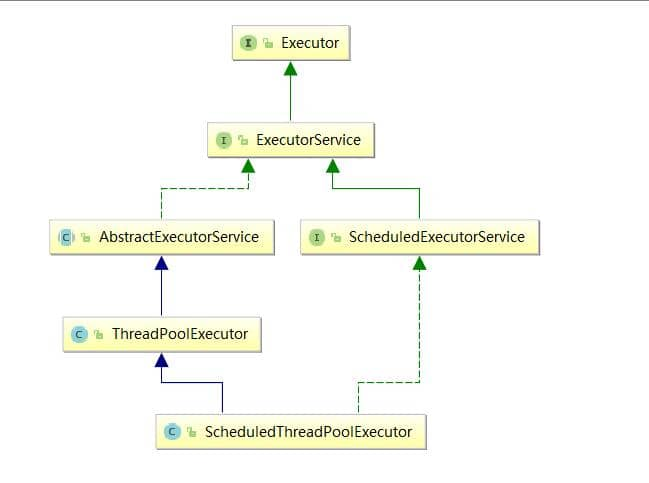

# JUC-基础

作者: fbk
时间：2023-2-3
地点：济南

## 共享模型之不可变

### 日期转化问题

```java
 public static void main(String[] args) {
        Demo1();
    }

    private static void Demo1() {
        SimpleDateFormat sdf = new SimpleDateFormat("yyyy-MM-dd");
        for (int i = 0; i < 10; i++) {
            new Thread(() -> {
                try {
                    log.debug("{}", sdf.parse("2002-11-27"));
                } catch (ParseException e) {
                    throw new RuntimeException(e);
                }
            }).start();
        }
    }
```

有很大的概率会出现`java.lang.NumberFormatExpection`或者日期解析不正常

```
java.lang.NumberFormatException: empty String
	at sun.misc.FloatingDecimal.readJavaFormatString(FloatingDecimal.java:1842)
	at sun.misc.FloatingDecimal.parseDouble(FloatingDecimal.java:110)
	at java.lang.Double.parseDouble(Double.java:538)
	at java.text.DigitList.getDouble(DigitList.java:169)
	at java.text.DecimalFormat.parse(DecimalFormat.java:2089)
	at java.text.SimpleDateFormat.subParse(SimpleDateFormat.java:1869)
	at java.text.SimpleDateFormat.parse(SimpleDateFormat.java:1514)
	at java.text.DateFormat.parse(DateFormat.java:364)
	at com.fbk.juc.gongxaingTest.lambda$Demo1$0(gongxaingTest.java:25)
	at java.lang.Thread.run(Thread.java:748)
java.lang.NumberFormatException: For input string: "11111111.E111111112.11111111E2"
	at sun.misc.FloatingDecimal.readJavaFormatString(FloatingDecimal.java:2043)
	at sun.misc.FloatingDecimal.parseDouble(FloatingDecimal.java:110)
	at java.lang.Double.parseDouble(Double.java:538)
	at java.text.DigitList.getDouble(DigitList.java:169)
	at java.text.DecimalFormat.parse(DecimalFormat.java:2089)
	at java.text.SimpleDateFormat.subParse(SimpleDateFormat.java:1869)
	at java.text.SimpleDateFormat.parse(SimpleDateFormat.java:1514)
	at java.text.DateFormat.parse(DateFormat.java:364)
	at com.fbk.juc.gongxaingTest.lambda$Demo1$0(gongxaingTest.java:25)
	at java.lang.Thread.run(Thread.java:748)
```

#### 解决-同步锁

```java
    private static void Demo2(){
        SimpleDateFormat sdf = new SimpleDateFormat("yyyy-MM-dd");
        for (int i = 0; i < 10; i++) {
            new Thread(()->{
                synchronized (lock) {
                    try {
                        log.debug("{}", sdf.parse("2002-11-27"));
                    } catch (ParseException e) {
                        throw new RuntimeException(e);
                    }
                }
            }).start();
        }
    }
```

#### 解决-不可变

如果一个对象不能够修改其内部的状态，那么他就是线程安全的，在 jdk1.8 后，提供了一个线程安全的日期格式化类

```java
    private static void Demo3(){
        DateTimeFormatter dtf = DateTimeFormatter.ofPattern("yyyy-MM-dd");
        for (int i = 0; i < 10; i++) {
            new Thread(()->{
                LocalDate date = dtf.parse("2002-11-27", LocalDate::from);
                log.debug("{}",date);
            }).start();
        }
    }
```

```
16:26:50 [DEBUG] [Thread-7] c.f.j.gongxaingTest - 2002-11-27
16:26:50 [DEBUG] [Thread-4] c.f.j.gongxaingTest - 2002-11-27
16:26:50 [DEBUG] [Thread-3] c.f.j.gongxaingTest - 2002-11-27
16:26:50 [DEBUG] [Thread-8] c.f.j.gongxaingTest - 2002-11-27
16:26:50 [DEBUG] [Thread-6] c.f.j.gongxaingTest - 2002-11-27
16:26:50 [DEBUG] [Thread-9] c.f.j.gongxaingTest - 2002-11-27
16:26:50 [DEBUG] [Thread-1] c.f.j.gongxaingTest - 2002-11-27
16:26:50 [DEBUG] [Thread-0] c.f.j.gongxaingTest - 2002-11-27
16:26:50 [DEBUG] [Thread-5] c.f.j.gongxaingTest - 2002-11-27
16:26:50 [DEBUG] [Thread-2] c.f.j.gongxaingTest - 2002-11-27
```

### 不可改变设计

`String也是不可改变的`

```java
public final class String
    implements java.io.Serializable, Comparable<String>, CharSequence {
    /** The value is used for character storage. */
    private final char value[];

    /** Cache the hash code for the string */
    private int hash; // Default to 0

    // ...

}
```

## 共享模型之工具

### 线程池

#### 自定义线程池
   
   创建一个线程池，可以提供四个形参

- coreSize 核心线程数
- 超时时间
- 时间单位
- 队列容量 不可以让一个线程池一直增加线程，给定一个具体大小的容量，线程池满的时候任务在队列等待

```java
/**
 * @Author 房博坤
 * @Date 2023/2/3 16:46
 * @Version 1.0.1
 */
@Slf4j
public class TestPool {

    public static void main(String[] args) {
        ThreadPool threadPool = new ThreadPool(2, 1000, TimeUnit.MILLISECONDS, 10);

        for (int i = 0; i < 5; i++) {
            int j = i;
            threadPool.execute(() -> {
                log.debug("{}", j);
            });
        }
    }
}

class BlockingQueue<T> {
    //1.任务队列（先进先出）
    private Deque<T> queue = new ArrayDeque<>();

    //2.锁

    private ReentrantLock lock = new ReentrantLock();

    //3.生产者条件变量

    private Condition fullWaitSet = lock.newCondition();

    //消费者条件变量

    private Condition emptyWaitSet = lock.newCondition();


    //5.容量
    private int capcity;

    public BlockingQueue(int capcity) {
        this.capcity = capcity;
    }

    private T poll(long timeout, TimeUnit unit) {
        lock.lock();
        try {
            long nanos = unit.toNanos(timeout);
            while (queue.isEmpty()) {
                try {
                    if (nanos <= 0) return null;
                    //返回剩余时间
                    nanos = emptyWaitSet.awaitNanos(nanos);
                } catch (InterruptedException e) {
                    throw new RuntimeException(e);
                }
            }

            T t = queue.removeFirst();
            fullWaitSet.signal();
            return t;
        } finally {
            lock.unlock();
        }
    }

    public T take() {
        lock.lock();
        try {
            while (queue.isEmpty()) {
                try {
                    emptyWaitSet.await();
                } catch (InterruptedException e) {
                    throw new RuntimeException(e);
                }
            }

            T t = queue.removeFirst();
            fullWaitSet.signal();
            return t;
        } finally {
            lock.unlock();
        }
    }

    public void put(T element) {
        lock.lock();

        try {
            while (queue.size() == capcity) {
                try {
                    fullWaitSet.await();
                } catch (InterruptedException e) {
                    throw new RuntimeException(e);
                }
            }
            queue.addLast(element);
            emptyWaitSet.signal();
        } finally {
            lock.unlock();
        }
    }

    public int size() {
        lock.lock();

        try {
            return queue.size();
        } finally {
            lock.unlock();
        }
    }
}

@Slf4j
class ThreadPool {
    private final BlockingQueue<Runnable> taskQueue;

    private final HashSet<Worker> workers = new HashSet<>();

    //核心线程数
    private final int coreSize;

    private final long time;
    //超时时间
    private final TimeUnit timeUnit;


    public void execute(Runnable task) {
        synchronized (workers) {
            if (workers.size() < coreSize) {
                Worker worker = new Worker(task);
                log.debug("新增worker{},{}", worker, task);
                workers.add(worker);
                worker.start();
            } else {
                taskQueue.put(task);
            }
        }
    }

    public ThreadPool(int coreSize, long time, TimeUnit timeUnit, int queueCapcity) {
        this.coreSize = coreSize;
        this.time = time;
        this.timeUnit = timeUnit;
        this.taskQueue = new BlockingQueue<>(queueCapcity);
    }


    class Worker extends Thread {
        private Runnable task;

        public Worker(Runnable runnable) {
            this.task = runnable;
        }

        @Override
        public void run() {
            //如果当前线程执行完了，要遵循重用线程，就要看看任务队列中是都存在任务
            while (task != null || (task = taskQueue.take()) != null) {
                try {
                    log.debug("正在执行{}", task);
                    task.run();
                } catch (Exception e) {
                    e.printStackTrace();
                } finally {
                    task = null;
                }
            }
            //但凡操作worker，都需要进行上锁
            synchronized (workers) {
                log.debug("worker被移除{}", this);
                workers.remove(this);
            }
        }
    }
}

```
#### ThreadPoolExecutor

`构造方法`
```java
public ThreadPoolExecutor(int corePoolSize,
                          int maximumPoolSize,
                          long keepAliveTime,
                          TimeUnit unit,
                          BlockingQueue<Runnable> workQueue,
                          ThreadFactory threadFactory,
                          RejectedExecutionHandler handler)

```
- corePoolSize 核心线程数目 (最多保留的线程数)
- maximumPoolSize 最大线程数目
- keepAliveTime 生存时间 - 针对救急线程
- unit 时间单位 - 针对救急线程
- workQueue 阻塞队列
- threadFactory 线程工厂 - 可以为线程创建时起个好名字
- handler 拒绝策略

1. 线程刚开始没有线程，任务1来到线程，线程池就会创建一个线程来执行任务
2. 当线程达到corePoolSize并没有线程空闲，再次加入任务，新加的任务会被加入到阻塞队列中等待，知道有空闲线程
3. 如果队列选择了有界队列，那么当任务超过了队列大小时，会创建maximumPoolSize-corePoolSize数目的线程来救急
4. 如果线程maximumPoolSize仍有新任务会执行拒绝策略，拒绝策略jdk提供4中实现
- 其他线程的实现
  - AbortPolicy 让调用者抛出 RejectedExecutionException 异常，这是默认策略
  - CallerRunsPolicy 让调用者运行任务
  - DiscardPolicy 放弃本次任务
  - DiscardOldestPolicy 放弃队列中最早的任务，本任务取而代之
  - Dubbo 的实现，在抛出 RejectedExecutionException 异常之前会记录日志，并 dump 线程栈信息，方
便定位问题
  - Netty 的实现，是创建一个新线程来执行任务
  - ActiveMQ 的实现，带超时等待（60s）尝试放入队列，类似我们之前自定义的拒绝策略
   -PinPoint 的实现，它使用了一个拒绝策略链，会逐一尝试策略链中每种拒绝策略
5. 当高峰过去后，超过corePoolSize 的救急线程如果一段时间没有任务做，需要结束节省资源，这个时间由
keepAliveTime 和 unit 来控制。
`newFixedThreadPool`
```java
    private static ExecutorService Demo1(int nThreads){
        return new ThreadPoolExecutor(nThreads,nThreads,0L, TimeUnit.MILLISECONDS,new LinkedBlockingDeque<Runnable>());
    }
```
特点：
- 核心线程数==最大线程数，没有急救线程，也就无需超时时间
- 阻塞队列是无界的，可以放任意数量的任务

`newCachedThreadPool`
```java
    private static ExecutorService newCachedThreadPool() {
        return new ThreadPoolExecutor(0,Integer.MAX_VALUE,60L,TimeUnit.MILLISECONDS,new SynchronousQueue<Runnable>());
    }
```
特点
- 核心线程数是 0， 最大线程数是 Integer.MAX_VALUE，救急线程的空闲生存时间是 60s，意味着
  - 全部都是救急线程（60s 后可以回收）
  - 救急线程可以无限创建
- 队列采用了 SynchronousQueue 实现特点是，它没有容量，没有线程来取是放不进去的（一手交钱、一手交
货）
```java
    private static void Demo1() {
        SynchronousQueue<Integer> integers = new SynchronousQueue<>();
        new Thread(()->{
            try {
                log.debug("putting{}",1);
                integers.put(1);
                log.debug("{} putted...", 1);
                log.debug("putting{}",2);
                integers.put(2);
                log.debug("{} putted...", 2);
            } catch (InterruptedException e) {
                throw new RuntimeException(e);
            }
        }).start();

        try {
            Thread.sleep(1000);
        } catch (InterruptedException e) {
            throw new RuntimeException(e);
        }
        new Thread(()->{
            log.debug("taking{}",1);
            try {
                integers.take();
            } catch (InterruptedException e) {
                throw new RuntimeException(e);
            }
        }).start();
        try {
            Thread.sleep(1000);
        } catch (InterruptedException e) {
            throw new RuntimeException(e);
        }
        new Thread(() -> {
            try {
                log.debug("taking {}", 2);
                integers.take();
            } catch (InterruptedException e) {
                e.printStackTrace();
            }
        },"t3").start();
    }
```
```
21:15:47 [DEBUG] [Thread-0] c.f.j.ExecutorDemo - putting1
21:15:48 [DEBUG] [Thread-1] c.f.j.ExecutorDemo - taking1
21:15:48 [DEBUG] [Thread-0] c.f.j.ExecutorDemo - 1 putted...
21:15:48 [DEBUG] [Thread-0] c.f.j.ExecutorDemo - putting2
21:15:49 [DEBUG] [t3] c.f.j.ExecutorDemo - taking 2
21:15:49 [DEBUG] [Thread-0] c.f.j.ExecutorDemo - 2 putted...
```
可以看到将在将1放入的时候，线程阻塞到integers.put(1)方法，过了1s，线程2执行，取出1，然后线程1才能继续执行

整个线程池表现为线程数会根据任务量不断增长，没有上限，当任务执行完毕，空闲1分钟会释放线程，适合任务密集但是每个任务执行较短的情况

`newSingleThreadExecutor`
```java
    private static void Demo3(){
        ExecutorService pool = Executors.newSingleThreadExecutor();
        pool.execute(()->{
            int i=1/0;
            log.debug("1");
        });
        pool.execute(()->{
            log.debug("2");
        });
    }
```
```
Exception in thread "pool-1-thread-1" java.lang.ArithmeticException: / by zero
	at com.fbk.juc.ExecutorDemo.lambda$Demo3$3(ExecutorDemo.java:75)
	at java.util.concurrent.ThreadPoolExecutor.runWorker(ThreadPoolExecutor.java:1149)
	at java.util.concurrent.ThreadPoolExecutor$Worker.run(ThreadPoolExecutor.java:624)
	at java.lang.Thread.run(Thread.java:748)
21:31:45 [DEBUG] [pool-1-thread-2] c.f.j.ExecutorDemo - 2
```
单例线程池和线程最大的区别是单例线程池在遇到异常抛出后还可以创建新的线程来执行下边的代码
- Executors.newSingleThreadExecutor() 线程个数始终为1，不能修改
- Executors.newFixedThreadPool(1) 初始时为1，以后还可以修改

`提交任务`
```java
// 执行任务
void execute(Runnable command);
// 提交任务 task，用返回值 Future 获得任务执行结果
<T> Future<T> submit(Callable<T> task);
// 提交 tasks 中所有任务
<T> List<Future<T>> invokeAll(Collection<? extends Callable<T>> tasks) throws InterruptedException;
// 提交 tasks 中所有任务，带超时时间
<T> List<Future<T>> invokeAll(Collection<? extends Callable<T>> tasks,
 long timeout, TimeUnit unit) throws InterruptedException;
// 提交 tasks 中所有任务，哪个任务先成功执行完毕，返回此任务执行结果，其它任务取消
<T> T invokeAny(Collection<? extends Callable<T>> tasks) throws InterruptedException, ExecutionException;
// 提交 tasks 中所有任务，哪个任务先成功执行完毕，返回此任务执行结果，其它任务取消，带超时时间
<T> T invokeAny(Collection<? extends Callable<T>> tasks,
 long timeout, TimeUnit unit) throws InterruptedException, ExecutionException, TimeoutException;
```
`关闭线程池`
```java
/**
1.线程池转变为shutDown
- 不会再接收新任务
- 但已提交任务会执行完
- 此方法不会阻塞线程的执行
 */
 void shutDown();

 /**
 - 不会接收新的任务
 - 会返回一个List<Runnable>集合
 - 并用 interrupt 的方式中断正在执行的任务
  */
 List<Runnable> shutDownNow();

 // 不在 RUNNING 状态的线程池，此方法就返回 true
boolean isShutdown();
// 线程池状态是否是 TERMINATED
boolean isTerminated();
// 调用 shutdown 后，由于调用线程并不会等待所有任务运行结束，因此如果它想在线程池 TERMINATED 后做些事情，可以利用此方法等待
boolean awaitTermination(long timeout, TimeUnit unit) throws InterruptedException;

```
`任务调度池`
在任务调度池加入之前，可以适用Timer来实现定时功能，但是timer是串行执行的，同一时间只能执行一个TimerTask方法
```java
    private static void Demo5(){
        Timer timer = new Timer();

        TimerTask task1 = new TimerTask() {
            @Override
            public void run() {
                log.debug("task 1");
                try {
                    sleep(2);
                } catch (InterruptedException e) {
                    throw new RuntimeException(e);
                }
            }
        };
        TimerTask timertask2 = new TimerTask() {
            @Override
            public void run() {
                log.debug("task 2");
                try {
                    sleep(1000);
                } catch (InterruptedException e) {
                    throw new RuntimeException(e);
                }
            }
        };
        // 使用 timer 添加两个任务，希望它们都在 1s 后执行
        // 但由于 timer 内只有一个线程来顺序执行队列中的任务，因此『任务1』的延时，影响了『任务2』的执行
        timer.schedule(task1,1000);
        timer.schedule(timertask2,1000);
    }
```
```
22:21:18 [DEBUG] [Timer-0] c.f.j.ExecutorDemo - task 1
22:21:18 [DEBUG] [Timer-0] c.f.j.ExecutorDemo - task 2
```
`使用executorService改写`
```java
    private static void Demo6(){
        ScheduledExecutorService executorService = Executors.newScheduledThreadPool(2);
        executorService.schedule(()->{
            log.debug("执行时间{}",new Date());
        },1000,TimeUnit.MILLISECONDS);

        executorService.schedule(()->{
            log.debug("执行时间2{}",new Date());
        },1000,TimeUnit.MILLISECONDS);
    }
```
```
22:24:33 [DEBUG] [pool-1-thread-1] c.f.j.ExecutorDemo - 执行时间Sun Feb 05 22:24:33 CST 2023
22:24:33 [DEBUG] [pool-1-thread-2] c.f.j.ExecutorDemo - 执行时间2Sun Feb 05 22:24:33 CST 2023
```
```java
    private static void Demo7(){
        ScheduledExecutorService service = Executors.newScheduledThreadPool(2);
        //初始时间是1，间隔时间是2，并且如果任务没有执行完但是间隔时间到了，那么就会等待任务执行
        service.scheduleAtFixedRate(()->{
            log.debug("running");
            try {
                sleep(2000);
            } catch (InterruptedException e) {
                throw new RuntimeException(e);
            }
        },1,1,TimeUnit.SECONDS);
        //每个任务执行完后的等待时间
        service.scheduleWithFixedDelay(()->{
            log.debug("start");
            try {
                sleep(2000);
            } catch (InterruptedException e) {
                throw new RuntimeException(e);
            }
        },1,1,TimeUnit.SECONDS);
    }
```
> 整个线程池表现为：线程数固定，任务数多于线程数时，会放入无界队列排队。任务执行完毕，这些线
程也不会被释放。用来执行延迟或反复执行的任务

`Excutor框架结构`
1. 任务（runnable/callable）

执行任务需要实现的 Runnable 接口 或 Callable接口。Runnable 接口或 Callable 接口 实现类都可以被 ThreadPoolExecutor 或 ScheduledThreadPoolExecutor 执行。

2. 任务的执行（Executor）

包括任务执行机制的核心接口 Executor ，以及继承自 Executor 接口的 ExecutorService 接口。ThreadPoolExecutor 和 ScheduledThreadPoolExecutor 这两个关键类实现了 ExecutorService 接口。

3. 异步计算的结果(Future)
Future 接口以及 Future 接口的实现类 FutureTask 类都可以代表异步计算的结果。

当我们把 Runnable接口 或 Callable 接口 的实现类提交给 ThreadPoolExecutor 或 ScheduledThreadPoolExecutor 执行。（调用 submit() 方法时会返回一个 FutureTask 对象）


## Fork/join
`实现一个由1+5`
```java
public class TestForkJoin2 {

    public static void main(String[] args) {
        ForkJoinPool pool = new ForkJoinPool(4);
        System.out.println(pool.invoke(new MyTask(5)));
    }
}
class MyTask extends RecursiveTask<Integer>{
    private int n;

    public MyTask(int n) {
        this.n = n;
    }

    @Override
    protected Integer compute() {
        if(n==1) {
            return 1;
        }
        MyTask t1 = new MyTask(n - 1);
        //执行结果
        t1.fork();
        //获取结果
        return n+t1.join();

    }
}
```
`优化代码-二分查找计算`
```java
public class TestForkJoin2 {

    public static void main(String[] args) {
        ForkJoinPool pool = new ForkJoinPool(4);
        System.out.println(pool.invoke(new MyTask2(1,5)));
    }
}
@Slf4j
class MyTask2 extends RecursiveTask<Integer>{
   private int start;
   private int end;
    //判断条件
    @Override
    public String toString() {
        return "{" + start + "," + end + '}';
    }

    public MyTask2(int start, int end) {
        this.start = start;
        this.end = end;
    }

    @Override
    protected Integer compute() {
        if(start==end) {
            return start;
        }

        if(end-start==1){
            return start+end;
        }

        int middle=(start+end)/2;

        MyTask2 t1 = new MyTask2(start, middle);

        t1.fork();

        MyTask2 t2 = new MyTask2(middle+1, end);

        t2.fork();

        return t1.join()+t2.join();

    }
}
```