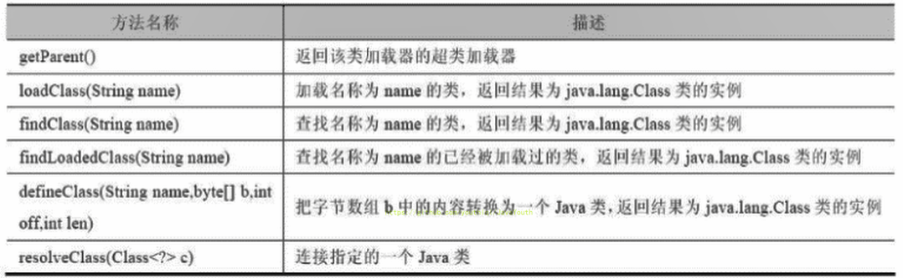

作者: fbk
时间：2023-1-27
地点：济南

## 内存结构概述
### 简图

### 详细图

### 中文版

## 类加载器子系统classLoader

1. class file也就是car.class存在于本地磁盘中，可以理解为设计师制作了一个模板，JVM需要再根据这个模板制作一模一样的实例
2. classFile加载到JVM中华，被称为DNA元数据模板（也就是在内存中的car class），放在方法区
3. 在class文件到jvm到最终成为元数据模板，此过程需要一个运输工具（classLoader），扮演一个快递员
## 类加载过程
```java
public class HelloLoader {

    public static void main(String[] args) {
        System.out.println("谢谢ClassLoader加载我....");
        System.out.println("你的大恩大德，我下辈子再报！");
    }
}
```

1. 执行main方法需要预先加载main方法存在的HelloHeader
2. 加载成功后，进行连接初始化等操作，完成后调用的HelloHeader类的静态方法main
3. 加载失败则抛出异常
## 加载阶段
### 加载
1. 通过一个类的全限定名获取定义此类的二进制字节流
2. 将这个字节流所代表的静态存储结构转化为方法区的运行时的数据
3. 在内存中生成一个代表这个类的java.class.lang对象，作为方法区这个类的各种数据的访问入口
### 链接阶段
#### 验证
1. 目的在于确保class文件的字节流中包含信息符合虚拟机要求，保证加载类的正确性，不会危害虚拟机自身的安全
2. 主要包含四种验证，文件格式验证，元数据验证，字节码验证，符号引用验证
#### 准备
1. 为类变量static分配内存并且设置该类变量的默认初始值
2. 这里不包含final修饰的static，因为final在编译的时候会分配好默认值，准备阶段就会初始化
3. 注意：这里不会为实例变量分配初始化，类变量会分配在方法区中，而实例变量会随着对象一起分配到java堆中
#### 解析
1. 将常量池内的符号引用转化为直接引用过程
2. 事实上，解析操作往往会随着JVM在执行完初始化后执行
3. 符号引用就是一组符号来描述所引用的目标。符号引用的字面量形式明确定义在《java虚拟机规范》的class文件格式中。直接引用就是直接指向目标的指针、相对偏移量或一个间接定位到目标的句柄
4. 解析动作主要针对类或接口、字段、类方法、接口方法、方法类型等。对应常量池中的CONSTANT Class info、CONSTANT Fieldref info、CONSTANT Methodref info等
`符号引用`
- 反编译class文件后可以查看符号引用


## 初始化阶段
1. 创建类的实例
2. 访问类中或者接口的静态变量，或者对静态变量赋值
3. 调用类的静态方法
4. 反射（class.forName()）
5. 初始化一个类的子类
6. java虚拟机启动时标名为启动类的类
7. JDK7开始提供的动态语言支持：java.lang.invoke.MethodHandle实例的解析结果REF_getStatic、REF putStatic、REF_invokeStatic句柄对应的类没有初始化，则初始化
除了以上七种情况，其他使用Java类的方式都被看作是对类的被动使用，都不会导致类的初始化，即不会执行初始化阶段（不会调用 `clinit()` 方法和 `init()` 方法）
### clint
1. 初始化阶段就是执行类构造器方法`clinit`的过程
2. 此方法不需定义，是javac编译器自动收集类中的所有类变量的赋值动作和静态代码块中的语句合并而来。也就是说，当我们代码中包含static变量的时候，就会有clinit方法
3. `clint`方法中的指令按语句在源文件中出现的顺序执行
4. `clinit()`不同于类的构造器。（关联：构造器是虚拟机视角下的`init()`)
5. 若该类具有父类，JVM会保证子类的`clinit()`执行前，父类的`clinit()`已经执行完毕
6. 虚拟机必须保证一个类的`clinit()`方法在多线程下被同步加锁
```java
  private static int num=1;
    static {
        number=10;
        num=2;
        System.out.println(num);
    }
    /**
    类加载的过程应该是先加载static中的代码，所以之前被准备阶段为0的number变量会首先被初始化为20，再接着被初始化成10
     */
    private static int number=10;

    public static void main(String[] args) {
        System.out.println(Demo1.num);
        System.out.println(Demo1.number);
    }
```
```java
  public static void main(String[] args) {
        Runnable r1=()->{
            System.out.println(Thread.currentThread().getName()+"start");
            DeadThread dead = new DeadThread();
            System.out.println(Thread.currentThread().getName()+"end");
        };
        
        Thread t1=new Thread(r1,"t1线程");
        Thread t2 = new Thread(r1, "t2线程");
        t1.start();
        t2.start();
    }
    class DeadThread{
    static {
        if(true){
            System.out.println(Thread.currentThread().getName()+"初始化当前类");
            while (true){}
        }
    }
}
```
```
r2start
r1start
r2初始化当前类

程序死锁
```
- 在DeadThread中的static有一处静态死循环方法
- 先加载DeadThread类的线程抢占同步锁，然后类的静态代码中执行死锁，而另一个线程在等待同步锁释放
- 所以无论哪个线程先执行 DeadThread 类的加载，另外一个类也不会继续执行。（一个类只会被加载一次）
## 类加载器

```java
 ClassLoader systemClassLoader = ClassLoader.getSystemClassLoader();
        //获取系统类加载器
        System.out.println(systemClassLoader);
        ClassLoader extClassLoader = systemClassLoader.getParent();
        //拓展类加载器
        System.out.println(extClassLoader);
        ClassLoader bootstrapClassLoader = extClassLoader.getParent();
        //获取其上层，获取不到引导类加载器
        System.out.println(bootstrapClassLoader);
        ClassLoader classLoader = ClassLoaderTest.class.getClassLoader();
        //用户自定义类来说，默认使用系统类加载器进行加载
        System.out.println(classLoader);
        ClassLoader classLoader1 = String.class.getClassLoader();
        //string类使用引导类加载器进行加载的，java核心类库都是使用引导类加载器进行加载
        System.out.println(classLoader1);
```
### 虚拟机自带的加载器
#### 启动类加载器（BootStrap ClassLoader）
1. 这个类加载使用c++实现，嵌套在JVM中
2. 它用来加载Java的核心库（JAVA_HOME/jre/lib/rt.jar、resources.jar或sun.boot.class.path路径下的内容），用于提供JVM自身需要的类
3. 没有继承java.class.ClassLoader,没有父加载器
4. 加载拓展类和应用程序类加载器，并作为他们的父类加载器
5. 出于安全考虑，Bootstrap启动类加载器只加载包名为java、javax、sun等开头的类
#### 拓展类加载器（Extension ClassLoader）
1. Java语言编写，由sun.misc.Launcher$ExtClassLoader实现
2. 派生于ClassLoader类
3. 父类加载器为启动类加载器
4. 从java.ext.dirs系统属性所指定的目录中加载类库，或从JDK的安装目录的jre/lib/ext子目录（扩展目录）下加载类库。如果用户创建的JAR放在此目录下，也会自动由扩展类加载器加载
#### 类加载器（System ClassLoader）
1. Java语言编写，由sun.misc.LaunchersAppClassLoader实现
2. 派生于ClassLoader类
3. 父类加载器为扩展类加载器
4. 他负责加载环境变量classpath或系统属性java.class.path指定路径下的类库
5. 该类加载是程序中默认的类加载器，java额应用类都是由他完成的
```java
 System.out.println("**********启动类加载器**************");
        //获取BootstrapClassLoader能够加载的api的路径
        URL[] urLs = sun.misc.Launcher.getBootstrapClassPath().getURLs();
        for (URL element : urLs) {
            System.out.println(element.toExternalForm());
        }
        //从上面的路径中随意选择一个类,来看看他的类加载器是什么:引导类加载器
        ClassLoader classLoader = Provider.class.getClassLoader();
        System.out.println(classLoader);

        System.out.println("***********扩展类加载器*************");
        String extDirs = System.getProperty("java.ext.dirs");
        for (String path : extDirs.split(";")) {
            System.out.println(path);
        }

        //从上面的路径中随意选择一个类,来看看他的类加载器是什么:扩展类加载器
        ClassLoader classLoader1 = CurveDB.class.getClassLoader();
        System.out.println(classLoader1);//sun.misc.Launcher$ExtClassLo
```
#### 用户自定义类加载器
```java
 * @Author 房博坤
 * @Date 2023/1/28 10:10
 * @Version 1.0.1
 */
public class CustomClassLoader extends ClassLoader{

    @Override
    protected Class<?> findClass(String name) throws ClassNotFoundException {
        byte[] bytes = getClassFromCustomPath(name);
        try {
            if (bytes == null) throw new FileNotFoundException();
            else return defineClass(name,bytes,0, bytes.length);
        }catch (FileNotFoundException e){
            e.printStackTrace();
        }
        throw new ClassNotFoundException();
    }
    //自定义流的加载类
    private byte[] getClassFromCustomPath(String name){
        return null;
    }

    public static void main(String[] args) {
        CustomClassLoader customClassLoader = new CustomClassLoader();
        try{
            Class<?> clazz = Class.forName("one", true, customClassLoader);
            Object obj = clazz.newInstance();
            System.out.println(obj.getClass().getClassLoader());
        }catch (Exception e){
            e.printStackTrace();
        }
    }
}
```
### classLoader


## 双亲委派机制
1. 如果一个类加载器收到了类加载器请求，他并不会自己去加载，而是这个请求托付给父类加载器去执行
2. 如果父类加载器还存在其父类加载器，则进一步向上委托，依次递归，请求最终将到达顶层的启动类加载器；
3. 如果父类加载器可以完成类加载任务，就成功返回，倘若父类加载器无法完成此加载任务，子加载器才会尝试自己去加载，这就是双亲委派模式。
4. 父类加载器一层一层往下分配任务，如果子类加载器能加载，则加载此类，如果将加载任务分配至系统类加载器也无法加载此类，则抛出异常
