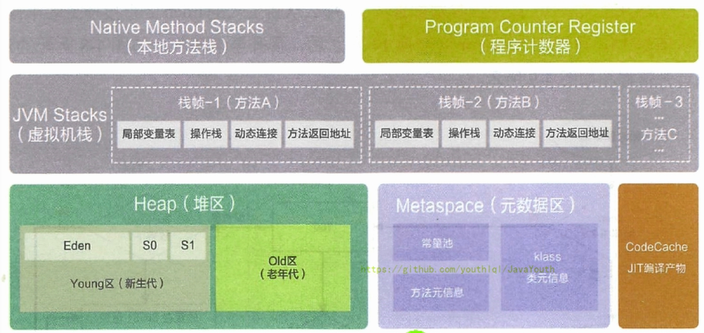

# jvm-基础

作者: fbk
时间：2023-1-28
地点：济南
## 运行时数据区

在上阶段经历类的加载-验证-准备-解析-初始化阶段完成后，会在运行时数据区（Runtime Data Area）进行

1. 内存是非常重要的系统资源，是硬盘和CPU的中间仓库及桥梁，承载着操作系统和应用程序的实时运行。JVM内存布局规定了Java在运行过程中内存申请、分配、管理的策略，保证了JVM的高效稳定运行。不同的JVM对于内存的划分方式和管理机制存在着部分差异。结合JVM虚拟机规范，来探讨一下经典的JVM内存布局。

2. 我们通过磁盘或者网络IO得到的数据，都需要先加载到内存中，然后CPU从内存中获取数据进行读取，也就是说内存充当了CPU和磁盘之间的桥梁


## 线程内存空间

其中红的是线程共享的，包括堆内存和方法去，绿色的是每个线程单独拥有的，包括本地方法栈，虚拟机栈，方法区
## runtime
每个JVM只有一个Runtime实例，即为运行时环境
## 线程
### JVM线程
1. 线程是一个程序运行单元，一个JVM中可以包含多个线程
2. 在HostPot JVM中，每个线程都与操作系统的线程映射
  - 在JVM中创建了一个线程，此时操作系统的本地线程也同时创建，操作系统会调用java线程的run方法，执行完后，java线程销毁，操作系统线程销毁
### JVM系统线程
1. 虚拟机线程
2. 周期任务线程
3. GC线程
4. 编译线程
5. 信号调度线程
## 程序计数器（PC计数器）
### 作用

`使用PC寄存器存储字节码指令地址有什么用呢？或者问为什么使用 PC 寄存器来记录当前线程的执行地址呢？`
1. 因为CPU需要不停切换线程，所以在线程切换完后，可以知道是从哪开始的
2. JVM的字节码解释器就需要通过改变PC寄存器的值来明确下一条应该执行什么样的字节码指令

`PC寄存器为什么被设定为私有的？`
1. 我们都知道所谓的多线程在一个特定的时间段内只会执行其中某一个线程的方法，CPU会不停地做任务切换，这样必然导致经常中断或恢复，如何保证分毫无差呢？为了能够准确地记录各个线程正在执行的当前字节码指令地址，最好的办法自然是为每一个线程都分配一个PC寄存器，这样一来各个线程之间便可以进行独立计算，从而不会出现相互干扰的情况。
2. 由于CPU时间片轮限制，众多线程在并发执行过程中，任何一个确定的时刻，一个处理器或者多核处理器中的一个内核，只会执行某个线程中的一条指令。
3. 这样必然导致经常中断或恢复，如何保证分毫无差呢？每个线程在创建后，都会产生自己的程序计数器和栈帧，程序计数器在各个线程之间互不影响。
## 本地方法栈
## 虚拟机栈
### 简介
1. 由于跨平台性的设计，java的指令都是根据栈来设计的，不同平台CPU的架构不同，所以不能设计为基于寄存器的【如果设计成基于寄存器的，耦合度高，性能会有所提升，因为可以对具体的CPU架构进行优化，但是跨平台性大大降低】。
2. 优点是跨平台，指令集小，编译器容易实现，缺点是性能下降，实现同样的功能需要更多的指令
### 内存中的栈和堆
1. 首先栈是运行时的单位，而堆是存储的单位。
2. 即：栈解决程序的运行问题，即程序如何执行，或者说如何处理数据。堆解决的是数据存储的问题，即数据怎么放，放哪里

### 基本内容
- 虚拟机栈是什么
  - java虚拟机栈，每个线程都会创建一个虚拟机栈，每个虚拟机栈储存多个栈帧，对应着一次次的java方法调用，栈是线程私有的
### 作用
- 主管java程序的运行，保存的是方法中的（8种基本数据，对象的引用地址），部分结果，方法的返回
### 特点
- 栈是一种快速有效的分配方式，访问速度仅次于程序计数器
- JVM直接对Java栈的操作只有两个：
  - 每个方法执行，伴随着进栈（入栈、压栈）
  - 执行结束后的出栈工作
- 对于栈来说不存在垃圾回收问题
- 栈不需要GC，但是可能存在OOM
### 虚拟机栈可能的异常
1. 当一个虚拟机栈的大小固定，每个线程创建请求的虚拟机栈容量超过虚拟机栈允许的最大容量，就会出现stackoverFlowError
2. java虚拟机栈会动态的扩展容量，如果没有申请到足够的内存，就会出现ssc（stackOutofMemory）
### 储存单位
- 每个线程都有自己的栈，栈中的数据都是以栈帧（Stack Frame）的格式存在
- 在这个线程上正在执行的每个方法都各自对应一个栈帧（Stack Frame）。
- 栈帧是一个内存区块，是一个数据集，维系着方法执行过程中的各种数据信息。
### 运行原理
### 内存结构
虚拟机中的每个栈帧都储存着

- 局部变量表
- 操作数栈
- 动态链接（或指向运行时常量池的方法引用）
- 方法返回地址
- 一些附加信息
## 局部变量表
1. 局部变量表也被称为局部变量表或本地变量表
2. 定义为一个数字数组，主要存储方法中的局部变量
3. 由于局部变量定义在线程的栈上，是线程的私有数据，因此不存在数据安全问题
4. 局部变量表所需的容量大小是在编译器时期确定的
5. 方法嵌套的次数由栈的大小决定，栈的内存越大，方法嵌套越多
6. 局部变量表中的变量只在当前的方法调用
```java
@Slf4j
public class Demo2 {

    private int count = 0;

    public static void main(String[] args) {
        Demo2 demo2 = new Demo2();
       demo2.Demo2();
    }
    public static void Demo1() {
        /**
         * 1. static是静态方法也叫类方法，在JVM初始化的时候，就会在内存分配一块内存，成为静态区
         * 2. this指向的是这个对象，this指针指向堆区中的类对象
         */
        int count = 1;
    }

    public void Demo2(){
        System.out.println(this);
        System.out.println(this.count);
    }

}
```
## 操作数栈
### 特点
1. 每个独立栈帧中除了包含局部变量表，还包括一个后进先出的操作数栈
2. 操作数栈，在方法执行的过程中，根据字节码指令，往栈中写入数据或者提取数据
3. 某些字节码指令压入操作数栈，其余的字节码在操作数栈出栈，并且把结果压入栈
### 作用
1. 操作数栈中，主要保存计算过程中的中间结果，为计算过程中的临时变量储存空间
2. JVM
### 操作
```java
public void testAddOperation() {
       //byte、short、char、boolean：都以int型来保存
       byte i = 15;
       int j = 8;
       int k = i + j;

      // int m = 800;

   }
```
```
 0 bipush 15
 2 istore_1
 3 bipush 8
 5 istore_2
 6 iload_1
 7 iload_2
 8 iadd
 9 istore_3
10 return
```

`分析`

可以看到使用javap -verbose后可以分析出，操作数栈是2，局部变量表是4，下面就来分析一下每个字节码执行的流程


1. 执行流程1其中pc寄存器记录打那个前指令地址为0，因为15可以是byte类型操作数栈将15入栈和出栈，最后转换为int类型储存在局部变量表中索引为1的位置，因为方法并不是一个static静态方法，所以局部变量表中的索引为0的位置是储存当前实例对象this


2. 程序计数器位置改变到2，在局部变量中储存15int类型


3. 和上述储存一样，依旧是将8储存到局部变量表中


4. 进行相加，首先在局部变量中加载15，8并且放进操作数栈


5. 字节码指令完成下相加操作局部变量表创建新的空间储存新变量
### 栈顶缓存技术
1. 因为在字节码执行的过程中，需要不断地在操作数栈中进行入栈和出栈的指令，所以会频繁的操作内存的读和写，也就必定会影响CPU的执行速度
2. 所以在HostPot JVM中采用的是栈顶缓存技术降低内存的读和写，将栈顶元素全部缓存在CPU的寄存器中
3. 寄存器的特点，指令更少，执行速度更快，但是指令集更多
#### 动态链接
1. 每一个栈帧内部都包含一个指向运行时常量池中该栈帧所属方法的引用。包含这个引用的目的就是为了支持当前方法的代码能够实现动态链接（Dynamic Linking），比如：invokedynamic指令
2. 在Java源文件被编译到字节码文件中时，所有的变量和方法引用都作为符号引用（Symbolic Reference）保存在class文件的常量池里。比如：描述一个方法调用了另外的其他方法时，就是通过常量池中指向方法的符号引用来表示的，那么动态链接的作用就是为了将这些符号引用转换为调用方法的直接引用
```java
public class DynamicLinkingTest {

    int num = 10;

    public void methodA(){
        System.out.println("methodA()....");
    }

    public void methodB(){
        System.out.println("methodB()....");

        methodA();

        num++;
    }

}
```

```java
Classfile /F:/IDEAWorkSpaceSourceCode/JVMDemo/out/production/chapter05/com/atguigu/java1/DynamicLinkingTest.class
  Last modified 2020-11-10; size 712 bytes
  MD5 checksum e56913c945f897c7ee6c0a608629bca8
  Compiled from "DynamicLinkingTest.java"
public class com.atguigu.java1.DynamicLinkingTest
  minor version: 0
  major version: 52
  flags: ACC_PUBLIC, ACC_SUPER
Constant pool:
   #1 = Methodref          #9.#23         // java/lang/Object."<init>":()V
   #2 = Fieldref           #8.#24         // com/atguigu/java1/DynamicLinkingTest.num:I
   #3 = Fieldref           #25.#26        // java/lang/System.out:Ljava/io/PrintStream;
   #4 = String             #27            // methodA()....
   #5 = Methodref          #28.#29        // java/io/PrintStream.println:(Ljava/lang/String;)V
   #6 = String             #30            // methodB()....
   #7 = Methodref          #8.#31         // com/atguigu/java1/DynamicLinkingTest.methodA:()V
   #8 = Class              #32            // com/atguigu/java1/DynamicLinkingTest
   #9 = Class              #33            // java/lang/Object
  #10 = Utf8               num
  #11 = Utf8               I
  #12 = Utf8               <init>
  #13 = Utf8               ()V
  #14 = Utf8               Code
  #15 = Utf8               LineNumberTable
  #16 = Utf8               LocalVariableTable
  #17 = Utf8               this
  #18 = Utf8               Lcom/atguigu/java1/DynamicLinkingTest;
  #19 = Utf8               methodA
  #20 = Utf8               methodB
  #21 = Utf8               SourceFile
  #22 = Utf8               DynamicLinkingTest.java
  #23 = NameAndType        #12:#13        // "<init>":()V
  #24 = NameAndType        #10:#11        // num:I
  #25 = Class              #34            // java/lang/System
  #26 = NameAndType        #35:#36        // out:Ljava/io/PrintStream;
  #27 = Utf8               methodA()....
  #28 = Class              #37            // java/io/PrintStream
  #29 = NameAndType        #38:#39        // println:(Ljava/lang/String;)V
  #30 = Utf8               methodB()....
  #31 = NameAndType        #19:#13        // methodA:()V
  #32 = Utf8               com/atguigu/java1/DynamicLinkingTest
  #33 = Utf8               java/lang/Object
  #34 = Utf8               java/lang/System
  #35 = Utf8               out
  #36 = Utf8               Ljava/io/PrintStream;
  #37 = Utf8               java/io/PrintStream
  #38 = Utf8               println
  #39 = Utf8               (Ljava/lang/String;)V
{
  int num;
    descriptor: I
    flags:

  public com.atguigu.java1.DynamicLinkingTest();
    descriptor: ()V
    flags: ACC_PUBLIC
    Code:
      stack=2, locals=1, args_size=1
         0: aload_0
         1: invokespecial #1                  // Method java/lang/Object."<init>":()V
         4: aload_0
         5: bipush        10
         7: putfield      #2                  // Field num:I
        10: return
      LineNumberTable:
        line 7: 0
        line 9: 4
      LocalVariableTable:
        Start  Length  Slot  Name   Signature
            0      11     0  this   Lcom/atguigu/java1/DynamicLinkingTest;

  public void methodA();
    descriptor: ()V
    flags: ACC_PUBLIC
    Code:
      stack=2, locals=1, args_size=1
         0: getstatic     #3                  // Field java/lang/System.out:Ljava/io/PrintStream;
         3: ldc           #4                  // String methodA()....
         5: invokevirtual #5                  // Method java/io/PrintStream.println:(Ljava/lang/String;)V
         8: return
      LineNumberTable:
        line 12: 0
        line 13: 8
      LocalVariableTable:
        Start  Length  Slot  Name   Signature
            0       9     0  this   Lcom/atguigu/java1/DynamicLinkingTest;

  public void methodB();
    descriptor: ()V
    flags: ACC_PUBLIC
    Code:
      stack=3, locals=1, args_size=1
         0: getstatic     #3                  // Field java/lang/System.out:Ljava/io/PrintStream;
         3: ldc           #6                  // String methodB()....
         5: invokevirtual #5                  // Method java/io/PrintStream.println:(Ljava/lang/String;)V
         8: aload_0
         9: invokevirtual #7                  // Method methodA:()V
        12: aload_0
        13: dup
        14: getfield      #2                  // Field num:I
        17: iconst_1
        18: iadd
        19: putfield      #2                  // Field num:I
        22: return
      LineNumberTable:
        line 16: 0
        line 18: 8
        line 20: 12
        line 21: 22
      LocalVariableTable:
        Start  Length  Slot  Name   Signature
            0      23     0  this   Lcom/atguigu/java1/DynamicLinkingTest;
}
SourceFile: "DynamicLinkingTest.java"
```
在解析后的字节码中可以看到在methodB中调用了methodA方法，字节码指令是`invokevirtual #7`,调用num属性的时候的字节码指令是`getfield      #2`,在上述字节码文件中，我们看到有一个区域名为Constant Pool,成为常量池，在学习String基础的时候，我们经常听到String是储存在方法区的常量池中，最左边的符号也就是符号引用
```java
   #7 = Methodref          #8.#31         // com/atguigu/java1/DynamicLinkingTest.methodA:()
```
#7中调用了方法的引用

为什么要使用常量池
1. 因为在不同的方法中，都可能调用常量或者方法，所以只要储存一份，在使用的时候去调用，节省空间
2. 常量池的作用：提供一份符号或者常量，便于指令识别
### 方法调用
#### 动态链接和静态链接
- 静态链接

当一个字节码文件被装载到JVM内部中，如果被调用的目标方法在在编译时期确定，且运行的时候不会发生改变，这种情况下调用方法的符号引用转化为直接引用的过程成为静态链接
- 动态链接

如果被调用的方法在编译期无法被确定下来，也就是说，只能够在程序运行期将调用的方法的符号转换为直接引用，由于这种引用转换过程具备动态性，因此也被称之为动态链接。
#### 早期绑定和晚期绑定
#### 动态语言和静态语言
1. 动态类型语言和静态类型语言两者的区别就在于对类型的检查是在编译期还是在运行期，满足前者就是静态类型语言，反之是动态类型语言。
2. 说的再直白一点就是，静态类型语言是判断变量自身的类型信息；动态类型语言是判断变量值的类型信息，变量没有类型信息，变量值才有类型信息，这是动态语言的一个重要特征。
> java是静态语言，js是动态语言
```java
int age=18;//在编译时期就进行检查
```
```js
var age=1;//在运行时期检查
```
```python
# 运行时期检查
age=18 
```
#### java重写方法的本质
1. 找到操作数栈顶的第一个元素所执行的对象的实际类型，记作C。
2. 如果在类型C中找到与常量中的描述符合简单名称都相符的方法，则进行访问权限校验。
 - 如果通过则返回这个方法的直接引用，查找过程结束
 - 如果不通过，则返回java.lang.IllegalAccessError 异常
3. 否则，按照继承关系从下往上依次对C的各个父类进行第2步的搜索和验证过程。
4. 如果始终没有找到合适的方法，则抛出java.lang.AbstractMethodError异常。
## 方法返回地址
1. 存放调用该方法的PC寄存器的值，一个方法的结束，有两种情况
  - 正常执行
  - 出现异常情况，非正常退出
2. 无论是哪种方式退出，在方法退出后都返回该方法被调用的位置，方法正常退出的时候，调用者pc计数器的值作为返回地址，调用该方法的指令的下一条指令，通过异常信息返回，返回地址是通过异常表确定
3. 本质上，方法的退出就是当前栈帧出栈的过程。此时，需要恢复上层方法的局部变量表、操作数栈、将返回值压入调用者栈帧的操作数栈、设置PC寄存器值等，让调用者方法继续执行下去。
4. 正常完成出口和异常完成出口的区别在于：通过异常完成出口退出的不会给他的上层调用者产生任何的返回值。
## 面试题
### 举例栈溢出的情况
- 如果内存空间不足，在虚拟机栈分配内存的时候得不到计划分配的内存大小，就会出现sdf
- 因为虚拟机栈内存是动态变化的，就可能出现oom
### 调正栈大小，就能保证栈不溢出吗
不能保证，只能降低sdf概率
### 分配的栈内存越大越好吗
不是，一定时间降低了oom的概率，但是会挤占其他的线程空间，因为整个虚拟机的内存空间是有限的
### 垃圾回收是否涉及到了虚拟机栈
不会

### 方法中定义的局部变量是否线程安全？
- 单线程操作，局部变量安全
- 多线程同时操作局部变量，可能存在不安全
