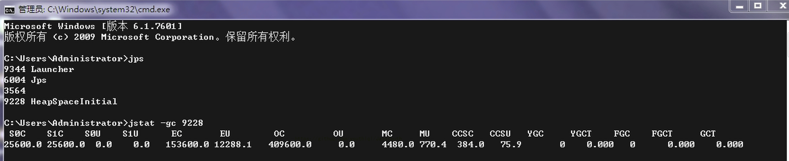
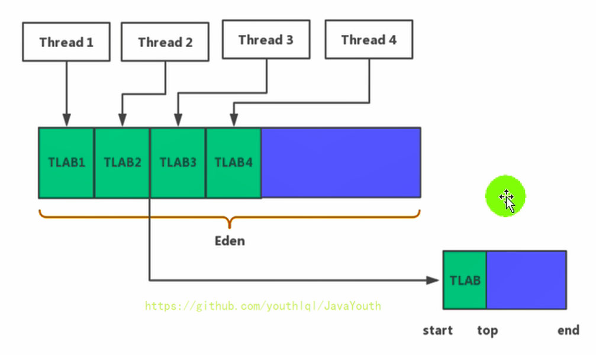

# jvm-堆

作者: fbk
时间：2023-1-30
地点：济南

## 堆核心
### 堆与进程
1. 一个进程中只有一个JVM实例，一个JVM实例只有一个运行时数据区，一个运行时数据区只有一个堆和方法区
2. 进程包含多个线程，共享同一堆空间
3. JVM堆区域在JVM启动时就创建了，空间大小也就确定了，堆是JVM管理的最大的内存空间，并且堆是可以调节的
4. 堆可以处于物理上不连续的内存空间，但是逻辑上可以视为连续的
5. 所有的线程可以共享堆，并且还可以划分线程私有的缓冲区
6. 数组和对象可能永远不会存储在栈上（不一定），因为栈帧中保存引用，这个引用指向对象或者数组在堆中的位置。
7. 在方法结束后，堆中的对象不会马上移除，仅仅在垃圾收集的时候才会移除
  - 也就是触发了GC的时候，才会进行回收
  - 如果堆中对象马上被回收，那么用户线程就会收到影响，因为有stop the word
```java
public class SimpleHeap {
    private int id;//属性、成员变量

    public SimpleHeap(int id) {
        this.id = id;
    }

    public void show() {
        System.out.println("My ID is " + id);
    }
    public static void main(String[] args) {
        SimpleHeap sl = new SimpleHeap(1);
        SimpleHeap s2 = new SimpleHeap(2);

        int[] arr = new int[10];

        Object[] arr1 = new Object[10];
    }
}
```

### 堆内存细分
1. java7之前堆内存逻辑上分为新生区+养老区+永久区
2. java8之后分为新生区+养老区+元空间
3. 约定：新生区 <–> 新生代 <–> 年轻代 、 养老区 <–> 老年区 <–> 老年代、 永久区 <–> 永久代
## 设置堆内存大小和OOM
1. java堆区用于储存java对象实例，可以通过`-Xms(最小)`和`-Xmx(最大)`查看
2. 一旦堆区超过最大的-Xmx，就会出现OOM现象
3. 默认情况下
  - 最小内存是物理电脑内存大小的1/64
  - 最大内存是物理电脑的1/4
```java
   //返回java虚拟的的堆总内存
        long initialMemory = Runtime.getRuntime().totalMemory() / 1024 / 1024;

        //获取虚拟机使用的最大内存

        long maxMemory = Runtime.getRuntime().maxMemory() / 1024 / 1024;

        System.out.println("-Xms : " + initialMemory + "M");
        System.out.println("-Xmx : " + maxMemory + "M");

        System.out.println("系统内存大小为：" + initialMemory * 64.0 / 1024 + "G");
        System.out.println("系统内存大小为：" + maxMemory * 4.0 / 1024 + "G");
```
```
-Xms : 241M
-Xmx : 3580M
系统内存大小为：15.0625G
系统内存大小为：13.984375G
```
电脑是16G内存，因为操作系统还占据部分内存

输出结果
```
-Xms : 575M
-Xmx : 575M
```
为什么会少25M
>使用JPS查看java进程
>使用tstat -gc进程ID

```
SOC: S0区总共容量
S1C: S1区总共容量
S0U: S0区使用的量
S1U: S1区使用的量
EC: 伊甸园区总共容量
EU: 伊甸园区使用的量
OC: 老年代总共容量
OU: 老年代使用的量
```
S0或者S1只能使用一个，另一个用不了，所以就造成了栈内存比定义的内存少25M
### OOM
```java
    private static void Demo2(){
        List<Picture> list=new ArrayList<>();

        while (true){
            try{
                Thread.sleep(20);
            }catch (InterruptedException e){
                e.printStackTrace();
            }
            list.add(new Picture(new Random().nextInt(1024 * 1024)));
        }
    }
class Picture{
    private byte[] bytes;

    public Picture(int length) {
        this.bytes=new byte[length];
    }
}
```
输出结果
```java
Exception in thread "main" java.lang.OutOfMemoryError: Java heap space
	at com.atguigu.java.Picture.<init>(OOMTest.java:29)
	at com.atguigu.java.OOMTest.main(OOMTest.java:20)

Process finished with exit code 1
```
1. 堆内存变化

2. 大对象导致堆内存溢出

## 年轻代与老年代
1. 储存在JVM中的java对象可以划分为两类
  - 一类是生命周期较短的瞬间对象，这类对象的创建和消亡都非常迅速
  - 另一类生命对象的周期很长，在某些极端的情况下还能够与JVM生命周期保持一致
2. java堆区可以划分为年轻代和老年代
3. 年轻代又有Eden区，Survivor0和Survivor0
4. 新生代和老年代的分配
  - 默认**-XX:NewRatio**=2，表示新生代占1，老年代占2，新生代占整个堆的1/3
  - 可以修改**-XX:NewRatio**=4，表示新生代占1，老年代占4，新生代占整个堆的1/5
5. 在HotSpot虚拟机下，Eden和另外两个survivor的比例是8：1：1，并且可以调整-XX:SurvivorRatio=8
6. 几乎所有的java对象都是在Eden创建出来的
7. 可以使用选项”-Xmn”设置新生代最大内存大小，但这个参数一般使用默认值就可以了。
## 对象分配过程
1. new的对象先放在Eden区，此区大小有限制
2. 当Eden空间填满，当需要创建对象，JVM垃圾回收器对Eden进行垃圾回收，没有被回收的对象放入from区（有可能是s1区，或者是s2区）
3. 当Eden区满，继续进行GC，并且survivor区也要进行GC，他们的年龄不断增加，如果没有回收，继续进行survivor区切换，从form区变为to区，之后from区变为to区，to区变为from区
4. 当对象的年龄到达15，对象放入老年代
### 特殊情况
1. 如果新对象放入Eden，先看Eden是否放得下
  - 如果Eden放得下，则放入Eden区
  - 如果Eden放不下，首先进行YGC,执行垃圾回收，看看是否放得下
2. 将对象放入到老年区有两种情况
  - 如果 Eden 执行了 YGC 还是无法放不下该对象，那没得办法，只能说明是超大对象，只能直接放到老年代
  - 那万一老年代都放不下，则先触发FullGC ，再看看能不能放下，放得下最好，但如果还是放不下，那只能报 OOM
3. 如果 Eden 区满了，将对象往幸存区拷贝时，发现幸存区放不下啦，那只能便宜了某些新对象，让他们直接晋升至老年区

## GC分类
1. JVM调优的环节，需要尽量避免垃圾回收，因为在垃圾回收中，容易出现（STW），`而 Major GC 和 Full GC出现STW的时间，是Minor GC的10倍以上`
2. JVM在进行GC时，并非每次都对上面三个内存区域一起回收的，大部分时候回收的都是指新生代。针对Hotspot VM的实现，它里面的GC按照回收区域又分为两大种类型：一种是`部分收集（Partial GC）`，一种是`整堆收集（FullGC）`
- 部分收集
  - 新生代收集（Minor GC/Young GC）：只是新生代（Eden，s0，s1）的垃圾收集
  - 老年代收集（Major GC/Old GC）：只是老年代的圾收集。
  - 混合收集（Mixed GC）：收集整个新生代以及部分老年代的垃圾收集。目前，只有G1 GC会有这种行为
- 整堆收集（Full GC）
### young GC==Minor GC
1. 当年轻代空间不足时，就会触发Minor GC，这里的年轻代满指的是Eden代满。Survivor满不会主动引发GC，在Eden区满的时候，会顺带触发s0区的GC，也就是被动触发GC（每次Minor GC会清理年轻代的内存）
2. 因为Java对象大多都具备朝生夕灭的特性，所以Minor GC非常频繁，一般回收速度也比较快。这一定义既清晰又易于理解。
### Major GC
1. 发生在老年代的GC
2. 出现在MajorGC，会伴随至少一次MinorGC
   - 在老年代空间不足的时候，也要进行一次MinorGC，很奇怪
3. MajorGC一般比MinorGC慢10倍，发生STW的几率也大
4. 如果MajorGC内存不足的时候，就会出现OOM
### FullGC
`出现的情况`

1. 调用System.gc(),系统建议FullGC，但是不一定执行
2. 老年代空间不足
3. 方法区空间不足
4. 通过Minor GC后进入老年代的平均大小大于老年代的可用内存
5. 由Eden区、survivor space0（From Space）区向survivor space1（To Space）区复制时，对象大小大于To Space可
用内存，则把该对象转存到老年代，且老年代的可用内存小于该对象大小
6. 在java调优的时候一定要减少FullGC，这样STW时间会减少

## 堆空间分配
为什么要把java堆进行分配，因为在不同的生命周期下，70%-99%的对象都是临时对象
1. 如果没有分代，所有的对象都被存在统一内存中，那么GC找对象就在所有的所有的内存中进行，性能太低
2. 但是很多对象都是朝升夕死的，如果分代的话，把新创建的对象放在某一个地方，当GC的时候先把这个朝升夕死对象的区域进行回收
### 分配原则
1. 大对象直接进入老年代（尽量要避免大对象）
2. 长期存活的对象分配到老年代
3. 优先分配到Eden：开发中比较长的字符串或者数组，会直接存在老年代，但是因为新创建的对象都是朝生夕死的，所以这个大对象可能也很快被回收，但是因为老年代触发Major GC的次数比 Minor GC要更少，因此可能回收起来就会比较慢
4. 动态对象年龄判断：如果Survivor区中相同年龄的所有对象大小的总和大于Survivor空间的一半，年龄大于或等于该年龄的对象可以直接进入老年代，无须等到MaxTenuringThreshold中要求的年龄。
5. 空间分配担保： -XX:HandlePromotionFailure 。
## TLAB为对象分配内存（保证线程安全）
### 为什么有TALB
1. 堆区是线程共享的区域，任何线程都可以访问到堆区的共同区域
2. 对象在JVM创建频繁，并且在并发环境下从堆区中划分内存空间是线程不安全的
3. 为避免多个线程同时操作同一地址，需要使用加锁等机制，会影响性能
### 什么是TALB
1. 从内存模型而不是垃圾收集的角度，对Eden区域继续进行划分，JVM为每个线程分配了一个私有缓存区域，它包含在Eden空间内。
2. 多线程同时分配内存时，使用TLAB可以避免一系列的非线程安全问题，同时还能够提升内存分配的吞吐量，因此我们可以将这种内存分配方式称之为快速分配策略。

1. 每个线程都有一个TALB
2. 当一个线程的TLAB存满时，可以使用公共区域（蓝色）的
### TALB分配的过程
1. 尽管不是所有的对象实例都能在TALB分配空间，但是JVM仍将TALB作为分配空间的首选
2. 一旦JVM在TALB分配空间失败，JVM就会进行加锁操作，直接在Eden进行内存分配
3. 默认情况下，TLAB空间的内存非常小，仅占有整个Eden空间的1%，当然我们可以通过选项`-XX:TLABWasteTargetPercent`设置TLAB空间所占用Eden空间的百分比大小。
4. 在程序中，开发人员可以通过选项`-XX:UseTLAB`设置是否开启TLAB空间。


## 堆空间参数设置
```java
/**
 * 测试堆空间常用的jvm参数：
 * -XX:+PrintFlagsInitial : 查看所有的参数的默认初始值
 * -XX:+PrintFlagsFinal  ：查看所有的参数的最终值（可能会存在修改，不再是初始值）
 *      具体查看某个参数的指令： jps：查看当前运行中的进程
 *                             jinfo -flag SurvivorRatio 进程id
 *
 * -Xms：初始堆空间内存 （默认为物理内存的1/64）
 * -Xmx：最大堆空间内存（默认为物理内存的1/4）
 * -Xmn：设置新生代的大小。(初始值及最大值)
 * -XX:NewRatio：配置新生代与老年代在堆结构的占比
 * -XX:SurvivorRatio：设置新生代中Eden和S0/S1空间的比例
 * -XX:MaxTenuringThreshold：设置新生代垃圾的最大年龄
 * -XX:+PrintGCDetails：输出详细的GC处理日志
 * 打印gc简要信息：① -XX:+PrintGC   ② -verbose:gc
 * -XX:HandlePromotionFailure：是否设置空间分配担保
 */
```
### 空间分配担保
在进行Minor GC的时候，首先虚拟机会检查老年代最大可用的连续空间是否大于新生代所有的内存空间
 - 如果大于，此次GC是安全的
 - 如果小于，则虚拟机会查看**-XX:HandlePromotionFailure**设置值是否允担保失败。
   - 如果HandlePromotionFailure=true，那么会继续检查老年代的连续空间是否大于历次晋升到老年代的对象的平均大小
     - 如果大于，进行一次MinorGC
     - 如果小于，进行一次FullGC
   - 如果HandlePromotionFailure=false，则进行一次Full GC。
> JDK6 Update 24之后的规则变为只要老年代的连续空间大于新生代对象总大小或者历次晋升的平均大小就会进行Minor GC，否则将进行Full GC。即 HandlePromotionFailure=true
### 堆是分配空间的唯一选择吗
`在《深入理解Java虚拟机》中关于Java堆内存有这样一段描述：`
1. 随着JIT编译期的发展与逃逸分析技术逐渐成熟，栈上分配、标量替换优化技术将会导致一些微妙的变化，所有的对象都分配到堆上也渐渐变得不那么“绝对”了。
2. 在Java虚拟机中，对象是在Java堆中分配内存的，这是一个普遍的常识。但是，有一种特殊情况，那就是`如果经过逃逸分析（Escape Analysis）后发现，一个对象并没有逃逸出方法的话，那么就可能被优化成栈上分配`。这样就无需在堆上分配内存，也无须进行垃圾回收了。这也是最常见的堆外存储技术。
3. 此外，前面提到的基于OpenJDK深度定制的TaoBao VM，其中创新的GCIH（GC invisible heap）技术实现off-heap，将生命周期较长的Java对象从heap中移至heap外，并且GC不能管理GCIH内部的Java对象，以此达到降低GC的回收频率和提升GC的回收效率的目的。

### 逃逸分析
1. 如何将堆上的对象分配到栈，需要使用逃逸分析手段。
2. 这是一种可以有效减少Java程序中同步负载和内存堆分配压力的跨函数全局数据流分析算法。
3. 通过逃逸分析，Java Hotspot编译器能够分析出一个新的对象的引用的使用范围从而决定是否要将这个对象分配到堆上。
4. 逃逸分析的基本行为就是分析对象动态作用域：
  - 当一个对象在方法中被定义后，对象只在方法内部使用，则认为没有发生逃逸。
  - 当一个对象在方法中被定义后，它被外部方法所引用，则认为发生逃逸。例如作为调用参数传递到其他地方中。
#### 例子
没有发生逃逸现象的对象，可以分配到栈，随着方法的结束，栈空间就会被移除
```java
public void Demo1(){
  V v=new V();
  v=null;
}
```
下面的StringBuilder就会发生逃逸现象
```java
 public static StringBuilder Demo1(String s1,String s2){
        StringBuilder sb = new StringBuilder();
        sb.append(s1);
        sb.append(s2);
        return sb;
    }
```
如果想要StringBuilder不会出现逃逸的现象
```java
 public static String Demo1(String s1,String s2){
        StringBuilder sb = new StringBuilder();
        sb.append(s1);
        sb.append(s2);
        return sb.toString();
    }
```
```java

/**
 * 逃逸分析
 *
 *  如何快速的判断是否发生了逃逸分析，大家就看new的对象实体是否有可能在方法外被调用。
 */
public class EscapeAnalysis {

    public EscapeAnalysis obj;

    /*
    方法返回EscapeAnalysis对象，发生逃逸
     */
    public EscapeAnalysis getInstance(){
        return obj == null? new EscapeAnalysis() : obj;
    }
    /*
    为成员属性赋值，发生逃逸
     */
    public void setObj(){
        this.obj = new EscapeAnalysis();
    }
    //思考：如果当前的obj引用声明为static的？仍然会发生逃逸。

    /*
    对象的作用域仅在当前方法中有效，没有发生逃逸
     */
    public void useEscapeAnalysis(){
        EscapeAnalysis e = new EscapeAnalysis();
    }
    /*
    引用成员变量的值，发生逃逸
     */
    public void useEscapeAnalysis1(){
        EscapeAnalysis e = getInstance();
        //getInstance().xxx()同样会发生逃逸
    }
}
```
#### 总结
开发中可以适用局部变量的，就不要再外边方法定义
### 代码优化
1. `栈上分配`：将堆分配转化为栈分配。如果一个对象在子程序中被分配，要使指向该对象的指针永远不会发生逃逸，对象可能是栈上分配的候选，而不是堆上分配
2. `同步省略`：如果一个对象被发现只有一个线程被访问到，那么对于这个对象的操作可以不考虑同步。
3. ``