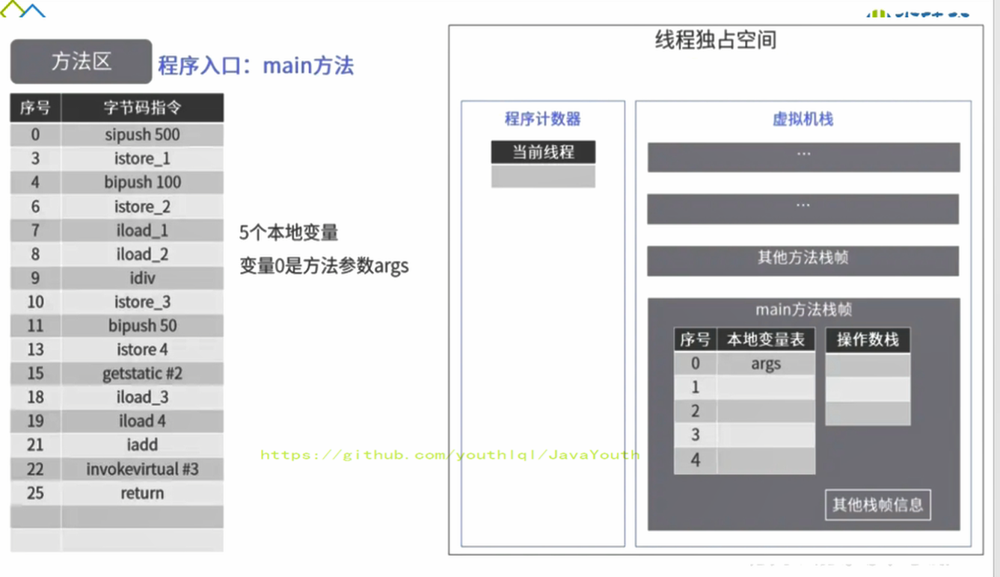
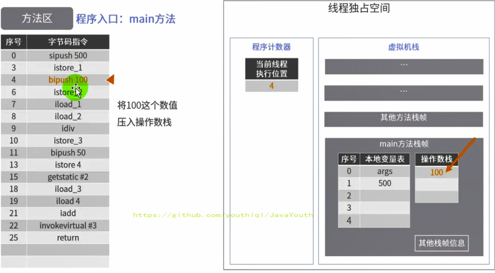
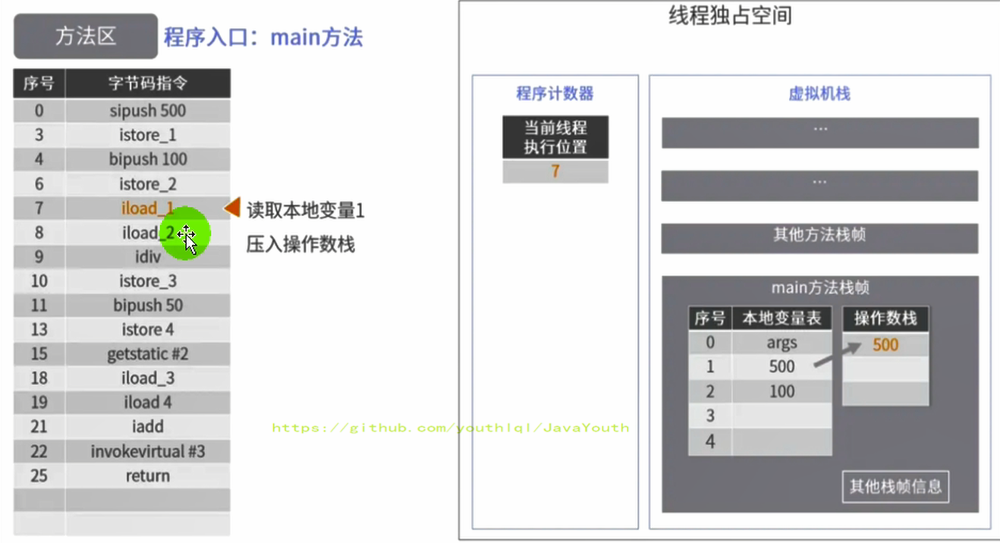
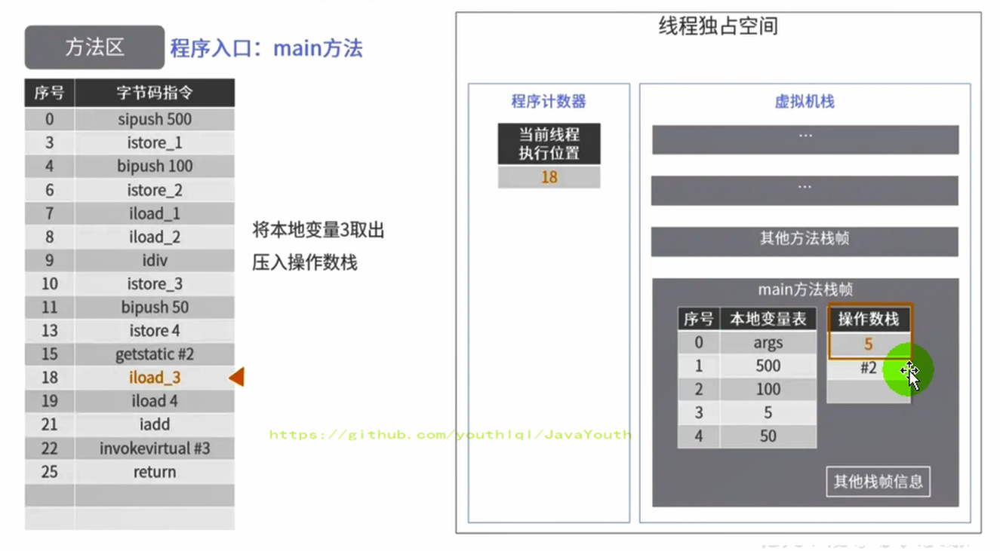

# jvm-方法区

作者: fbk
时间：2023-2-1
地点：济南

## 方法区
### 栈-堆-方法区
`ThreadLocal`:如何保证多个线程在并发环境的安全性

```java
Person person=new Person();
```

1. Person类.class存在在方法区
2. person变量存在java栈的局部变量表中
3. 真正的person对象存放在java堆中
4. 在person对象中，有个指针指向方法区的person类型数据，表明这个person对象是用方法区的Person类new出来的

## 方法区理解
### 方法区在哪
1. 《Java虚拟机规范》中明确说明：尽管所有的方法区在逻辑上是属于堆的一部分，但一些简单的实现可能不会选择去进行垃圾收集或者进行压缩。但对于HotSpotJVM而言，方法区还有一个别名叫做Non-Heap（非堆），目的就是要和堆分开。
2. 方法区可以看作是独立存在于java堆的内存空间
### 方法区基本理解
`方法区主要是存放Class，而堆中主要存放实例对象`
1. 方法区是多线程共享的对象，是各个线程存在的共享区域，多个线程同时加载一个类的时候，只有一个线程能加载该类，其他的线程只能等待，等类加载完毕，其他线程可以直接使用该类，`类的加载只能一次`
2. 方法区在JVM启动的时候被创建，并且他的实际物理内存空间中和java堆区一样是不连续的
3. 方法区的大小，跟堆空间一样，可以选择固定的大小，或者拓展
4. 方法区的大小决定了系统可以保存多少类，如果系统定义了太多的类，导致方法区溢出，虚拟机同样会抛出内存溢出错误：`java.lang.OutofMemoryError:PermGen space`或者`java.lang.OutOfMemoryError:Metaspace`
  - 加载大量的jar包
  - Tomcat部署的工程过多
  - 大量的动态的生成反射类
5. 关闭JVM就会释放这个内存的区域
```JAVA
public class MethodAreaDemo {
    public static void main(String[] args) {
        System.out.println("start...");
        try {
            Thread.sleep(1000000);
        } catch (InterruptedException e) {
            e.printStackTrace();
        }

        System.out.println("end...");
    }
}
```
`加载了1600多类`

### HotSpot方法区演进
1. 在JDK7中，习惯把方法区称为永久代，在JDK8中，使用元空间代替永久代，可以把方法区比作java接口，永久代或者元空间比作java中具体的实现类
2. 本质上，方法区和永久代不等价，但是在HotSpot可以看作是等价的
3. 而到了JDK8，终于完全废弃了永久代的概念，改用与JRockit、J9一样在本地内存中实现的元空间（Metaspace）来代替
4. 元空间和永久代类似，都是JVM方法区的实现，元空间和永久代的最大区别是元空间直接使用物理内存，而永久代使用的是虚拟机中的内存

## 设置方法区的大小和OOM
> 方法区的大小是可以改变的
### JDK8
1. 元空间的数据大小可以用`-XX:MetaspaceSize 和 -XX:MaxMetaspaceSize `设定
2. 默认值依赖于平台，Windows下，-XX:MetaspaceSize 约为21M，-XX:MaxMetaspaceSize的值是-1，即没有限制。
3. 与永久代不同，如果不指定大小，默认情况下，虚拟机会耗尽所有的可用系统内存。如果元数据区发生溢出，虚拟机一样会抛出异常OutOfMemoryError:Metaspace
4. -XX:MetaspaceSize：设置初始的元空间大小。对于一个 64位 的服务器端 JVM 来说，其默认的 -XX:MetaspaceSize值为21MB。这就是初始的高水位线，一旦触及这个水位线，Full GC将会被触发并卸载没用的类（即这些类对应的类加载器不再存活），然后这个高水位线将会重置。新的高水位线的值取决于GC后释放了多少元空间。如果释放的空间不足，那么在不超过MaxMetaspaceSize时，适当提高该值。如果释放空间过多，则适当降低该值。
5. 如果初始化的高水位线设置过低，上述高水位线调整情况会发生很多次。通过垃圾回收器的日志可以观察到Full GC多次调用。为了避免频繁地GC，建议将-XX:MetaspaceSize设置为一个相对较高的值。
### 方法区OOM
代码：OOMTest类继承ClassLoader类，获取defineClass（）方法，可以进行类加载
```java
    public static void main(String[] args) {
        int j=0;
        try{
            OOMTest oomTest = new OOMTest();
            for (int i = 0; i < 10000; i++) {
                //创建classWriter对象，用于生成二进制字节码
                ClassWriter classWriter = new ClassWriter(0);
                //指明版本号，修饰符，类名，包名，父类，接口
                classWriter.visit(Opcodes.V1_8, Opcodes.ACC_PUBLIC, "Class" + i, null, "java/lang/Object", null);
                //返回byte[]
                byte[] code = classWriter.toByteArray();
                //类的加载
                oomTest.defineClass("Class" + i, code, 0, code.length);//Class对象
                j++;
            }
        }finally {
            System.out.println(j);
        }
    }
```
如果不设置元空间上限

`输出结果`
```
10000
```

设置元空间的上限

`-XX:MetaspaceSize=10m -XX:MaxMetaspaceSize=10m`

```
8531
Exception in thread "main" java.lang.OutOfMemoryError: Metaspace
	at java.lang.ClassLoader.defineClass1(Native Method)
	at java.lang.ClassLoader.defineClass(ClassLoader.java:763)
	at java.lang.ClassLoader.defineClass(ClassLoader.java:642)
	at com.atguigu.java.OOMTest.main(OOMTest.java:29)
```

### 如何解决OOM
1. 要解决OOM异常或heap space的异常，一般的手段是首先通过内存映像分析工具（如Ec1ipse Memory Analyzer）对dump出来的堆转储快照进行分析，重点是确认内存中的对象是否是必要的，也就是要先分清楚到底是出现了内存泄漏（Memory Leak）还是内存溢出（Memory Overflow）
2. 内存泄漏就是有大量的引用指向某些对象，但是这些对象以后不会使用了，但是因为它们还和GC ROOT有关联，所以导致以后这些对象也不会被回收，这就是内存泄漏的问题
3. 如果是内存泄漏，可进一步通过工具查看泄漏对象到GC Roots的引用链。于是就能找到泄漏对象是通过怎样的路径与GC Roots相关联并导致垃圾收集器无法自动回收它们的。掌握了泄漏对象的类型信息，以及GC Roots引用链的信息，就可以比较准确地定位出泄漏代码的位置。
4. 如果不存在内存泄漏，换句话说就是内存中的对象确实都还必须存活着，那就应当检查虚拟机的堆参数（-Xmx与-Xms），与机器物理内存对比看是否还可以调大，从代码上检查是否存在某些对象生命周期过长、持有状态时间过长的情况，尝试减少程序运行期的内存消耗。
## 方法区的内部结构
### 方法区的储存
#### 概念
《深入理解Java虚拟机》书中对方法区（Method Area）存储内容描述如下：它用于存储已`被虚拟机加载的类型信息、常量、静态变量、即时编译器编译后的代码缓存等`。

`类型信息`

不管是class，interface，enum，annotation，JVM必须在方法区储存一下信息
1. 这个类型的完整有效名是（全名=包名.类名）
2. 这个类型直接父类的完整有效名（对于interface或是java.lang.Object，都没有父类）
3. 这个类型的修饰符（final，public，abstract）
4. 这个类型直接接口的有序列表


`域`
>常说的成员变量
1. JVM必须在方法区中保存类型所有域的相关信息以及域的声明顺序
2. 域的相关信息：域名称，域类型，域修饰符（public，private，protected，static，final，volatile，transient的某个子集）

`方法信息`

1. 方法名称
2. 方法的返回类型（包括void类型），void在class中对应的void.class
3. 方法参数的数量和类型
4. 方法的修饰符（public，private，protected，static，final，synchronized，native，abstract的一个子集）
5. 方法的字节码（bytecodes），操作数栈，局部变量表及大小（abstract和native方法除外）
6. 异常表（abstract和native方法除外），异常表记录每个异常处理的开始位置、结束位置、代码处理在程序计数器中的偏移地址、被捕获的异常类的常量池索引
```java
public class MethodInnerStructTest extends Object implements Comparable<String>, Serializable {
    private int num=10;

    private static String str="测试方法的内部结构";

    public void test1(){
        int count = 20;
        System.out.println("count = " + count);
    }
    public static int test2(int cal){
        int result = 0;
        try {
            int value = 30;
            result = value / cal;
        } catch (Exception e) {
            e.printStackTrace();
        }
        return result;
    }
    @Override
    public int compareTo(String o) {
        return 0;
    }
}
```
`javap -v -p MethodInnerStrucTest.class > test.txt`

`类型信息`
```
//类型信息      
public class com.atguigu.java.MethodInnerStrucTest extends java.lang.Object implements java.lang.Comparable<java.lang.String>, java.io.Serializable
```
`域信息`
```
//域信息
  public int num;
    descriptor: I
    flags: ACC_PUBLIC

  private static java.lang.String str;
    descriptor: Ljava/lang/String;
    flags: ACC_PRIVATE, ACC_STATIC
```

`方法信息`
1. descriptor: ()V 表示方法返回值类型为 void
2. flags: ACC_PUBLIC 表示方法权限修饰符为 public
3. stack=3 表示操作数栈深度为 3
4. locals=2 表示局部变量个数为 2 个（实力方法包含 this）
5. test1() 方法虽然没有参数，但是其 args_size=1 ，这时因为将 this 作为了参数
```java
public void test1();
    descriptor: ()V
    flags: ACC_PUBLIC
    Code:
      stack=3, locals=2, args_size=1
         0: bipush        20
         2: istore_1
         3: getstatic     #3                  // Field java/lang/System.out:Ljava/io/PrintStream;
         6: new           #4                  // class java/lang/StringBuilder
         9: dup
        10: invokespecial #5                  // Method java/lang/StringBuilder."<init>":()V
        13: ldc           #6                  // String count =
        15: invokevirtual #7                  // Method java/lang/StringBuilder.append:(Ljava/lang/String;)Ljava/lang/StringBuilder;
        18: iload_1
        19: invokevirtual #8                  // Method java/lang/StringBuilder.append:(I)Ljava/lang/StringBuilder;
        22: invokevirtual #9                  // Method java/lang/StringBuilder.toString:()Ljava/lang/String;
        25: invokevirtual #10                 // Method java/io/PrintStream.println:(Ljava/lang/String;)V
        28: return
      LineNumberTable:
        line 17: 0
        line 18: 3
        line 19: 28
      LocalVariableTable:
        Start  Length  Slot  Name   Signature
            0      29     0  this   Lcom/atguigu/java/MethodInnerStrucTest;
            3      26     1 count   I

```
### non-final类型的类变量
1. 静态变量和类关联在一起，随着类加载
2. 类变量和类实例共享，即使没有类实例，不创建实例就可以访问
```java
    public static void Demo2(){
        Order order=null;

        System.out.println(order.count);

        order.hello();
    }

class Order{
    static int count=1;

    public static final int number=1;

    public static void hello(){
        System.out.println("hello");
    }
}
```
```
hello!
1
```
### 全局常量static-final
1. 全局常量是`static final`修饰的
2. 全局常量在编译阶段就分配了内存
3. 全局变量是在链接（准备阶段）分配内存的
```java
class Order {
    public static int count = 1;
    public static final int number = 2;
    ...
}    
```
```java
class Order {
    public static int count = 1;
    public static final int number = 2;
    ...
}    
```
### 运行时常量池
1. 方法区，内部包含了运行时常量池
2. 字节码文件，内部包含了常量池。（之前的字节码文件中已经看到了很多Constant pool的东西，这个就是常量池）
3. 要弄清楚方法区，需要理解清楚ClassFile，因为加载类的信息都在方法区。
4. 要弄清楚方法区的运行时常量池，需要理解清楚ClassFile中的常量池。

### 常量池
1. 一个有效的字节码文件中除了包含类的版本信息、字段、方法以及接口等描述符信息外。还包含一项信息就是常量池表（Constant Pool Table），包括各种字面量和对类型、域和方法的符号引用。
2. 字面量： 10 ， “我是某某”这种数字和字符串都是字面量
`为什么需要常量池`
1. 一个java源文件中的类、接口，编译后产生一个字节码文件。而Java中的字节码需要数据支持，通常这种数据会很大以至于不能直接储存到字节码中，但是可以储存到常量池，这个字节码包含了指向常量池引用，在动态链接的时候会用到运行时常量池
```java
public class SimpleClass {
    public void sayHello() {
        System.out.println("hello");
    }
}
```
1. 虽然上述代码只有194字节，但是里面却使用了String、System、PrintStream及Object等结构。
2. 比如说我们这个文件中有6个地方用到了”hello”这个字符串，如果不用常量池，就需要在6个地方全写一遍，造成臃肿。我们可以将”hello”等所需用到的结构信息记录在常量池中，并通过引用的方式，来加载、调用所需的结构
3. 这里的代码量其实很少了，如果代码多的话，引用的结构将会更多，这里就需要用到常量池了。

`常量池存储的数据`

1. 数量值
2. 字符串值
3. 类引用
4. 字段引用
5. 方法引用
`常量池引用`
常量池可以看作是一张表，虚拟机指令根据这张常量表找到要执行的类名、方法名、参数类型、字面量等类型。
### 运行时常量池
1. 运行时常量池是方法区的一部分
2. 常量池表是class字节码文件的一部分，用于存放编译器生成的各种字面量与符号引用，`这部分内容将类加载后存放到方法区的运行时常量池`
3. 运行时常量池，在加载类和接口到虚拟机后，就会创建运行时常量池
4. JVM为每个已加载的类型（类或接口）都维护一个常量池。池中的数据项像数组项一样，是通过索引访问的。
5. 运行时常量池中包含多种不同的常量，包括编译期就已经明确的数值字面量，也包括到运行期解析后才能够获得的方法或者字段引用。此时不再是常量池中的符号地址了，这里换为真实地址。
6. 运行时常量池，相对于Class文件常量池的另一重要特征是：具备动态性。
7. 运行时常量池类似于传统编程语言中的符号表（symbol table），但是它所包含的数据却比符号表要更加丰富一些。
8. 当创建类或接口的运行时常量池时，如果构造运行时常量池所需的内存空间超过了方法区所能提供的最大值，则JVM会抛OutofMemoryError异常。

## 方法区使用
```java
public class MethodAreaDemo {
    public static void main(String[] args) {
        int x = 500;
        int y = 100;
        int a = x / y;
        int b = 50;
        System.out.println(a + b);
    }
}
```
```
public class com.atguigu.java1.MethodAreaDemo
  minor version: 0
  major version: 51
  flags: ACC_PUBLIC, ACC_SUPER
Constant pool:
   #1 = Methodref          #5.#24         // java/lang/Object."<init>":()V
   #2 = Fieldref           #25.#26        // java/lang/System.out:Ljava/io/PrintStream;
   #3 = Methodref          #27.#28        // java/io/PrintStream.println:(I)V
   #4 = Class              #29            // com/atguigu/java1/MethodAreaDemo
   #5 = Class              #30            // java/lang/Object
   #6 = Utf8               <init>
   #7 = Utf8               ()V
   #8 = Utf8               Code
   #9 = Utf8               LineNumberTable
  #10 = Utf8               LocalVariableTable
  #11 = Utf8               this
  #12 = Utf8               Lcom/atguigu/java1/MethodAreaDemo;
  #13 = Utf8               main
  #14 = Utf8               ([Ljava/lang/String;)V
  #15 = Utf8               args
  #16 = Utf8               [Ljava/lang/String;
  #17 = Utf8               x
  #18 = Utf8               I
  #19 = Utf8               y
  #20 = Utf8               a
  #21 = Utf8               b
  #22 = Utf8               SourceFile
  #23 = Utf8               MethodAreaDemo.java
  #24 = NameAndType        #6:#7          // "<init>":()V
  #25 = Class              #31            // java/lang/System
  #26 = NameAndType        #32:#33        // out:Ljava/io/PrintStream;
  #27 = Class              #34            // java/io/PrintStream
  #28 = NameAndType        #35:#36        // println:(I)V
  #29 = Utf8               com/atguigu/java1/MethodAreaDemo
  #30 = Utf8               java/lang/Object
  #31 = Utf8               java/lang/System
  #32 = Utf8               out
  #33 = Utf8               Ljava/io/PrintStream;
  #34 = Utf8               java/io/PrintStream
  #35 = Utf8               println
  #36 = Utf8               (I)V
{
  public com.atguigu.java1.MethodAreaDemo();
    descriptor: ()V
    flags: ACC_PUBLIC
    Code:
      stack=1, locals=1, args_size=1
         0: aload_0
         1: invokespecial #1                  // Method java/lang/Object."<init>":()V
         4: return
      LineNumberTable:
        line 7: 0
      LocalVariableTable:
        Start  Length  Slot  Name   Signature
            0       5     0  this   Lcom/atguigu/java1/MethodAreaDemo;

  public static void main(java.lang.String[]);
    descriptor: ([Ljava/lang/String;)V
    flags: ACC_PUBLIC, ACC_STATIC
    Code:
      stack=3, locals=5, args_size=1
         0: sipush        500
         3: istore_1
         4: bipush        100
         6: istore_2
         7: iload_1
         8: iload_2
         9: idiv
        10: istore_3
        11: bipush        50
        13: istore        4
        15: getstatic     #2                  // Field java/lang/System.out:Ljava/io/PrintStream;
        18: iload_3
        19: iload         4
        21: iadd
        22: invokevirtual #3                  // Method java/io/PrintStream.println:(I)V
        25: return
      LineNumberTable:
        line 9: 0
        line 10: 4
        line 11: 7
        line 12: 11
        line 13: 15
        line 14: 25
      LocalVariableTable:
        Start  Length  Slot  Name   Signature
            0      26     0  args   [Ljava/lang/String;
            4      22     1     x   I
            7      19     2     y   I
           11      15     3     a   I
           15      11     4     b   I
}
SourceFile: "MethodAreaDemo.java"
```
### 字节码执行流程
```java
public class MethodAreaDead{
public static void main(String [] args){
    int x=500;
    int y=100;
    int a=x/y;
    int b=50;
    System.out.println(a+b);
}
}
```
1. 初始阶段

方法区加载字节码文件，将字节码指令在虚拟机栈帧的操作数栈执行指令

2. 将500压入操作数栈

3. 执行字节码指令3，将500存入操作数栈顶，然后执行，500存入局部变量表中

4. 继续执行

5. 将2存入局部变量表中

6. 执行相除的方法，读取本地变量表中的1和2，压入操作数栈中

7. 

8. 入栈，执行相除的方法

9. 将除法的结果压入操作数栈中

10. 将栈顶的50存入局部变量表的索引为4中保存

11. 

12. 

13. 

14. 

15. 执行方法，加载类，进行打印

16. 返回


## 方法区演进
### 永久代演进过程
1. 首先明确：只有Hotspot才有永久代。BEA JRockit、IBMJ9等来说，是不存在永久代的概念的。原则上如何实现方法区属于虚拟机实现细节，不受《Java虚拟机规范》管束，并不要求统一
2. HotSpot方法区演进

|    |   |
|  ------------------  | -----------------------  |
| jdk1.6之前  | 有永久代，静态变量储存在永久代上 |
| jdk1.7  | 有永久代，但已经逐步失去`去永久代`，字符串常量池，静态变量移除，保存在堆中 |
| jdk1.8中 | 无永久代，类型信息，字段，方法，常量保存在本地内存的元空间，但字符串常量池、静态变量仍然在堆中。 |

`jdk1.6`

`jdk7`

`jdk8`

### 为什么永久代会被元空间替代
### 字符串常量池
`字符串常量池StringTable为什么要调整位置`
- JDK1.7中将StringTable放到堆内存，因为永久代回收效率很低，在进行FullGC的时候才会执行永久代的垃圾回收，而FullGC是堆区域中老年代内存不足，才会进行FullGC
- 这就导致StringTable回收效率不高，但是在开发中会有大量的字符串被创建，回收效率很低，导致永久代内存不足。放到堆里，能及时回收内存。
`静态变量放在哪`
```java
/**
 * 结论：
 * 1、静态引用对应的对象实体(也就是这个new byte[1024 * 1024 * 100])始终都存在堆空间，
 * 2、只是那个变量(相当于下面的arr变量名)在JDK6,JDK7,JDK8存放位置中有所变化
 *
 * jdk7：
 * -Xms200m -Xmx200m -XX:PermSize=300m -XX:MaxPermSize=300m -XX:+PrintGCDetails
 * jdk 8：
 * -Xms200m -Xmx200m -XX:MetaspaceSize=300m -XX:MaxMetaspaceSize=300m -XX:+PrintGCDetails
 */
public class StaticFieldTest {
    private static byte[] arr = new byte[1024 * 1024 * 100];//100MB

    public static void main(String[] args) {
        System.out.println(StaticFieldTest.arr);
    }
}
```
`变量名存放在哪`

```java
package com.atguigu.java1;

/**
 * 《深入理解Java虚拟机》中的案例：
 * staticObj、instanceObj、localObj存放在哪里？
 */
public class StaticObjTest {
    static class Test {
        static ObjectHolder staticObj = new ObjectHolder();
        ObjectHolder instanceObj = new ObjectHolder();

        void foo() {
            ObjectHolder localObj = new ObjectHolder();
            System.out.println("done");
        }
    }

    private static class ObjectHolder {
    }

    public static void main(String[] args) {
        Test test = new StaticObjTest.Test();
        test.foo();
    }
}

```
- jdk1.6环境下
  - 随着staticOb随着Test类型信息存放在方法区
  - instanceObj随着Test对象实例存放在java堆中
  - localObj存放在foo方法栈帧的局部变量表中
  - 测试发现：三个对象的数据在内存中的地址都落在Eden区范围内，所以结论：只要是对象实例必然会在Java堆中分配。
## 方法区垃圾回收
1. 有些人认为方法区（如Hotspot虚拟机中的元空间或者永久代）是没有垃圾收集行为的，其实不然。《Java虚拟机规范》对方法区的约束是非常宽松的，提到过可以不要求虚拟机在方法区中实现垃圾收集。事实上也确实有未实现或未能完整实现方法区类型卸载的收集器存在（如JDK11时期的ZGC收集器就不支持类卸载）。
2. 一般来说这个区域的回收效果比较难令人满意，尤其是类型的卸载，条件相当苛刻。但是这部分区域的回收有时又确实是必要的。以前sun公司的Bug列表中，曾出现过的若干个严重的Bug就是由于低版本的HotSpot虚拟机对此区域未完全回收而导致内存泄漏。
3. 方法区的垃圾收集主要回收两部分内容：常量池中废弃的常量和不再使用的类型。
4. 先来说说方法区内常量池之中主要存放的两大类常量：字面量和符号引用。字面量比较接近Java语言层次的常量概念，如文本字符串、被声明为final的常量值等。而符号引用则属于编译原理方面的概念，包括下面三类常量：
   - 类和接口的全限定名
   - 字段的名称和描述符
   - 方法的名称和描述符
5. HotSpot虚拟机对常量池的回收策略是很明确的，只要常量池中的常量没有被任何地方引用，就可以被回收。

6. 回收废弃常量与回收Java堆中的对象非常类似。（关于常量的回收比较简单，重点是类的回收）
## 直接内存