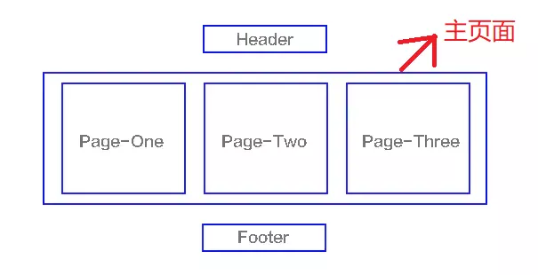

# SPA以及优化SPA

作者: fbk
时间：2023-1-2
地点：济南
>足够优秀再大方拥有 

## 简介
我们知道，当下最流行的前端框架vue，react，angular都是单页面应用，其实就是SPA,通过重写当前页面与用户进行交互，在我们打开页面的时候，浏览器会加载所有必要的代码(`html`,`css`,`javascript`)，所以也就导致了页面初次加载缓慢，如何优化，我们后续会讲到

## spa和mpa的区别
mpa每个页面都是一个主页面，我们访问一个页面时，需要重新加载当前页面的(`html`,`css`,`javascript`)
## 实现SPA
### `hash`模式

