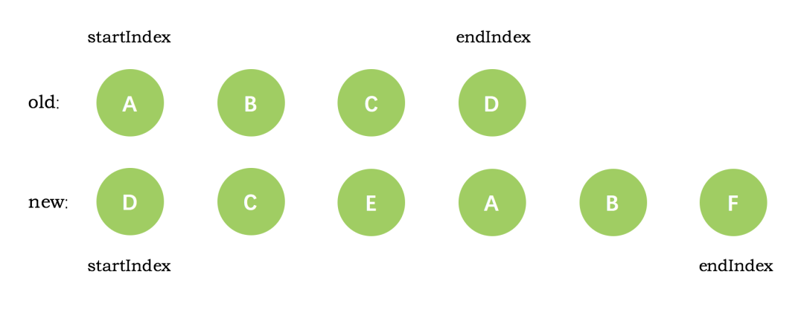
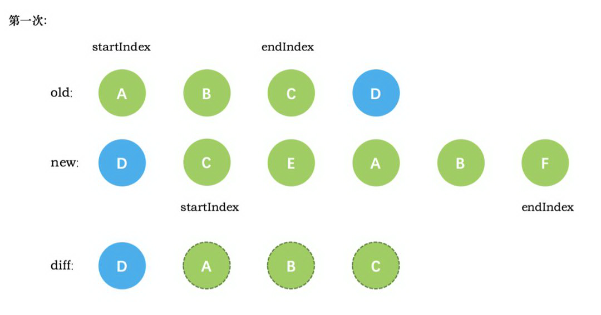
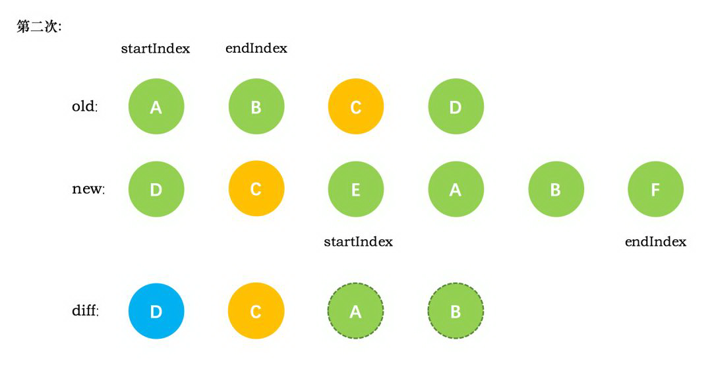
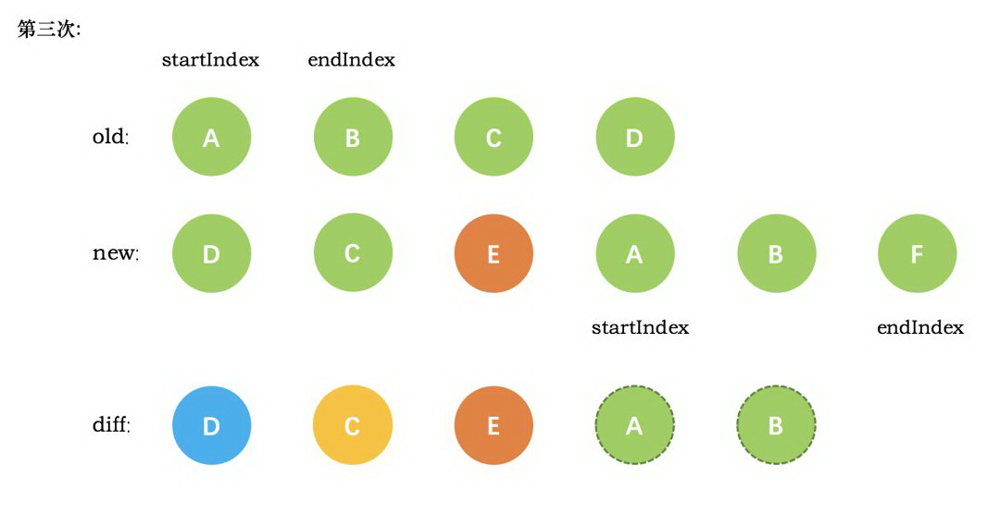
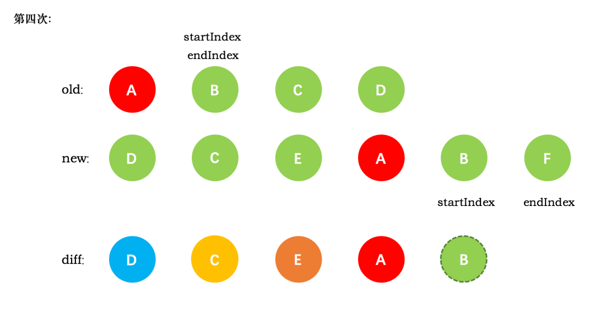
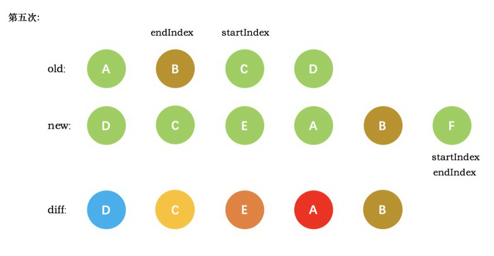
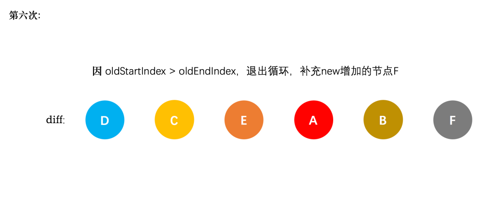

# diff算法

作者: fbk
时间：2023-1-2
地点：济南
>足够优秀再大方拥有 
## 简介
- diff算法是一种通过同层的树节点进行比较的高效算法
- 比较只会在同层级比较，不会跨层级比较
- 在diff比较的过程中，循环从两边向中间比较
## 比较方式
`diff`整体策略是：深度优先，同层比较
1. 比较只会在同层进行比较

2. 比较是两边向中间靠拢

## 举例
### 开始

### 第一次
第一次循环，diff发现节点D是相同的，直接复用旧节点d作为diff后的第一个真是节点，old的endIndex移向前一位，new的startIndex移向后一位

### 第二次
和第一次同理，也是发现节点c是相同的，所以原理也如第一次循环

### 第三次
第三次new中deE节点在old中没有找到，只能创建真实节点E，插入到diff的c后，new中startIndex向后移动，old只不变

### 第四次
第四次循环，old和new的startIndex都是A，diff循环插入A，new的startIndex向后移动一位，new中的startIndex向后移动一位

### 第五次
第五次循环中，情形同第四次循环一样，因此 diff 后创建了 B 真实节点 插入到前一次创建的 A 节点后面。同时旧节点的 startIndex移动到了 C，新节点的 startIndex 移动到了 F

### 第六次
新节点的 startIndex 已经大于 endIndex 了，需要创建 newStartIdx 和 newEndIdx 之间的所有节点，也就是节点F，直接创建 F 节点对应的真实节点放到 B 节点后面

## 原理分析
### patch方法
当数据发生变化的时候，`set`方法会调用`Dep.notify`通知多有watcher,订阅者会调用`patch`给真实的DOM打补丁
```javascript
function patch(oldVnode, vnode, hydrating, removeOnly) {
    if (isUndef(vnode)) { // 没有新节点，直接执行destory钩子函数
        if (isDef(oldVnode)) invokeDestroyHook(oldVnode)
        return
    }

    let isInitialPatch = false
    const insertedVnodeQueue = []

    if (isUndef(oldVnode)) {
        isInitialPatch = true
        createElm(vnode, insertedVnodeQueue) // 没有旧节点，直接用新节点生成dom元素
    } else {
        const isRealElement = isDef(oldVnode.nodeType)
        if (!isRealElement && sameVnode(oldVnode, vnode)) {
            // 判断旧节点和新节点自身一样，一致执行patchVnode
            patchVnode(oldVnode, vnode, insertedVnodeQueue, null, null, removeOnly)
        } else {
            // 否则直接销毁及旧节点，根据新节点生成dom元素
            if (isRealElement) {

                if (oldVnode.nodeType === 1 && oldVnode.hasAttribute(SSR_ATTR)) {
                    oldVnode.removeAttribute(SSR_ATTR)
                    hydrating = true
                }
                if (isTrue(hydrating)) {
                    if (hydrate(oldVnode, vnode, insertedVnodeQueue)) {
                        invokeInsertHook(vnode, insertedVnodeQueue, true)
                        return oldVnode
                    }
                }
                oldVnode = emptyNodeAt(oldVnode)
            }
            return vnode.elm
        }
    }
}
```
patch函数的形参oldVnode和Vnode,一个是旧节点，另一个是欣姐带你
- 如果没有新节点,patch直接调用destory销毁旧节点
- 如果没有旧节点，那就是页面初始化，直接使用createElm
- 如果旧节点和新节点自身一样，调用sameVnode判断节点是否一样，如果一样调用`patchNode`去处理两个节点
- 旧节点和新节点自身不一样的，调用destory删除旧节点，使用createElm创建新节点
### patchNode方法
```javascript
function patchVnode (oldVnode, vnode, insertedVnodeQueue, removeOnly) {
    // 如果新旧节点一致，什么都不做
    if (oldVnode === vnode) {
      return
    }

    // 让vnode.el引用到现在的真实dom，当el修改时，vnode.el会同步变化
    const elm = vnode.elm = oldVnode.elm

    // 异步占位符
    if (isTrue(oldVnode.isAsyncPlaceholder)) {
      if (isDef(vnode.asyncFactory.resolved)) {
        hydrate(oldVnode.elm, vnode, insertedVnodeQueue)
      } else {
        vnode.isAsyncPlaceholder = true
      }
      return
    }
    // 如果新旧都是静态节点，并且具有相同的key
    // 当vnode是克隆节点或是v-once指令控制的节点时，只需要把oldVnode.elm和oldVnode.child都复制到vnode上
    // 也不用再有其他操作
    if (isTrue(vnode.isStatic) &&
      isTrue(oldVnode.isStatic) &&
      vnode.key === oldVnode.key &&
      (isTrue(vnode.isCloned) || isTrue(vnode.isOnce))
    ) {
      vnode.componentInstance = oldVnode.componentInstance
      return
    }

    let i
    const data = vnode.data
    if (isDef(data) && isDef(i = data.hook) && isDef(i = i.prepatch)) {
      i(oldVnode, vnode)
    }

    const oldCh = oldVnode.children
    const ch = vnode.children
    if (isDef(data) && isPatchable(vnode)) {
      for (i = 0; i < cbs.update.length; ++i) cbs.update[i](oldVnode, vnode)
      if (isDef(i = data.hook) && isDef(i = i.update)) i(oldVnode, vnode)
    }
    // 如果vnode不是文本节点或者注释节点
    if (isUndef(vnode.text)) {
      // 并且都有子节点
      if (isDef(oldCh) && isDef(ch)) {
        // 并且子节点不完全一致，则调用updateChildren
        if (oldCh !== ch) updateChildren(elm, oldCh, ch, insertedVnodeQueue, removeOnly)

        // 如果只有新的vnode有子节点
      } else if (isDef(ch)) {
        if (isDef(oldVnode.text)) nodeOps.setTextContent(elm, '')
        // elm已经引用了老的dom节点，在老的dom节点上添加子节点
        addVnodes(elm, null, ch, 0, ch.length - 1, insertedVnodeQueue)

        // 如果新vnode没有子节点，而vnode有子节点，直接删除老的oldCh
      } else if (isDef(oldCh)) {
        removeVnodes(elm, oldCh, 0, oldCh.length - 1)

        // 如果老节点是文本节点
      } else if (isDef(oldVnode.text)) {
        nodeOps.setTextContent(elm, '')
      }

      // 如果新vnode和老vnode是文本节点或注释节点
      // 但是vnode.text != oldVnode.text时，只需要更新vnode.elm的文本内容就可以
    } else if (oldVnode.text !== vnode.text) {
      nodeOps.setTextContent(elm, vnode.text)
    }
    if (isDef(data)) {
      if (isDef(i = data.hook) && isDef(i = i.postpatch)) i(oldVnode, vnode)
    }
  }
```
- 新节点是否是文本节点，如果是哦，直接更新dom中的文本内容为新节点的文本内容
- 新节点和就旧节点都有子节点，那么处理子节点
- 只有新节点有字节点，旧节点没有，那么所有节点都是全新的，全部创建DOM，添加父节点
- 只有旧节点有子节点新节点没有，要把旧节点的DOM全部删除
- 子节点不完全一致，使用updateChildren
```javascript
function updateChildren (parentElm, oldCh, newCh, insertedVnodeQueue, removeOnly) {
    let oldStartIdx = 0 // 旧头索引
    let newStartIdx = 0 // 新头索引
    let oldEndIdx = oldCh.length - 1 // 旧尾索引
    let newEndIdx = newCh.length - 1 // 新尾索引
    let oldStartVnode = oldCh[0] // oldVnode的第一个child
    let oldEndVnode = oldCh[oldEndIdx] // oldVnode的最后一个child
    let newStartVnode = newCh[0] // newVnode的第一个child
    let newEndVnode = newCh[newEndIdx] // newVnode的最后一个child
    let oldKeyToIdx, idxInOld, vnodeToMove, refElm

    // removeOnly is a special flag used only by <transition-group>
    // to ensure removed elements stay in correct relative positions
    // during leaving transitions
    const canMove = !removeOnly

    // 如果oldStartVnode和oldEndVnode重合，并且新的也都重合了，证明diff完了，循环结束
    while (oldStartIdx <= oldEndIdx && newStartIdx <= newEndIdx) {
      // 如果oldVnode的第一个child不存在
      if (isUndef(oldStartVnode)) {
        // oldStart索引右移
        oldStartVnode = oldCh[++oldStartIdx] // Vnode has been moved left

      // 如果oldVnode的最后一个child不存在
      } else if (isUndef(oldEndVnode)) {
        // oldEnd索引左移
        oldEndVnode = oldCh[--oldEndIdx]

      // oldStartVnode和newStartVnode是同一个节点
      } else if (sameVnode(oldStartVnode, newStartVnode)) {
        // patch oldStartVnode和newStartVnode， 索引左移，继续循环
        patchVnode(oldStartVnode, newStartVnode, insertedVnodeQueue)
        oldStartVnode = oldCh[++oldStartIdx]
        newStartVnode = newCh[++newStartIdx]

      // oldEndVnode和newEndVnode是同一个节点
      } else if (sameVnode(oldEndVnode, newEndVnode)) {
        // patch oldEndVnode和newEndVnode，索引右移，继续循环
        patchVnode(oldEndVnode, newEndVnode, insertedVnodeQueue)
        oldEndVnode = oldCh[--oldEndIdx]
        newEndVnode = newCh[--newEndIdx]

      // oldStartVnode和newEndVnode是同一个节点
      } else if (sameVnode(oldStartVnode, newEndVnode)) { // Vnode moved right
        // patch oldStartVnode和newEndVnode
        patchVnode(oldStartVnode, newEndVnode, insertedVnodeQueue)
        // 如果removeOnly是false，则将oldStartVnode.eml移动到oldEndVnode.elm之后
        canMove && nodeOps.insertBefore(parentElm, oldStartVnode.elm, nodeOps.nextSibling(oldEndVnode.elm))
        // oldStart索引右移，newEnd索引左移
        oldStartVnode = oldCh[++oldStartIdx]
        newEndVnode = newCh[--newEndIdx]

      // 如果oldEndVnode和newStartVnode是同一个节点
      } else if (sameVnode(oldEndVnode, newStartVnode)) { // Vnode moved left
        // patch oldEndVnode和newStartVnode
        patchVnode(oldEndVnode, newStartVnode, insertedVnodeQueue)
        // 如果removeOnly是false，则将oldEndVnode.elm移动到oldStartVnode.elm之前
        canMove && nodeOps.insertBefore(parentElm, oldEndVnode.elm, oldStartVnode.elm)
        // oldEnd索引左移，newStart索引右移
        oldEndVnode = oldCh[--oldEndIdx]
        newStartVnode = newCh[++newStartIdx]

      // 如果都不匹配
      } else {
        if (isUndef(oldKeyToIdx)) oldKeyToIdx = createKeyToOldIdx(oldCh, oldStartIdx, oldEndIdx)

        // 尝试在oldChildren中寻找和newStartVnode的具有相同的key的Vnode
        idxInOld = isDef(newStartVnode.key)
          ? oldKeyToIdx[newStartVnode.key]
          : findIdxInOld(newStartVnode, oldCh, oldStartIdx, oldEndIdx)

        // 如果未找到，说明newStartVnode是一个新的节点
        if (isUndef(idxInOld)) { // New element
          // 创建一个新Vnode
          createElm(newStartVnode, insertedVnodeQueue, parentElm, oldStartVnode.elm)

        // 如果找到了和newStartVnodej具有相同的key的Vnode，叫vnodeToMove
        } else {
          vnodeToMove = oldCh[idxInOld]
          /* istanbul ignore if */
          if (process.env.NODE_ENV !== 'production' && !vnodeToMove) {
            warn(
              'It seems there are duplicate keys that is causing an update error. ' +
              'Make sure each v-for item has a unique key.'
            )
          }

          // 比较两个具有相同的key的新节点是否是同一个节点
          //不设key，newCh和oldCh只会进行头尾两端的相互比较，设key后，除了头尾两端的比较外，还会从用key生成的对象oldKeyToIdx中查找匹配的节点，所以为节点设置key可以更高效的利用dom。
          if (sameVnode(vnodeToMove, newStartVnode)) {
            // patch vnodeToMove和newStartVnode
            patchVnode(vnodeToMove, newStartVnode, insertedVnodeQueue)
            // 清除
            oldCh[idxInOld] = undefined
            // 如果removeOnly是false，则将找到的和newStartVnodej具有相同的key的Vnode，叫vnodeToMove.elm
            // 移动到oldStartVnode.elm之前
            canMove && nodeOps.insertBefore(parentElm, vnodeToMove.elm, oldStartVnode.elm)

          // 如果key相同，但是节点不相同，则创建一个新的节点
          } else {
            // same key but different element. treat as new element
            createElm(newStartVnode, insertedVnodeQueue, parentElm, oldStartVnode.elm)
          }
        }

        // 右移
        newStartVnode = newCh[++newStartIdx]
      }
    }
}
```


## 总结
1. 当数据发生变化，订阅者watcher就对调用patch给真实DOM打补丁
2. 当old的节点和new节点相同，就对调用patchVNode
   1. 首先找到真实dom（el）
   2. 如果都有文本节点且不相同，将el文本节点设置为vnode文本节点
   3. 如果oldNode有子节点但是Vnode没有，删除oldVNode子节点
   4. 如果oldVNode没有字节戴安但是VNode有，创建子节点添加到el
   5. 如果都有子节点调用updateChildren
3. update操作
   1. 设置新旧VNode节点头尾指针
   2. 新旧头尾指针进行比较，循环向中间靠拢，根据情况调用patchVnode进行patch重复流程、调用createElem创建一个新节点，从哈希表寻找 key一致的VNode 节点再分情况操作