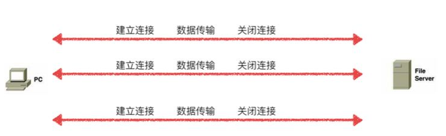

# http1,http2,http3的区别

作者: fbk
时间：2022-12-29
地点：济南
>足够优秀再大方拥有

# Http1.0
浏览器至于服务器短暂连接，每次请求都要建立一个`TCP`连接，请求完成后立即断开`TCP`连接

例如：在请求一个`html`文件，文件存在多个资源又要重新建立`TCP`请求去请求数据
# Http1.1
`http1.1`默认支持长连接，在一个`TCP`中可以传送多个`http`请求和响应
`http1.1`允许客户端不用等待上一次请求的返回结果就可以发送下一次请求，但服务器必须按照接收到客户端的请求先后书勋依次返回请求结果
# Http2.0
`http2`在`TCP``连接中可以同时发送多个请求或者响应，而且不用按照顺序一一对应，避免了对头阻塞
