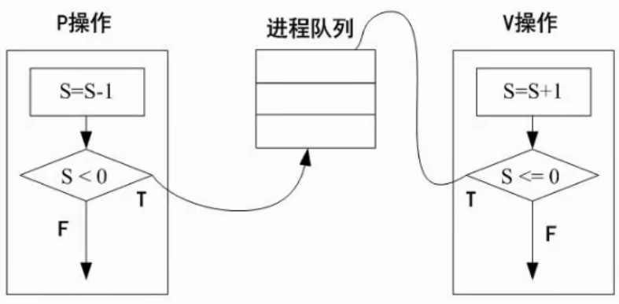

# 1

作者: fbk
时间：2023-2-21
地点：济南

> 足够优秀再大方拥有
## 数据的表示
- 原码
- 反码
   - 正数的原码和反码相同
   - 负数的原码`除符号位`取反
- 补码
   - 正数的补码和原码相同
   - 负数的补码是反码+1
- 移码：作为浮点运算的介码，不管是正数还是负数，都在补码的基础上对`符号位取反`
### 数据的表示范围

## 计算机结构
- 运算器
  1. 算术逻辑单元ALU： 跟运算相关
  2. 累加寄存器AC： 常用于ALU执行算数逻辑运算提供数据并暂存运算结果的寄存器
  3. 数据缓冲寄存器DR： 对内存储器进行读写操作的时候，用来暂存数据的寄存器
  4. 状态条件寄存器PSW： 记录运算中产生的标志信息，每一位单独使用，成为标志位（进位，溢出，中断…）
- 控制器：控制整个计算机各部件有条不紊的工作，其基本功能是取指令与执行指令
  1. 程序计数器PC： 用来存放指令地址，运行时用来获取下一条指令的位置。
  2. 指令寄存器IR： 存储正在执行的指令，存储位数由指令字长决定。
  3. 指令译码器ID： 分析指令的操作码，来决定操作的性质与分法。
  4. 时序部件： CPU执行指令时根据时序部件发出的时钟信号进行相应操作，在取指阶段读取指令，在分析和执行阶段读取数据。
## 流水线
- 如果把流水线的一条指令分为取值，分析和执行三部分，且三部分的时间分别是取指2ns，分析2ns，执行1ns
- 流水线周期是执行时间最长的一段，也就是2ns
- 100条指令全部执行完毕需要多长时间
  - 1条指令执行的时间`1条指令执行的时间+（指令条数-1）*流水线周期`
  - 流水线计算理论公式是`(t1+t2+...tk)+(n-1)*t`
  - 流水线计算实践公式是`(k+n-1)*t`
## 流水线吞吐率计算
## 流水线加速比
完成同样一批任务，不使用流水线所用的时间与使用流水线所用的时间之比称为流水线加速比
## 流水线的效率
流水线的设备利用率
## 层次化的存储结构

## cahche
- cahce的功能：提高CPU的传出数据
- 子啊计算机的系统体系中，cache是访问速度最快的一层
- 使用cache改善系统性能的依据是程序的局部性原理

如果以h代表队cache的访问命中率，t1表示cache的周期时间，t2表示主存储器周期时间，以读操作为例，使用cache+主存储器的系统平均周期位t3

t3=h*t1+(1-h)*t2

1-h被称为失效率

## 局部性原理

- 空间局部性
- 时间局部性

## 主存分类

- 随机存取存储器：断电后存储的信息丢失
- 只读存储器：断电后存储的信息不丢失

## 磁盘结构和参数
存取时间=寻道时间+等待时间（平均定位时间+转动延迟）

- 第一空

1. 开始读取R0的数据，消耗3ns的时间，但是这样的话就不能读取到R1的数据，所以圆盘需要绕一周才能读取R1的数据
2. 因为有11个扇区，所以绕一周的时间加上自己去读取的时间就是33+3
3. 一共需要自己读取10个扇区数据，因为R0是直接读的，所以只需要计算R1到R10
4. 也就是(33+3)*10+6=366

- 第二空

1. 这样读取也就是先读取R0的数据，然后经过3ns解析，此时数据正好经过的是R6，也就是不需要转一圈就可以接着读取R1
2. 所以时间是每个读取解析的时间6ns乘上11个

## 总线
- 内部总线
- 系统总线
  - 数据总线
  - 地址总线
  - 控制总线
- 外部总线
## 串联系统-并联系统

## 差错控制-CRC与海明校验码

校验码都是存放在2的n次方位，也就是2^r>=x+r+1

x就是信息位的个数，r就是检验位

确定校验码位3位，也就是2^3>=8,只能放在2^0,2^1,2^2这几个地方

## 进程状态转换

## 进程的同步和互斥（PV）
- 互斥：千军万马过独木桥
- 同步：速度有差异，在一定情况停下等待

## PV操作
- 临界资源：诸进程间需要互斥方式对其进行共享的资源
- 临界区：每个进程中访问临界资源的那段代码称为临界区
- 信号量：是一种特殊的变量

p相当于把一个进程在不符合条件的情况下放入进程队列，而v操作就相当于是否取出进程队列的操作，p就是阻塞，v就是唤醒

1. 如果把a1，a2，b1，b2去掉的话，可以设想一下，收银员可能会立刻执行收费，但是这样不符合逻辑
2. 所以在b1，如果没有人付款，就要一直进行p操作，直到a1有人付款，就会执行v操作唤醒b1
3. 如果有人想要离开，为了确定他是否真的付了款，所以要在a2一直等待b2提示是否付款成功，所以a2就执行p操作，b2就执行v操作

## 死锁问题

如果线程中有三个进程A,B,C,这三个进程都需要5个系统资源，那么至少需要几个资源？

- 如果只给她分配10个资源，那么334依然导致死锁问题
- 如果分配13个，那么每个我们可以给他先分配4个资源，然后最后的资源不管给谁，他都可以完成5个资源的要求，从而释放资源
- 所以公式就是`线程个数*(每个线程需要的系统资源-1)+1`
## 死锁地避免
- 有序资源分配法：先分给a，后分给b，再分给c，但是这样存在的问题就是效率太低
- 银行家算法
  - 当一个线程对资源的最大需求不超过系统中的资源数时可以接纳线程
  - 线程可以分期请求资源，但请求的总数不能超过最大需求量
  - 当线程现有的资源不能满足进程尚需资源时，对线程的请求可以延迟分配，但总能使进程在有限的时间得到资源